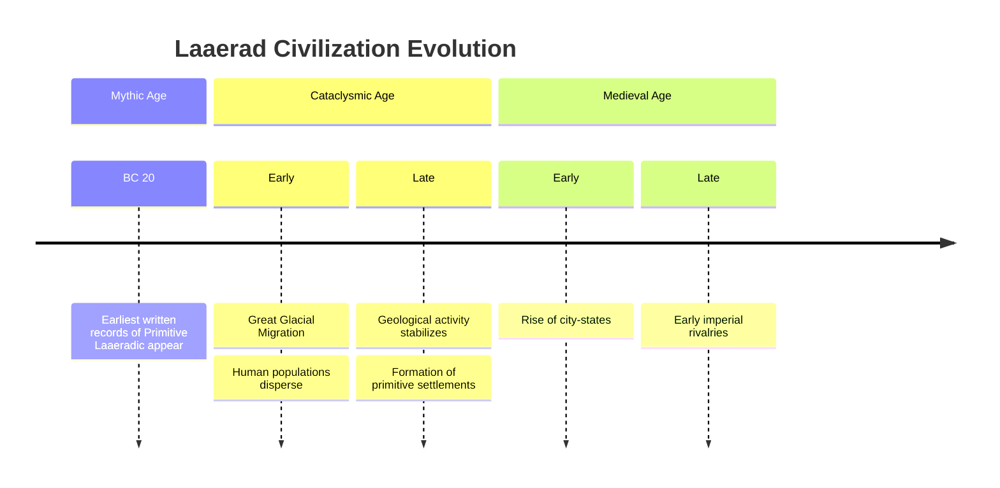
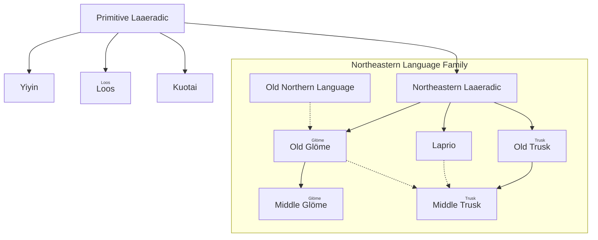

# <ruby>拉埃拉德<rt>Laaerad</rt></ruby>

!!! wiki "Entry Information"
    | Attribute | Description |
    | :--- | :--- |
    | **Celestial Type** | Terrestrial Planet |
    | **Star System** | Single-star system (with one natural satellite) |
    | **Core Features** | Magical Ring, Double Sun Phenomenon |
    | **Major Eras** | <ruby>Mythic Age<rt>Porurmart</rt></ruby>, <ruby>Cataclysmic Age<rt>Glios</rt></ruby>, <ruby>Medieval Age<rt>Yupoyur</rt></ruby> |

<b><ruby>拉埃拉德<rt>Laaerad</rt></ruby></b> is a constructed world that blends hard science fiction cosmology with traditional fantasy elements. This planet possesses a unique magical ring, and its magic system is built upon complex higher-dimensional cosmological theories. In this world, historical progression and the forms of civilization are deeply influenced by astronomical phenomena and magical cycles, which together shape a civilizational landscape filled with the unknown and a spirit of exploration.

## 1 🌌 Astronomical Environment

Astronomically, <b><ruby>拉埃拉德<rt>Laaerad</rt></ruby></b> is a planet highly similar to Earth in terms of mass, volume, gravity, and climatic conditions, providing the physical basis for diverse ecosystems and the emergence of intelligent life. The planet orbits a single star and possesses one natural satellite; its star system structure is analogous to our Solar System.

The planet's most prominent astronomical feature is a unique **Magical Ring**. This ring not only constitutes a magnificent night sky spectacle but also serves as a direct indicator of the effective strength of "magic" in the material world.
- **Nighttime**: The ring reflects starlight, typically appearing white like moonlight; during specific periods, it shifts to a purplish-red or grayish-green hue.
- **Daytime**: Depending on the relative positions of the ring and the star, observers on the ground may witness the "Double Sun" phenomenon—where the star and a bright segment of the ring appear simultaneously in the sky.

---

## 2 ✨ Magic System

Magic in Laaerad is not a supernatural miracle but a cosmic phenomenon adhering to strict physical laws.

### 2.1 Foundational Theory

Beyond the "reality" dimension, there exists a higher-dimensional space. The real world is mapped into this higher-dimensional space in the form of "**snapshots**". This mapping is unique and reversible, recording not only the holographic information of three-dimensional space but also encompassing the flow of time.

The essence of magic is the caster constructing a channel between "reality" and a specific higher-dimensional "snapshot", forcing the current state of reality to collapse towards that snapshot. During this process, energy, fluctuations, and matter are exchanged between the two dimensions. Due to the cyclical nature of celestial motion, when the "reality" of the material world rotates on a macro scale to approach specific mapping points in the higher-dimensional space, the Magical Ring becomes visible. Based on this mechanism, during the ring's visibility cycle, most magical effects fail due to interference. This cycle is highly irregular, lasting as long as centuries or as short as several oscillations within a single day.

### 2.2 Manifestations

Magic manifests in various forms in practical application:

- <b><ruby>Enchantment<rt>uru</rt></ruby></b>
  Binds specific "elements" to the higher-dimensional mapping of an object, granting it properties beyond its physical material. For example, an enchanted blade can cut non-physical substances, and enchanted fabric can isolate extreme heat. The stability of this form depends on the caster's control over element purity and compatibility; imbalanced binding can cause the item to fail or backfire.

- <b><ruby>Blessing<rt>anhuz</rt></ruby></b>
  Superimposes an idealized state from a "snapshot" onto a target individual through a magical channel, slightly enhancing their vitality, fortune, or mental state. This type of magic is commonly used in war mobilization, weddings, or harvest festivals. Although its actual efficacy is often not significant, it is deeply rooted in the folk rituals of Laaerad's various peoples.

- <b><ruby>Prophecy<rt>portesdra</rt></ruby></b>
  An extremely rare and dangerous high-level technique. The caster attempts to selectively read information from a "snapshot" to deduce the future. Since "snapshots" exist in a higher-dimensional and non-linearly fixed state, the impressions obtained by the caster are often chaotic and vague. Forced reading imposes a severe mental burden, and in severe cases, can lead to the loss of perception of the reality dimension.

- <b><ruby>Spirit Communication<rt>strahuy</rt></ruby></b>
  Spirit-speakers or mages from history who once ventured into the higher-dimensional realm may leave imprints there. Later casters exploring these traces might capture fragments of thought from predecessors (or even successors).

Regardless of the form, the core of successful spellcasting lies in the precise acquisition and recreation of specific "elements" (matter, energy, symbols, or environmental conditions).

### 2.3 Spellcasting Mechanism

In Laaerad, a "mage" is defined as an individual with the innate talent to observe "snapshots" of the higher-dimensional space. The caster's ability level directly depends on their observation precision.

- **Scarcity of Talent**: The observational talent has a probability of manifesting only at the moment of a newborn's birth, when the higher-dimensional mapping and the real world coincide in a specific way. While it shows a certain tendency for hereditary transmission, no definitive pattern has been established due to scarce samples.
- **Limitations of Ability**: An observer may not be able to precisely locate elements; one who can locate may not observe the full picture. Even with both capabilities, if one cannot construct a connecting channel, spellcasting is impossible. It is known that meditation training can help strengthen the perceptual connection to the dimension.

**Spellcasting Example: Enchanting a Blade with Fire**

1.  **Locate the Entity**: Confirm the physical existence of the sword in reality.
2.  **Higher-Dimensional Analysis**: The caster observes and analyzes the sword's mapping in the "snapshot", then constructs a dimensional channel.
3.  **Element Binding**: Search the static "snapshot" state for the elements constituting fire and forcibly bind them to the sword's mapping.
4.  **Reality Collapse**: Manifest the binding result in reality through the channel, causing the blade to ignite with flames.

This setting implies the fluctuating nature of magical strength: the effectiveness of magic depends on the relative celestial positions of the real universe and the higher-dimensional "snapshots". Therefore, **astrology** becomes a key discipline for predicting magical potency and periods of failure. This has also led to the possibility in Laaerad's history of highly developed magical civilizations and completely non-magical technological societies alternating or coexisting.

!!! note "Creative Background"
    This system provides a self-consistent physical and astronomical basis for magic while leaving ample room for science fiction-style creation.
    > Inspiration: Isaac Asimov's *The Gods Themselves*

---

## 3 📜 Historical Progression

### 3.1 Timeline Overview

### 3.2 Historical Periods

#### 3.2.1 <ruby>Mythic Age<rt>Porurmart</rt></ruby>
In this era, Laaerad's climate was warm and stable, with higher sea levels and continents often surrounded by shallow seas. Terrestrial ecology flourished, with humans and other intelligent races widely proliferating in temperate and coastal regions.

- **Civilizational Characteristics**: Humans appeared approximately one hundred thousand years before the era's end. At the era's conclusion (20 years before its end), the oldest surviving stone inscriptions were created, recording about two hundred **Primitive Laaeradic** vocabulary words. The core social spirit of this period was constituted by faith in the <b><ruby>Porurka<rt>Porurka</rt></ruby></b> pantheon, tribal structures, and nature worship.
- **Terminating Event**: An individual known as the "Door Opener" opened a "Snapshot Gate" to the universe's early state. This caused a massive amount of water vapor to instantly freeze and fall back, triggering a sharp drop in sea levels, drastic climate change, and intense crustal movements. The seabed of the old continents was exposed, new mountain ranges rose, and the Mythic Age ended in catastrophe.

#### 3.2.2 <ruby>Cataclysmic Age<rt>Glios</rt></ruby>
A period of geological and climatic turmoil lasting approximately one thousand years. Polar ice caps expanded, global temperatures plummeted, and tectonic plate movements were frequent.

- **The Great Migration**: Harsh environments forced humans to disperse across ice sheets and land bridges to various continents. Long-term geographical isolation caused Primitive Laaeradic to rapidly diverge.
- **Civilizational Reshaping**: Despite the harsh environment, migration fostered cultural diversity. Stable hunting-gathering centers and early settlements gradually formed in temperate regions. As geological activity slowed and the climate warmed towards the era's end, lowlands were re-flooded, and agriculture and handicrafts emerged, laying the foundation for new civilizations.

#### 3.2.3 <ruby>Medieval Age<rt>Yupoyur</rt></ruby>
After climate stabilization, agriculture and animal husbandry became the core of production, and population surges drove urbanization.

- **Technological Advancement**: The transition from the Bronze to the Iron Age enhanced warfare and engineering capabilities. Some regions reacquired magical technology, giving rise to unique "secondary magical civilizations".
- **Political Landscape**: Early city-states established along rivers, lakes, and bays gradually evolved into cross-regional alliances. In the late era, through conquest and assimilation, the prototypes of early empires emerged, laying the foundation for future hegemonic structures.

---

## 4 🏛️ Civilization and Language

### 4.1 Language Evolution Tree

By the early Medieval Age, Primitive Laaeradic evolved under the dual influences of geographical isolation and ethnic interaction:

- **Northeastern Language Family**: Derived from Northeastern Laaeradic, it gave birth to three classical languages:
    - **Old <ruby>Glöme<rt>Glöme</rt></ruby>**: Retains archaic grammar, influenced indirectly by the Old Northern Language (which shares a common origin but separated early).
    - **Laprio**: Distributed along the coast, incorporating elements from Truskean and overseas languages.
    - **Old <ruby>Trusk<rt>Trusk</rt></ruby>**: Evolved into Middle Truskean, eventually becoming the mainstream language for official and written communication in the region.
- **Other Language Families**: The **Yiyin**, **<ruby>Loos<rt>Loos</rt></ruby>**, and **Kuotai** families, distributed in the central and southwestern parts of the continent, directly inherited from Primitive Laaeradic. Due to relative isolation, they retained more archaic phonological features of the prehistoric language.

### 4.2 Related Entries

| Entry | Related Description |
| :--- | :--- |
| [Primitive Laaeradic](../语言/拉埃拉德原始语.md) | The oldest and most primitive known linguistic ancestor in this world. |
| [Truskean](../语言/图斯克/图斯克语.md) | An important sub-branch of the Northeastern Laaeradic family, holding widespread official status. |
| [Glömezher](../语言/图斯克/咕洛语.md) | One of the sub-branches of the Northeastern Laaeradic family, retaining unique archaic grammar. |