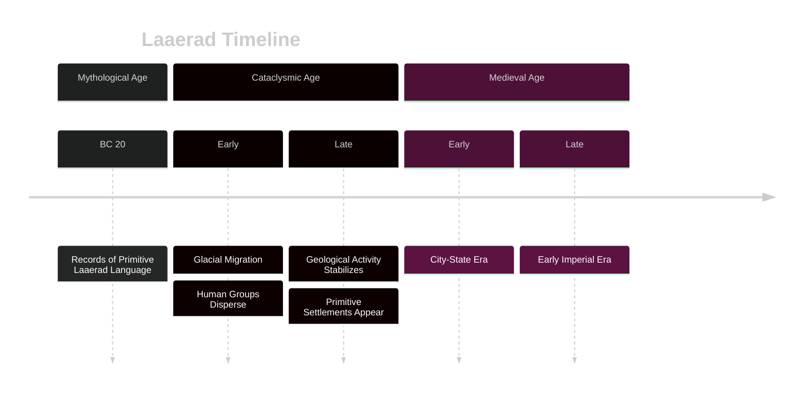
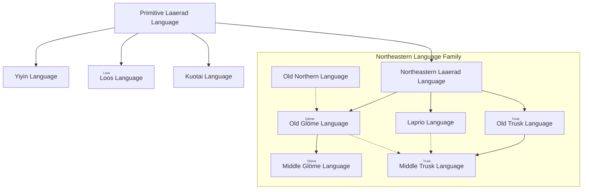

# <ruby>Laaerad<rt>laaerad</rt></ruby> Basic Setting

Laaerad is a unique world that skillfully blends hard science fiction settings with traditional fantasy elements. It not only possesses a mysterious magical ring, but its magic system is not凭空 generated; it is based on a complex cosmological theory. In this world, historical processes and civilizational development are closely intertwined with astronomical phenomena and magical events, collectively shaping a universe full of unknowns and exploration.

## 1 Astronomy

From an astronomical perspective, **Laaerad** is a planet with mass and volume extremely similar to Earth, with comparable gravity and climatic conditions, thus nurturing diverse ecosystems and intelligent life. It orbits its own star and is accompanied by a satellite; the structure of its star system resembles that of the Solar System. However, the most prominent feature of this planet is a shimmering **Magical Ring** that orbits it in a unique way. The ring is not only a beautiful night sky spectacle but also an important indicator of the effective strength of "magic" in the world. When it appears in the night sky, it reflects sunlight to illuminate the heavens, most of the time as bright as the moon, but sometimes appearing purplish-red or grayish-green; during the day, depending on the relative position of the ring and the sun, from specific angles, people on the ground can even see two suns simultaneously in the sky—the spectacle of "two suns sharing the sky."

![[docs/assets/img/laaerad0918_gem.png|Satellite image of the Truskean region of Laaerad]]

---

## 2 Magic

The "magic" of Laaerad follows the rules below:

Beyond "reality," there exists a higher-dimensional space. The real world is mapped within it in the form of "snapshots." This mapping is unique and reversible, containing not only all spatial information but also encompassing the flow of time. The occurrence of magic is essentially the caster opening a channel between reality and a certain "snapshot," causing the current state of reality to collapse towards that "snapshot." During the collapse, energy, waves, and matter are exchanged between the two. Periodically, when the astronomical-scale "reality" rotates to a position close to a certain mapping location in the higher-dimensional space, the Magical Ring becomes visible. Based on the aforementioned magic mechanism, during this period, most magic fails. This cycle can be extremely long, spanning hundreds of years, or as short as multiple repetitions within a single day.

### 2.1 Forms

Magic manifests in various forms in Laaerad:

- **Enchantment (uru)**
    By binding "elements" to the higher-dimensional mapping of an item, the item gains abilities beyond its physical properties. For example, an enchanted sword can cut non-physical substances when swung, and enchanted clothing can isolate extreme temperature differences. The stability of an enchantment depends on the caster's mastery of the purity and compatibility of the elements. Once the binding process becomes unbalanced, the item may fail or even backfire on its holder.

- **Blessing (anhuz)**
    By using a magical channel, an ideal state from a "snapshot" is superimposed onto a target, thereby enhancing its vitality, luck, or mental state. Blessings are commonly used in rituals such as pre-battle ceremonies, weddings, and harvest festivals. The effects are usually not significant and it is also a common courtesy; many peoples of Laaerad have folklore related to "*blessing*."

- **Prophecy (portesdra)**
    A rare and extremely difficult form to master, it involves selectively reading information from "snapshots" to predict the possible course of events. However, "snapshots" exist in a higher-dimensional space and are not fixed. What the caster sees may be chaotic and模糊 impressions, and the reading process can cause mental strain, with severe cases potentially losing perception of reality.

- **Spiritualism (strahuy)**
    Some *Spirit Speakers* or *Mages* who have previously ventured into the higher-dimensional space may leave their imprints there. By exploring these imprints, a *Spirit Speaker* practicing spiritualism may obtain some ideas from *predecessors* (or possibly *successors*).

Regardless of the form, the casting of magic relies on the acquisition of specific "elements"—these elements could be matter, energy, symbols, or environmental conditions. The key to stably repeating spellcasting lies in whether the caster can accurately find and acquire the required elements in each attempt.

### 2.2 Mechanism

In Laaerad, so-called "Mages" are those who can see the "*snapshots*" in the higher-dimensional space. A caster's strength largely depends on their ability to observe "*snapshots*." However, this talent for observing the higher-dimensional space is extremely rare—it only has a probability of manifesting in newborn infants when the mapping of the higher-dimensional space coincides with the real world to some extent. Although it seems to be heritable through bloodlines, due to insufficient samples, no stable pattern has been summarized to date.

Those who can observe "snapshots" do not necessarily possess the ability to precisely locate elements; those who can locate elements may not be able to observe enough elements. Even those proficient in both may lose their spellcasting ability if they cannot open a channel between reality and the higher-dimensional space. It is known that *meditation* helps strengthen the connection with the higher-dimensional space, but the effect varies from person to person.

Taking **adding fire to a sword** as an example:

1.  In reality, the sword exists as a physical entity;
2.  The mage first glimpses and analyzes its "snapshot," then attempts to open a channel;
3.  In the "snapshot," the state is static and unchanging. The caster must find the elements constituting fire, bind them to the sword's mapping, and manifest the fire into reality through the channel.

On the surface, this is no different from the magic forms in typical fantasy worlds. However, in this setting, the effect and strength of magic depend on the relative position of the real universe and the "snapshot." Therefore, by observing the stars, people can predict the feasibility and power variations of magic during a certain period; in specific timeframes, magic may even completely fail. Consequently, the world of Laaerad may harbor highly developed magical civilizations, as well as social structures that completely lack magical technology.

This system provides a self-consistent physical and astronomical foundation for magic while leaving ample room for science fiction-style creation.

> Inspiration source: Asimov's *The Gods Themselves*

---

## 3 Cultural Foundation
### 3.1 History

#### 3.1.1 <ruby>Mythological Age<rt>porurmart </rt></ruby>
##### 3.1.1.1 Overview

Under warm and stable climatic conditions, Laaerad's sea levels were high, with extensive shallow seas covering the continental margins, resulting in relatively limited land area. Terrestrial flora and fauna were diverse, and the climate was suitable, allowing early humans and other intelligent races to proliferate and spread in temperate and coastal regions.

Humans appeared approximately one hundred thousand years before the end of the Mythological Age and gradually spread across the temperate zones and coastlines of the continent. Twenty years before the end of the Age, the Primitive Laaerad Language was first recorded in stone carvings—about two hundred words engraved on rock, becoming the oldest extant linguistic document. During this period, myths of the *Porurka* gods were prevalent, with language, tribes, and nature worship highly intertwined, forming the spiritual core of early society.

At the end of the Age, a figure historians call the "Door Opener" discovered a "Snapshot Door" leading to an early state of the universe. The opening of this door caused a massive amount of water vapor to instantly freeze and fall back onto the planet, leading to a sharp drop in sea levels, abrupt climate change, and intense crustal movements. Old continental seabeds were exposed in many places, and mountains rose. This disaster marked the end of the Mythological Age and the beginning of the Cataclysmic Age.

#### 3.1.2 <ruby>Cataclysmic Age<rt>glios</rt></ruby>
##### 3.1.2.1 Overview

The Cataclysmic Age lasted about a thousand years, a period of intense geological and climatic fluctuations. Polar ice caps expanded rapidly, permafrost zones formed extensively, sea levels continuously dropped, and some inland lakes dried up. Plate tectonics and volcanic eruptions were frequent, shaping new mountains and rifts.

The harsh climate forced human groups to migrate on a large scale, crossing ice fields and land bridges to disperse across the continents. The Primitive Laaerad Language rapidly diverged into various dialects and early independent languages due to prolonged isolation. The glacial migration waves promoted cultural diversification and regional isolation. Stable hunting and gathering centers emerged in some temperate regions, establishing the first fixed camps.

By the end of the Age, geological activity slowed, the climate gradually warmed, glaciers began to retreat, and low-lying areas were re-submerged by seawater. The development of primitive settlements in various regions laid the foundation for agriculture and handicrafts, ushering in a new civilizational process.

#### 3.1.3 <ruby>Medieval Age<rt>yupoyur</rt></ruby>

As the climate stabilized, regions across the continent entered a production stage centered on agriculture and animal husbandry. Food surpluses drove population growth and urban expansion. Regional civilizations emerged successively, with limited mutual交流, and most cultures evolved independently.

Bronze smelting technology gradually became widespread and transitioned towards the Iron Age. Metal tools and weapons significantly enhanced warfare and engineering capabilities. Some regions rediscovered and mastered magic, triggering the rise of "secondary civilizations."

This period saw the emergence of early city-states built around river valleys, lakes, and bays. Regional trade and resource competition gave rise to inter-city-state alliances and hegemonic structures. By the late Age, early imperial雏形 appeared. A few civilizations established跨区域 rule through military conquest and cultural assimilation, laying the groundwork for the formation of subsequent great empires.

***

## 4 Civilization

### 4.1 Language

Entering the early Medieval Age, the Primitive Language gradually diverged under the influence of geographical isolation and交流.

Northeastern Laaerad Language evolved into the Northeastern Language Family, giving birth to three classical languages: Old Glömezher, Laprio, and Old Truskean. Old Glömezher retained many ancient grammatical structures and was influenced by Old Truskean. Laprio was distributed in coastal areas, absorbing elements from Truskean and overseas languages early on. Old Truskean developed into Middle Truskean, becoming the core language for official and written communication. The Old Northern Language in the north, although sharing a common origin with the Northeastern Language Family, diverged early, and some of its dialects became indirect ancestors of Old Glömezher.

The languages of the Yiyin, Loos, and Kuotai language families, distributed in the central and southwestern parts of the continent, directly inherited from the Primitive Language, with less external influence, retaining more archaic features in their phonology. Language evolution was influenced not only by geographical isolation but also by ethnic migration, contact, and融合. Languages within the Northeastern Language Family渗透 through mutual influence, while relatively isolated branches preserved the ancient面貌 of prehistoric languages, providing important clues for后世 research.

### 4.2 Related Entries in This Section

| Entry                          | Relation            |
| --------------------------- | ------------- |
| [Primitive Laaerad Language](../语言/拉埃拉德原始语.md) | The oldest and most primitive language of Laaerad |
| [Truskean](../语言/图斯克/图斯克语.md)   | One of the sub-branches of Northeastern Laaerad Language  |
| [Glömezher](../语言/图斯克/咕洛语.md)     | One of the sub-branches of Northeastern Laaerad Language  |

---

<footer>

<!--
  <<< Author notes: Footer >>>
  Add a link to get support, GitHub status page, code of conduct, license link.
-->

&copy; This Website is constructed by Phychias Lok, Phychiaslok@gmail.com. The copyrights of the conlan that's not created by Phychias is owned by its creator. &copy;

Worldview Discussion Group QQ: 150665831

</footer>

---