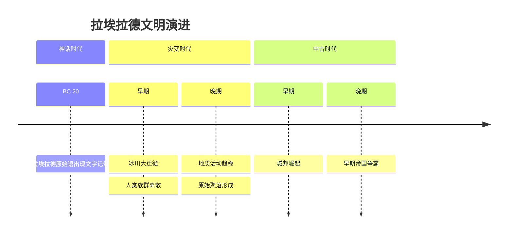
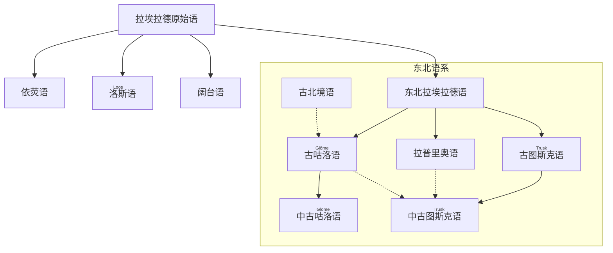

---
tags:
  - 拉埃拉德
  - 概念
  - 中文
language: zh
---
# 拉埃拉德

!!! danger "该条为全知者视角"

!!! wiki "词条信息"
    | 属性 | 描述 |
    | :--- | :--- |
    | **天体类型** | 类地行星 |
    | **所属星系** | 单恒星系统（伴有一颗卫星） |
    | **核心特征** | 魔力星环、双日同天奇观 |
    | **主要纪元** | <ruby>神话时代<rt>Porurmart</rt></ruby>、<ruby>灾变时代<rt>Glios</rt></ruby>、<ruby>中古时代<rt>Yupoyur</rt></ruby> |

<b><ruby>拉埃拉德<rt>Laaerad</rt></ruby></b>是一个将硬科幻宇宙观与传统奇幻元素相融合的架空世界。该行星拥有独特的魔力星环，其魔法体系建立于复杂的高维宇宙学理论之上。在此世界中，历史演进与文明形态深受天文现象及魔法周期的影响，二者共同塑造了一个充满未知与探索精神的文明图景。

## 1 🌌 天文环境

在天文学层面，<b><ruby>拉埃拉德<rt>Laaerad</rt></ruby></b>是一颗在质量、体积、重力及气候条件上与地球高度近似的行星，这为多样化生态系统与智慧生命的诞生提供了物理基础。该行星围绕一颗恒星公转，并拥有一颗天然卫星，其所在的恒星系结构与太阳系类同。

该行星最显著的天文特征是一道独特的**魔力星环**。这道星环不仅构成了壮丽的夜空景观，更是“魔法”在物质世界生效强度的直观指标。
- **夜间**：星环反射恒星光芒，通常呈现如月光般的洁白；在特定时期，它会转变为紫红色或灰绿色。
- **日间**：取决于星环与恒星的相对位置，特定角度下地面观测者可见“双日同天”的奇观——即恒星与明亮的星环部分同时悬挂于苍穹。

---

## 2 ✨ 魔法体系

拉埃拉德的魔法并非超自然的奇迹，而是遵循严格物理法则的宇宙现象。

### 2.1 基础理论

在“现实”维度之外，存在一个更高维度的空间。现实世界在这一高维空间中以“**快照**”的形式被映射。这种映射具有唯一性与可逆性，不仅记录了三维空间的全息信息，亦囊括了时间的流动状态。

魔法的本质，是施法者在“现实”与某个高维“快照”之间构建通道，迫使当前的现实状态向该“快照”发生坍缩。在此过程中，能量、波动与物质在两个维度间发生交换。由于天体运行的周期性，当物质世界的“现实”在宏观尺度上旋转至接近高维空间特定映射点时，魔力星环便会显现。基于此机制，在星环显现周期内，大多数魔法效应会因干扰而失效。该周期跨度极不固定，长可达数百年，短则一日内数次往复。

### 2.2 表现形式

魔法在实际应用中衍生出多种形态：

- <b><ruby>附魔<rt>uru</rt></ruby></b>
  将特定的“要素”与物品的高维映射进行绑定，赋予物品超越物理材质的特性。例如，附魔剑刃可切割非实体物质，附魔织物可隔绝极端热力。该形式的稳定性取决于施法者对要素纯度与匹配度的控制，绑定失衡会导致物品失效或反噬。

- <b><ruby>祝福<rt>anhuz</rt></ruby></b>
  通过魔法通道，将“快照”中某种理想化的状态叠加于目标个体，微幅提升其生命力、运势或精神状态。此类魔法常用于战争动员、婚礼或丰收庆典。尽管实际效能往往不显著，但它已深深植根于拉埃拉德各民族的民俗礼仪之中。

- <b><ruby>预言<rt>portesdra</rt></ruby></b>
  一种极其罕见且危险的高阶技巧。施法者试图选择性地读取“快照”中的信息以推演未来。由于“快照”处于高维且非线性固定状态，施法者所获往往是错乱模糊的印象。强行读取会对精神造成剧烈负担，严重者将丧失对现实维度的感知能力。

- <b><ruby>通灵<rt>strahuy</rt></ruby></b>
  历史上曾涉足高维领域的灵语者或魔法师可能会在高维空间残留印迹。后世施法者通过探索这些痕迹，可能捕捉到前人（甚至是后人）的思维碎片。

无论何种形式，施法成功的核心在于对特定“要素”（物质、能量、符号或环境条件）的精准获取与重现。

### 2.3 施法机制

在拉埃拉德，“魔法师”被定义为具备观测高维空间“快照”天赋的个体。施法者的能力层级直接取决于其观测精度。

- **天赋稀缺性**：观测天赋仅在新生儿诞生时，高维映射与现实世界发生特定重合的瞬间有概率产生。虽表现出一定的血统遗传倾向，但因样本稀缺，尚未总结出确切规律。
- **能力局限**：观测者未必能精准定位要素；定位者未必能观测全貌。即便两者兼备，若无法构建连接通道，亦无法施法。已知冥想训练有助于强化维度的感知联系。

**施法实例：为剑刃附加火焰**

1.  **定位实体**：确认现实中剑的物理存在。
2.  **高维解析**：施法者观测并解析剑在“快照”中的映射，随后构建维度通道。
3.  **要素绑定**：在静止的“快照”状态中搜寻构成火焰的要素，将其与剑的映射强制绑定。
4.  **现实坍缩**：通过通道使绑定结果在现实中显现，剑刃随即燃起烈火。

此设定暗示了魔法强度的波动性：魔法的有效性取决于现实宇宙与高维“快照”的相对天体位置。因此，**观星学**成为预测魔法威力与失效期的关键学科。这也导致了拉埃拉德历史上，高度发达的魔法文明与完全无魔的科技社会可能交替或并存。

!!! note "创作背景"
    这种体系既为魔法提供了自洽的物理与天文学基础，也为科幻式的创作留出了足够的空间。
    > 灵感来源：艾萨克·阿西莫夫《神们自己》

---

## 3 📜 历史沿革

### 3.1 时间线概览

### 3.2 历史分期

#### 3.2.1 <ruby>神话时代<rt>Porurmart</rt></ruby>
在这一纪元，拉埃拉德气候温暖稳定，海平面较高，大陆多被浅海环绕。陆地生态繁茂，人类及其他智慧种族在温带与沿海区域广泛繁衍。

- **文明特征**：人类约在纪元结束前十万年登场。纪元末期（结束前 20 年），现存最古老的石刻文献诞生，记录了约两百个**拉埃拉德原始语**词汇。此时期社会精神核心由<b><ruby>波鲁尔卡<rt>Porurka</rt></ruby></b>诸神信仰、部落结构及自然崇拜构成。
- **终结事件**：被称为“开门者”的个体开启了通往宇宙早期状态的“快照之门”。此举导致巨量水汽瞬间冻结回落，引发海平面骤降、气候剧变及剧烈地壳运动。旧大陆海底裸露、新山脉隆起，神话时代在灾难中落幕。

#### 3.2.2 <ruby>灾变时代<rt>Glios</rt></ruby>
持续约一千年的地质与气候动荡期。极地冰盖扩张，全球气温骤降，板块运动频繁。

- **大迁徙**：严酷环境迫使人类跨越冰原与陆桥向各大陆扩散。长期的地理隔绝导致拉埃拉德原始语迅速分化。
- **文明重塑**：尽管环境恶劣，但迁徙促进了文化多样性。温带地区逐渐形成稳定的狩猎采集中心及早期定居点。随着纪元末期地质活动趋缓、气候回暖，低地重被淹没，农业与手工业萌芽，为新文明奠基。

#### 3.2.3 <ruby>中古时代<rt>Yupoyur</rt></ruby>
气候稳定后，农业与畜牧业成为生产核心，人口激增推动城镇化进程。

- **技术进步**：青铜至铁器时代的过渡提升了战争与工程水平。部分地区重新掌握魔法技术，催生了独特的“次生魔法文明”。
- **政治格局**：早期依河湖海湾建立的城邦逐渐演变为跨区域联盟。纪元晚期，通过征服与同化，早期帝国雏形初现，奠定了后世霸权格局的基础。

---

## 4 🏛️ 文明与语言

### 4.1 语言演化树

进入中古早期，拉埃拉德原始语在地理隔绝与族群交流的双重作用下发生演变：

- **东北语系**：由东北拉埃拉德语分化而来，孕育了三大古典语言：
    - **古<ruby>咕洛<rt>Glöme</rt></ruby>语**：保留古老语法，受古北境语（虽同源但在早期分离）间接影响。
    - **拉普里奥语**：分布于沿海，吸收了图斯克语及外海语言成分。
    - **古<ruby>图斯克<rt>Trusk</rt></ruby>语**：演化为中古图斯克语，最终成为该区域官方与书面交流的主流语言。
- **其他语系**：分布于大陆中部与西南部的**依荧语系**、**<ruby>洛斯<rt>Loos</rt></ruby>语系**与**阔台语系**直接继承自原始语，因相对孤立，在音系上保留了更多史前语言的古老特征。

### 4.2 关联词条

| 词条 | 关联描述 |
| :--- | :--- |
| [拉埃拉德原始语](../50_语言文化/语言/拉埃拉德原始语.md) | 本世界已知最古老和原始的语言母体。 |
| [图斯克语](../50_语言文化/语言/图斯克语.md) | 东北拉埃拉德语系的重要子系，具有广泛的官方地位。 |
| [咕洛语](../50_语言文化/语言/咕洛语.md) | 东北拉埃拉德语系子系之一，保留了独特的古老语法。 |