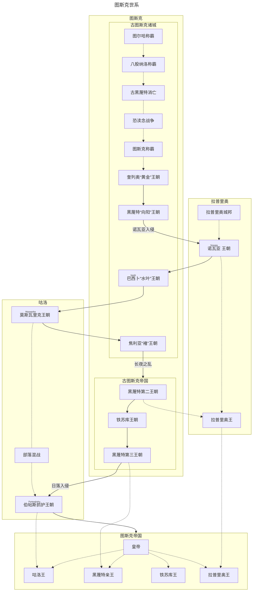

---
tags:
  - 图斯克
  - 年表
aliases:
  - 历史长河
---
# 历史长河

## ⏳ 历史总览

### 世系图

## 🛡️ 上古时代
> **核心特征**：部落扩张、早期城邦混战、原始多神信仰。

| 年份          | 事件       | 影响                         |
| :---------- | :------- | :------------------------- |
| **BC 3500** | 古图斯克部落形成 | 西部山脉早期聚落出现，青铜冶炼初步发展。       |
| **BC 3000** | 早期城邦形成   | 原始多神信仰体系确立，出现十余个独立城邦。      |
| **BC 2800** | 俺东蛮族入侵   | 八股纳洛与黑蔑特地区首次结成城邦联盟抵御外敌。    |
| **BC 2400** | 恐渎念海盗入侵  | 沿海诸城受到重创，引发了长达两百年的信仰与生存危机。 |
| **BC 2180** | 恐渎念战争结束  | 诸城进入相对平稳的恢复期，古图斯克开始崛起。     |
| **BC 1700** | 古图斯克曲折统一 | 农业效率提高，锻造水平增长，为王朝建立奠基。     |

---

## 🏛️ 城邦时期
> **核心特征**：首次大一统、贵族共和尝试、传送技术革新。

### [[奎列奥王朝]]
- **BC 1500**：奎列奥家族首次统一图斯克及八股纳洛。
- **BC 1200**：黑蔑特城邦势力抬头，形成地方割据。
- **BC 900**：马塔肖萨门一世迁都黑蔑特，架空皇权。

### [黑蔑特第一王朝](朝代更迭/黑蔑特王朝.md)
!!! info "王朝基石"
    黑蔑特第一王朝确立了图斯克的商业基础与官僚体系雏形。

- **BC 883**：[[马塔肖萨门二世]] 建立王朝，修筑马塔肖萨门大道。
- **BC 845**：[[波拉斯蓬]] 征服克鲁索法，开采金矿，图斯克国力达至顶峰。
- **BC 650**：**[[七家共治]]** 开始。中央集权瓦解，由七大贵族家族组成元老议会共同执政。
- **BC 598**：[[卓奥西一世]] 废除共和，确立帝国标准疆域。

### [[拉普里奥王朝]] 与 巴西卜
- **BC 455**：南方的  利用传送法阵网络建立诺瓦亚王朝。
- **BC 278**：巴西卜王朝驱逐拉普里奥人，形成南北割据。

---

## 🐎 前帝国时期
> **核心事件**：咕洛征服、灵语黄金期、白银时代。

### [[莫斯瓦里克王朝]]
- **BC 183**：咕洛大酋长 [[图录亥刻]] 发动“海峡战役”，征服黑蔑特。
- **BC 150**：**灵语黄金期**。确立了灵语者（皎忽匝依）的祭司地位，推行宗教改革。

### [[朝代更迭/黑蔑特王朝|黑蔑特第二王朝]]
!!! abstract "白银时代"
    BC 26 - BC 5 年间，在奥勒曼的统治下，图斯克迎来了农业与贸易的全面复苏。

- **BC 48**：**“长夜之乱”**。政变引发长达二十年的割据混战。
- **BC 26**：奥勒曼统治时期，银币 `古冶` 成为通用货币，国库充盈。
- **BC 5**：大瘟疫爆发，铁苏库·德卓黑作为政治盟友崛起。

---

## 👑 帝国时期
> **核心特征**：铁苏库集权、日落宴会、百年乱局。

### [[朝代更迭/铁苏库王朝|铁苏库第一王朝]]
- **AD 1**：**[[德卓黑一世]]** 攻破哈希特城，确立图斯克公元，利用传送法阵遗产平定四方。

### [黑蔑特第三王朝](朝代更迭/黑蔑特王朝.md) 与[[伯帖斯抓护王朝]]
- **AD 48**：黑蔑特短暂复辟，法坨一世在“日落宴会”遇刺。
- **AD 50**：**“日落女皇”** 瓦特苏卡瑟姆入主黑蔑特。
- **AD 58 - 150**：**“百年乱局”**。
    - 中央集权名存实亡，皇位更迭频繁。
    - **正面影响**：税收宽松，民间商业与自由贸易空前繁荣，文化多元化。

### [[朝代更迭/铁苏库王朝|铁苏库第二王朝]] 
!!! success "集权巅峰"
    德卓黑三世通过军事改革与货币统一，彻底终结了地方割据。

- **AD 153**：[[德卓黑三世]] 领导起义，收复哈希特城。
- **AD 155**：摧毁诺瓦亚城，终结拉普里奥军事割据，推行嫡长子继承制。
- **AD 170**：安忽而蔑特受封第一任铁苏库王。
- **AD 175**：莱斯卫即位。

---