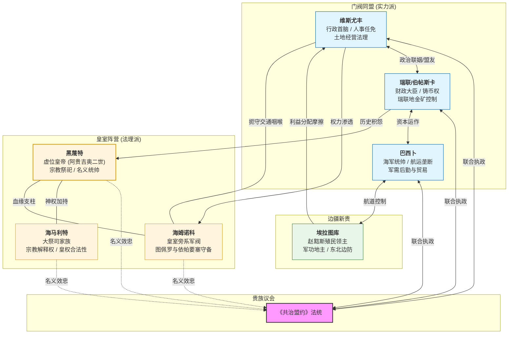

---
tags:
  - 历史
  - 事件
  - 黑蔑特
---
# 七家共治：贵族共和与帝国的黄昏

!!! wiki "历史时期：七家共治 (The Heptarchy)"
    | 属性 | 描述 |
    | :--- | :--- |
    | **时间跨度** | 前 650 年 – 前 598 年（共 62 年） |
    | **前置事件** | 塔莫格三世遇刺 |
    | **终结事件** | [卓奥西一世](../../40_家族血脉/黑蔑特/卓奥西一世.md)建立终身执政官制度 |
    | **政治体制** | 寡头共和制 |
    | **核心矛盾** | 中央法统衰落 vs 地方门阀崛起 |

## 1 超速扩张的帝国
### 1.1 铁血摄政的代价

<b><ruby>阿贵吉奥<rt>Aguijio</rt></ruby></b>的统治虽然被称为帝国的极盛期，但他留给继承者的，是一个外表光鲜却内部千疮百孔的政治遗产。阿贵吉奥治下的帝国，先是击败了帝国主要的几个蛮族敌人，同时收复了古阿山脉盐矿和瑞联地金矿；帝国的殖民也进入了高速发展期，帝国各地的埃拉图库和维苏库纷纷想方设法扩展自己的领地和势力。

这一时期的图斯克气候也相对温暖平和，帝国腹地图斯克盆地的粮食产量相当充足，帝国的人口不断上涨也促使了帝国人向外不断的征伐和殖民。

也是在这一时期，图斯克人在赵黠斯的存在才成为了一个固定的事实：图斯克人在赵黠斯建立了库久港，也在库久港附近建造了一系列用于物资转换的城镇；赵黠斯丰沛的水土所催生的大量优质林木被开采，用于当地建筑的建设，也被销往帝国各地，乃至拉普里奥。

尽管帝国在阿贵吉奥治下一篇欣欣向荣，但飞速向外扩张的模式还是给帝国留下了许多隐患：帝国各地的殖民军官团和贵族想要进一步扩大自己的影响力，在殖民地的分配上攫取更多利益；各殖民地的原住民或有逃去远方的，却也有相当一部分留下来静待转机。

阿贵吉奥本人在位时，他尚且能够凭借丰厚的军功、个人的威望、忠诚的军队来控制帝国的一切，在帝国的诸多矛盾中寻求到一个脆弱的平衡。但当这位武功皇帝死去后，他的继任者塔莫格三世，尽管并不懦弱也不算昏庸，却还是最终倒在了早就在阴谋算计皇室的诸贵族手中。

#### 1.1.1 瑞联家族的倒戈：被背叛的盟约

[瑞联家族](../../40_家族血脉/瑞联/index.md)自[波拉斯蓬](../../40_家族血脉/黑蔑特/波拉斯蓬.md)时代以来就是皇室在瑞联地金矿的掌握者，瑞联地也因此而得名。到阿贵吉奥时代，瑞联家族已经一跃而成为帝国最为富裕的家族之一，牢牢地把控着帝国的铸币和财政大权。

在阿贵吉奥掌权初期，为了对抗盘踞朝堂的[维斯尤丰](../../40_家族血脉/维斯尤丰/index.md)，他曾寻求瑞联家族的支持，并迎娶了哈希特瑞联家族捧在掌心的，当时号称帝国第一美女的长女<b><ruby>维斯帕安<rt>Wespan</rt></ruby></b>为后。瑞联家族倾尽家财资助阿贵吉奥的军队，同时也在战争中牟取了相当大的利益。

然而，当阿贵吉奥大权在握并发动“瑞联地大战”时，他为了筹集足够的军饷，不仅随便找了一些由头罢免了瑞联家族的几个负责金矿开采的官员，将金矿的开采权收归了中央，同时也在瑞联家族在金矿附近的领地征收重税，以填补瑞联地大战所带来的帝国财政的的赤字。

有观点指出，阿贵吉奥本可选择[维斯尤丰](../../40_家族血脉/维斯尤丰/index.md)或巴西卜等关系较疏远的家族作为惩戒对象，以达到震慑不臣、稳固皇权的目的，从而避免其统治后期及继任者陷入政治孤立的困境。

针对其最终选择清算瑞联家族的原因，部分史学家倾向于归咎于王后维斯帕安的个人行为。维斯帕安素有“帝国第一美女”之称，作为瑞联家族的核心成员，据传其在位期间仍保持着骄纵乃至放荡的作风。**这种行为可能引发了阿贵吉奥的强烈猜忌，导致矛盾由后宫私情上升为对整个外戚家族的政治清算**。这一假说与史料记载中的几处疑点相吻合：在瑞联家族覆灭前夕，有关维斯帕安王后的文字记录在史书中突然中断；终其一生，维斯帕安和阿贵吉奥也没有诞下一子。

不论如何，尽管阿贵吉奥在位时，他仍能凭借自己的威信压制住瑞联家族，并且勉强保持他们的忠诚，但是当政权最终落到阿贵吉奥的堂弟/侄子塔莫格三世手里的时候，瑞联家族的这份忠诚就很难再继续维持了。

随着政治局势的日渐紧张，瑞联家族很快便秘密投靠了维斯尤丰一派，但在明面上仍然忠于塔莫格三世，这一转变也为最终塔莫格三世对局势的误判埋下了伏笔。

#### 1.1.2 军功新贵的崛起：埃拉图库与巴西卜

阿贵吉奥治下的图斯克，由于气候的转圜和帝国奇迹般地连续十几年的丰收以及十几年未曾出现瘟疫，国力达到了马塔肖萨门以来的顶峰。哈希特城的人口在那时可能接近二十万。没有任何一个古典国家的君主能够抵御开疆扩土的诱惑，阿贵吉奥的征伐在他即位后不就就开始了。阿贵吉奥先是征伐了赵黠斯，扩张了库久港，并在更靠近安纽科萨丛林的地方设立了更多的堡垒；重新夺回瑞联金矿，并扩大了在那里的开采；在南方的古督卡走廊建立长城防止南方的卡扎卡人入侵。

这一时期在帝国的快速的对外扩展中，一些军功贵族很快就乘着东风成为了帝国的新贵。其中最为显赫的有：

*   **埃拉图库家族 (Eratuku)**：该词在古语中意为“地主”，反映了其对土地资源的绝对控制。家族核心成员原为阿贵吉奥征服**赵黠斯 (Drosias)** 地区的先锋军官团。他们实际上并不是一个统一的家族，其中有许多军官都拥有自己的
*   **巴西卜家族 (Basib)**：不同于埃拉图库家族的军事割据，巴西卜家族崛起于军队后勤体系。作为特许商团，该家族主要负责前线补给运输及战利品处置，并借此垄断了帝国主要水系的航运与贸易路线。通过军需贸易与走私活动，该家族积累了巨额财富。据塔莫格三世时期的民间俗语形容，巴西卜家族与老牌财阀维斯尤丰家族的财富总和，足以买下三座哈希特城。

阿贵吉奥逝世后，帝国权力结构发生失衡。这些在战争中崛起的新兴军事贵族掌握了土地、军队与资本，不再满足于作为皇室的附庸。他们转而寻求进入帝国决策中枢，意图攫取与其实力相匹配的政治地位。

### 1.2 塔莫格三世的困局：笼中之狮

**塔莫格三世**也并非无能的庸主，他试图维持阿贵吉奥给他留下的一个在飞速扩张的帝国的政治生态，但是他并没有阿贵吉奥那样的手段，他本人由于是阿贵吉奥从家族的旁支收养的，其血统也常常遭到诸大臣、元老的质疑，他悲哀地发现，自己处于一个死局之中：

**朝堂之上**过去层遭到数次清洗的维斯尤丰家族展现出了惊人的韧性。他们利用阿贵吉奥死后的权力真空，迅速与对皇室不满的瑞联家族结盟，控制了元老院的话语权。

**边境之外**的埃拉图库家族和巴西卜家族以“边境防御”为由，扩大武装、截留税款，实际上已经形成了听调不听宣的割据态势。

塔莫格三世曾试图通过提拔下层军官来重组禁卫军，试图再度将权力集中到自己手里，但是由于他个人的威望不足以及黑蔑特家族的人财凋敝，他集中权力的尝试不但没能削弱蠢蠢欲动的贵族们，反而触动了所有贵族的神经，成为了政变的导火索。

### 1.3 寒冬之乱和《共治盟约》的签立

前 650 年的天气尤为寒冷，帝国上下都弥漫着不安的情绪。冬天，哈希特的粮食价格在维斯尤丰、瑞联、巴西卜等贵族家族的操控下飞涨，同时城内充满了关于塔莫格三世的血统的谣言，皇室的正统性遭到极大的破坏。

塔莫格三世在这种情况下仍然试图继续他从贵族手里收回权力的计划，他一方面催促帝国的官僚尽快通过向马塔肖萨门法中添加条例来限制维斯尤丰等家族的权力，另一方面试图绕开诸家族，恢复被他们拆解的，帝国旧日的行政税收系统。

塔莫格三世试图发信调集海姆诺科在图佩罗堡垒一带驻扎的军队，但是哈希特城内仍然拥护他的人已经不多了，他派出信使的消息被埃拉图库家族的人所知晓，埃拉图库没有成功拦截信使，但是所有密谋倒皇的家族都已经知道，此时已经是箭在弦上了。

维斯尤丰的人很快取得了哈希特城防军的控制权，王宫内的卫队也早已经被巴西卜家族的势力把控，塔莫格三世只剩下阿贵吉奥临死前留给他的一些特务，完全无力阻挡诸家族的逼宫。

塔莫格三世被软禁，直到死亡人们也很少再听到他的消息。

黑蔑特家族的余党，尽管作为皇族的他们也有着自己的势力，但是面对着家族首领被软禁的境地，他们能做出的反应也相当有限。塔莫格三世之子阿贵吉奥二世被推举上了皇位，作为一个虚主。

此时朝政已经由各大家族所把持，各大贵族为了如何瓜分胜利果实而争论不休、最终由维斯尤丰和巴西卜牵头起草了《共治盟约》，规定图斯克的皇位仍然由黑蔑特家族年幼的阿贵吉奥二世担任，但帝国的行政和税收制度被彻底改变了，七个家族瓜分了殖民过程中所产生的各种利益。

### 1.4 七家共治：新的平衡

随着誓约的签订，一种微妙的**寡头共和**格局形成：

维斯尤丰联盟一方，由势力最大，家族最古老的维斯尤丰家族把控了国家的行政和人事任免，同时把握了帝国最关键的“土地经营权”，扼住了各家族继续扩张的法理命脉。

瑞联家族收回了被皇室占有的金矿开采权，把握了国家的铸币权。

埃拉图库则代表了赵黠斯地区的利益，掌握了黑蔑特海峡东方的殖民权和对东北方咕洛人相关事务的处理权。

巴西卜家族作为新贵，把握了国家的航运和很大一部分的帝国海军。

黑蔑特一方，黑蔑特皇室保留了宗教祭祀权和名义上的最高军事统帅权（这部分显然成为了需要新成立的贵族议会共同商讨决定的），也勉强保留了一部分皇家卫队的控制权。

海姆诺科作为黑蔑特家族在波拉斯蓬时期分出去皇室旁系，把控着图佩罗和依帕堡垒以及周遭领地的控制权。

海马利特作为宗教祭祀家族，协助者黑蔑特继续掌控帝国的宗教解释权，延续了命悬一线的皇室法理。

图斯克自此从王政滑向了贵族共和的时代，这一时期帝国对于殖民利益的统一分配权彻底丧失，各家族各显神通在帝国边境疯狂扩张，为之后帝国的一系列剧变埋下了深刻的伏笔。同时这一时期原先利益相同的七大家族开始因为利益分配的不均而产生嫌隙。

## 不均的利益分配

