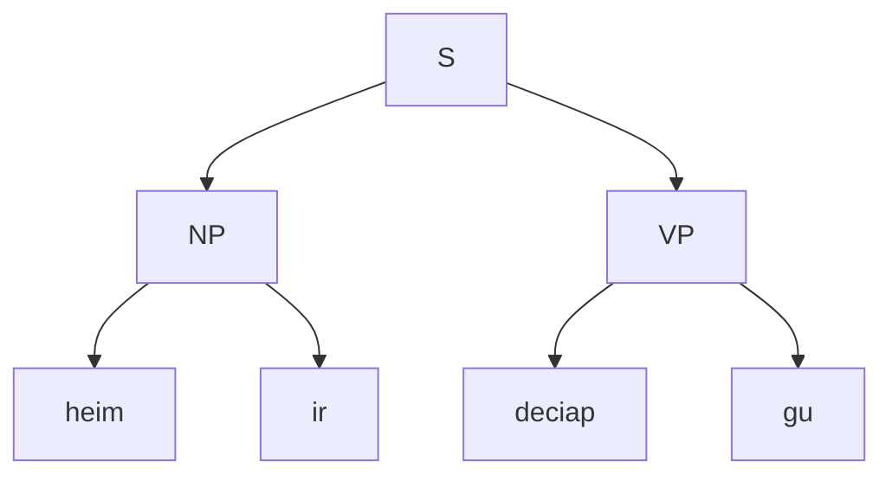
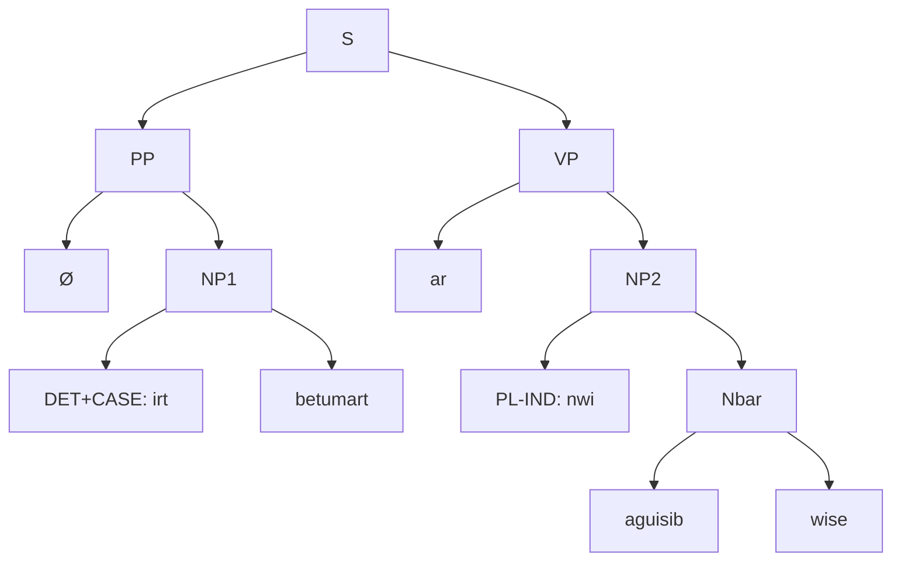

!!! wiki "图斯克语概述"
	
	|   |   |
	|---|---|
	|**使用地区**|图斯克帝国全境，主要为黑蔑特、铁苏库、图尔哈、俺东、大拉普里奥等地区|
	|**语系**|拉埃拉德语系（原始拉埃拉德语—古图斯克语—图斯克语）|
	|**官方地位**|图斯克帝国官方语言（海峡图斯克语，即黑蔑特方言）|
	|**方言**|沿海（海峡）方言、西部山地方言、东部山地方言（分北、南两支）|
	|**文字**|图斯克字母（源自古图斯克碑文与方尖碑文字）|
	|**研究机构**|皇家学会（铁苏库王朝设立）|

# 图斯克语

**图斯克语**是图斯克帝国的官方语言，其标准语基于**海峡图斯克语**（即黑蔑特方言）。本书主要记述该语言在帝国历一百七十五年左右，皇帝铁苏库·莱斯卫在位第二年时正式采用的形式。图斯克语的使用范围覆盖黑蔑特、铁苏库、图尔哈、俺东及大拉普里奥等广阔地域，形成一个**方言连续体**。

## 1 简介

### 1.1 📜 历史与研究背景

本书的编纂得益于铁苏库王朝第三位皇帝——**铁苏库·德卓黑三世**的推动。他在灵语的启示下，组织发掘了多处古代遗迹，包括米斯特那提拉的咕洛语石碑、拉普里奥山区的密比恩方尖碑以及古图斯克的众多雕像。随后，他创立了**皇家学会**，并专设机构为其提供资金与人力，系统研究帝国内的各种现象。

在德卓黑三世执政的十五年间，学会致力于破译这些遗迹上的文字，成果构成了今人对**古图斯克语**乃至**原始拉埃拉德语**认识的基础。皇帝去世后，学会经费缩减，古迹研究放缓，转而整理已有资料，并通过比较语言学方法研究图斯克各地区方言，这成为本书的重要基础。

现任皇帝**莱斯卫**登基后，下令编纂记录帝国各地状况的丛书。恰逢学者**大皎忽匝依**试图拓展对灵语的研究，于是学会受托撰写此部图斯克语专著，以辅助相关研究。

### 1.2 🗺️ 方言分布

图斯克语方言大体可分为**沿海方言**与**山地方言**两类，山地方言进一步分为东部与西部。

- **沿海方言**：分布于诺瓦亚海沿岸，包括黑蔑特方言在内。其词汇系统高度统一，但在音段发音上存在地域差异。
- **西部山地方言**：涵盖北起俺东、南至齐米亚克的连绵山地，内部一致性较强，形成一个相对连贯的方言连续体。
- **东部山地方言**：分为南北两支。北部山区邻近咕洛族聚居区，受咕洛语影响显著，发音与用词均具特色；南部方言则与当地赵黠斯地区、古督卡-卡扎卡地区的土著语言融合，形成各具特色的方言或混合语。

### 1.3 🏛️ 语言地位与使用情况

在帝国非图斯克族群主导的地区，多实行**双语制**：
- 拉普里奥地区原有语言仍为该地区的主要语言，但是教会和公文往来已经被图斯克语所掌控。
- 咕洛族地区因守旧势力抵制图斯克化，且各部族间沟通有限，仍保留较强的双语并行状态，同时使用本族语与图斯克语。

总体而言，掌握**海峡图斯克语（黑蔑特方言）** 者在帝国大部分富裕、人口密集地区可顺畅交流。在拉普里奥及东南山区可能遇到理解障碍，但在咕洛地区的城镇、俺东、八股纳洛等地，仍能找到精通官方语言的向导或旅店服务人员。

> **译者注**：本书译文在部分段落结合现代汉语视角进行了注解与调整，例如加入词汇对照与中译示例，以便读者了解图斯克语。某些叙述角度可能与原文略有不同，特此说明。

***
## 2 音系

### 2.1 音段总藏

图斯克语的**音系**颇为简单：

标准图斯克语基础的**元音**只有五个音段，其中两个 a、o 存在鼻化变体，但在部分方言中 i, e 可能也存在在鼻辅音附近的鼻化现象；存在大量双元音，尽管存在绝对音位上的差距，但是仍可以视作两个元音音位之间的移动。

标准图斯克语的**辅音**音段共有 24 个，如下表所注。总体而言较为对称, 存在较为规律的送气不送气对立，但缺乏浊塞音；龈颚音的一列实际上是齿龈音在前元音 i 前的懒化，在正字法中不表达。

#### 2.1.1 元音

下表是图斯克语的元音拉丁正字及其 IPA 对照

| 元音  | 发音（IPA） |
| --- | ------- |
| a   | /ä/     |
| o   | /ɔ/     |
| e   | /ɛ/     |
| i   | /i/     |
| u   | /u/     |
| aa  | /ã/     |
| oo  | /~ɔ/    |
| ai  | /ai/    |
| oi  | /ɔi/    |
| au  | /aʊ/    |
| ia  | /ia/    |
| iu  | /iu/    |
| ui  | /ui/    |
| ua  | /ua/    |
| ue  | /uɛ/    |

---

#### 2.1.2 辅音

| 序号  | 拉丁正字 | IPA     |
| --- | ---- | ------- |
| 1   | m    | m       |
| 2   | n    | n       |
| 3   | ng   | ŋ       |
| 4   | b    | p       |
| 5   | d    | t       |
| 6   | g    | k       |
| 7   | p    | pʰ      |
| 8   | t    | tʰ      |
| 9   | k    | kʰ      |
| 10  | h    | h       |
| 11  | s    | s,ɕ     |
| 12  | z    | z,ʑ     |
| 13  | j    | ts,tɕ   |
| 14  | c    | tsʰ,tɕʰ |
| 15  | l    | l       |
| 16  | r    | r       |
| 17  | w    | w       |
| 18  | y    | j       |

| 发音部位 | 送气  | 唇音     | 齿龈音     | 龈颚音     | 软腭音   | 声门音 |
| ---- | --- | ------ | ------- | ------- | ----- | --- |
| 鼻音   |     | m      | n       |         | ŋ(ng) |     |
| 塞音   | 不送气 | p (b)  | t (d)   |         | k (g) |     |
|      | 送气  | pʰ (p) | tʰ(t)   |         | kʰ(k) |     |
| 擦音   |     |        | s       | ɕ (s)   |       | h   |
|      | 浊   |        | z       | ʑ (z)   |       |     |
| 塞擦音  | 不送气 |        | ts (j)  | tɕ (j)  |       |     |
|      | 送气  |        | tsʰ (c) | tɕʰ (c) |       |     |
|      | 浊   |        | dz      | dʑ (dz) |       |     |
| 流音   |     |        | l\~ɾ(l) |         |       |     |
| 颤音   |     |        | r (r)   |         |       |     |
| 边音   |     | w      |         |         | j (y) |     |

*** 

### 2.2 语音配列

在词语派生，变形的过程中，可能会发生各种音位的**连缀**，这里对图斯克语中常见的情况进行简单的叙述。

#### 2.2.1 元音连缀
图斯克语的**元音**连缀规则很简单：
两个短元音连缀时，若存在对应双元音，则读作对应的双元音；若不存在对应双元音，则取前一个元音，第二个元音的时值通常会空置。
若双元音和短元音连缀，优先取对应的三元音；若不存在对应的三元音，那么短元音在前时，取双元音第一个元音，按照短元音连缀的规则进行缩合；若双元音在前，则单元音脱落。
如果是派生、变形所致，那么在正字法中，会写作缩合后的形式；如果是词间连缀，发音上遵从规则，但不影响拼写。

#### 2.2.2 辅音连缀
图斯克语的**辅音**连缀，总体上而言遵从向前合并的原则，即同位置或同发音方式的辅音连缀时，倾向于向前合并。当然也存在各种情况的特例，并且也根据具体方言的不同而有所不同。

***
### 2.3 重音

**重音**通常在词干的**第一音节**上，若前缀为弱化类或单音节前缀，通常，重音仍在核心词根的第一音节。

*** 
### 2.4 历时音变
本节描述的是从拉埃拉德原始语到海峡图斯克语所发生的可总结的系统性历时音变，在实际的图斯克语和拉埃拉德原始语的比较中也发现存在各种个例，仅供研究者和读者参考。

#### 2.4.1 元音

| 规则编号 | 规则形式                                       | 条件/环境          |
| ---- | ------------------------------------------ | -------------- |
| V 1  | V → Ṽ / {m, n, ŋ}                         | 元音邻近鼻辅音        |
| V 2  | Vː → VV → 短元音合并裂化                          | 长元音裂化为双元音      |
| V 3  | V → [+前] / \{t, d}   V → [+后] / \{k, g} | 前/后辅音环境        |
| V 4  | VV → Ṽ / [+鼻音]   VV → V / elsewhere    | 双元音邻近鼻音鼻化，否则保留 |
| V 5  | 双元音后元音脱落 → 单元音                             | 腭化辅音间环境        |

#### 2.4.2 辅音

| 规则编号 | 规则形式                                          | 条件/环境           |
| ---- | --------------------------------------------- | --------------- |
| C 1  | d → dz / σ[-重音]                               | 非重读音节首          |
| C 2  | ts → tɕʰ / \{i}   ts → tsʰ / \{ɔ, u}       |                 |
| C 3  | 送气辅音保留对立                                      | 所有环境            |
| C 4  | 浊塞音去送气化                                       | 与清送气对立          |
| C 5  | ts → dz / VV                                  | 元音间位置           |
| C 6  | 词尾鼻音脱落，元音鼻化                                   | 音节尾鼻音 V 1 → C 6 |
| C 7  | d → dʑ / \{i, e}   d → {d, dz} / elsewhere | 前元音触发颚化         |
| C 8  | z → ʑ / [-重音] ∪ \#                            | 非重读音节或词尾        |
| C 9  | 词尾塞音脱落                                        | 所有塞音在词尾         |
| C 10 | 词尾擦音/流音弱化                                     | s, z, l, ɾ在词尾   |
| C 11 | 声门擦音 h 脱落                                     | 词首              |
| C 12 | 部分颤音 r 脱落                                     | 元音间             |
| C 13 | ʂ → {ʑ} / {i} ʂ → {s, z} / elsewhere       |                 |

#### 2.4.3 其他

| 规则编号 | 规则形式                  | 条件/环境        |
| ---- | --------------------- | ------------ |
| O 1  | l\~ɾ → w / {o, u} ∪ # | 邻近圆唇元音或词尾    |
| O 2  | 词尾塞音弱化为鼻音             | 开元音节尾塞音      |
| O 3  | 多音节词尾音节脱落，前音节补偿音长     | 尾音节脱落补偿前音节元音 |
| O 4  | 颚化擦音保留对立              | 闭音节辅音擦化      |

---

## 3 形态
### 3.1 动词

本节详述标准图斯克语动词的形态变化系统。图斯克语动词呈现出典型的高度黏着特征，其形态变化不仅是丰富构词的手段，更是构建句法框架的核心机制。动词形态的运作遵循严密的层级逻辑：越靠近词根的成分，越倾向于改变词汇的基本语义（派生）；越远离词根的成分，越倾向于通过时、体、气等范畴将动词锚定在具体的句法语境中（屈折）。

#### 3.1.1 形态结构总览

图斯克语动词的形态结构可被视为一个以词根为核心的同心层级系统。其基本框架遵循 **前缀 + 词根 + 后缀** 的线性序列：

$$\mathbf{Prefixes} \text{ (主体/内涵)} + \mathbf{ROOT} \text{ (词根)} + \mathbf{Suffixes} \text{ (客体/外延)}$$

在这一框架下，各词缀占据固定的句法槽位，其完整生成序列如下：

$$\mathbf{[P_1 否定]} + \mathbf{[P_2 语态/减价]} + \mathbf{ROOT} + \mathbf{[S_1 增价]} + \mathbf{[S_2 态/方式]} + \mathbf{[S_3 语气/时]}$$

各层级功能界定如下：

1. **前缀区（内涵域）**：
    
    - **$P_1$ 否定**：位于最外层，对整个动词概念进行逻辑否定。
        
    - **$P_2$ 语态/减价**：处理动作的主体关系及配价削减（如被动、反身），改变主语的角色性质。
        
2. **词根（ROOT）**：承载核心语义概念。
    
3. **后缀区（外延域）**：
    
    - **$S_1$ 增价（派生层）**：最紧密的派生词缀，引入新的核心论元（如致使者、受益者），直接改变动词的配价结构。
        
    - **$S_2$ 态/方式（词汇层）**：描述动作进行的内部方式或状态（如彻底、急速），修饰动作本身的性质。
        
    - **$S_3$ 语气/时（屈折层）**：最外层的句法标记，负责标示语气（虚拟）和时态（未来），完成动词与句子的语法对接。
        

#### 3.1.2 配价系统

配价指动词所能支配的核心论元（主语、宾语等）数量。它是图斯克语动词分类的基石：

- 零价动词：无逻辑论元，主要用于描述自然现象（如“下雨”）。
    
- 一价动词（不及物）：仅支配一个**施事**论元（主语）。
    
- 二价动词（及物）：支配**施事**（主语）与**受事**（宾语）。
    
- 三价动词（双及物）：支配施事、受事及**与事/受益者**。
    

#### 3.1.3 前缀区：语态与否定

前缀主要负责处理动作的“减法”操作（否定或减少论元）及主语角色的调整。

| **槽位** | **类别**      | **词缀**  | **名称** | **功能/语义**               |
| ------ | ----------- | ------- | ------ | ----------------------- |
| **P1** | **否定**      | **a**   | 词汇否定   | 构建反义概念，直接否定动作或状态。       |
| **P2** | **语态 (减价)** | **kwa** | 被动态    | 降级施事，提升受事为主语，配价-1。      |
|        |             | **zi**  | 反身态    | 施事同时也是受事，动作回归自身，配价-1。   |
|        |             | **ma**  | 交互态    | 多个施事相互作为受事，强调共同参与，配价-1。 |

- 例句 A：交互态 (Reciprocal)

展示 $P_2$ `ma-` 如何处理群体行为，将“模仿”变为“互相模仿”。

> **原文**：`kahya mapaubau`
> 
> **词间对照**：海鸥 交互-模仿
> 
> **中译**：海鸥们在互相模仿。
> 
> **解析**：
> 
> - **词根**：`paubau` (模仿)。
>     
> - **前缀**：加上 `ma-` 后，配价减少，表示主语内部（海鸥群体）互为动作的施事和受事。
>     

- 例句 B：否定被动态 (Negated Passive)

展示 $P_1$ `a-` 和 $P_2$ `kwa-` 的叠加，用于描述某种状态的缺失。

> **原文**：`sywas akwadisyonau`
> 
> **词间对照**：序列 否定-被动-引导
> 
> **中译**：该序列未被引导（处于无序/失控状态）。
> 
> **解析**：
> 
> - **词根**：`disyonau` (引导)。
>     
> - **Step 1**：`kwa-disyonau` (被引导)。
>     
> - **Step 2**：`a-kwadisyonau` (未被引导)。
>     
> - 这种结构常用于描述抽象概念的状态。
>

#### 3.1.4 后缀区：派生与屈折

后缀区严格遵循 **$S_1$ 增价 $\to$ $S_2$ 态 $\to$ $S_3$ 屈折** 的顺序。这种排列反映了人类认知的自然顺序：先确定“谁参与动作（增价）”，再描述“动作怎么做（态）”，最后确定“动作何时/是否发生（时/气）”。

| **槽位** | **类别**       | **词缀**   | **名称** | **功能/语义**                |
| ------ | ------------ | -------- | ------ | ------------------------ |
| **S1** | **增价 (派生)**  | **de**   | 使动     | 引入致使者（使...做），配价+1。       |
|        |              | **rit**  | 受益     | 引入受益者（为...做），配价+1。       |
|        |              | **sek**  | 强迫     | 引入受迫者（逼...做），配价+1。       |
| **S2** | **态 (方式)**   | **morg** | 彻底态    | 强调动作完成的彻底性与完结性。          |
|        |              | **soi**  | 急速态    | 强调动作发生的速度与紧迫感。           |
|        |              | **twa**  | 撤销态    | 逆转已发生的动作（Undo）。          |
|        |              | **bor**  | 起始态    | 聚焦于动作的起始阶段（Ingressive）。  |
|        |              | **mau**  | 佯装态    | 描述动作的非真实性或模拟性质。          |
|        |              | **klo**  | 误行态    | 表示动作执行错误或结果偏离预期。         |
|        |              | **lu**   | 企图态    | 强调尝试与意图，不保证结果。           |
| **S3** | **气/时 (屈折)** | **es**   | 虚拟气    | 标记非现实情境（假设、条件）。通常先于时态后缀。 |
|        |              | **in**   | 未来时    | 标记动作发生于说话时刻之后。           |

- 例句 A：使动态 (Causative) - S1 层

展示 $S_1$ `de` 如何改变词义，将“懂”变为“解释/阐明”。

> **原文**：`ia gamaide mboem`
> 
> **词间对照**：我 懂-使动 他=NOM.ACC
> 
> **中译** 我使他明白/我给他讲解。
> 
> **解析**：
> 
> - **词根**：`gamai` (懂/理解)。
>     
> - **派生**：`gamai-de` 字面义为“使人懂”，在图斯克语中固化为“讲解”或“启蒙”的意思。
>     

- 例句 B：佯装态 (Pretend) - S2 层

展示 $S_2$ `mau` 描述动作的虚假性。

> **原文**：`kizy sisicmau`
> 
> **词间对照**：鸟类 发疯-佯装
> 
> **中译**：那鸟在装疯。
> 
> **解析**：
> 
> - **词根**：`sisic` (发疯)。
>     
> - **修饰**：`sisic-mau` (假装发疯)。这里后缀直接修饰了动作的性质，而不改变论元关系。
>     

- 例句 C：复合后缀链 (Complex Suffix Chain)

展示完整的 **词根 $\to$ 增价 $\to$ 方式 $\to$ 时态** 链条。

> **原文**：`nemludesoin`
> 
> **词间对照**：转-使动-急速-未来
> 
> **中译**：将快速旋转（某物）。
> 
> 解析：
> 
> 这是一个高信息密度的动词结构，构建过程如下：

| **结构层级**      | **语素**    | **含义**      | **逻辑演变**                                                  |
| ------------- | --------- | ----------- | --------------------------------------------------------- |
| **ROOT (词根)** | **nemlu** | 转 (Turn)    | 基础动作（自身旋转）                                                |
| **+ S1 (增价)** | **-de**   | 使动 (Make)   | **nemlu-de** (使旋转/Twist)      _词义变为及物动词_      |
| **+ S2 (方式)** | **-soi**  | 急速 (Rapid)  | **nemlu-de-soi** (猛拧/Spin fast)      _修饰动作方式_ |
| **+ S3 (时态)** | **-in**   | 未来 (Future) | **nemludesoin** (将要猛拧)      _锚定时间_            |

---

#### 3.1.5 其余形态变化

##### 3.1.5.1 未来时 (Future Tense)

未来时通过黏着后缀 `-in` 标记，位于动词形态的最外层。

> **例句 3**
> 
> 原文：`heimir ileyazin`
> 
> 词间对照：太阳=SG.NOM.DEF 发光=FUT
> 
> 中译：**太阳将发光**
> 
> _解析：`ileyaz`（发光）+ `in`（未来时）。_

##### 3.1.5.2 反复体 (Repetitive Aspect)

反复体是图斯克语中独特的形态手段，它不占据常规后缀槽位，而是通过**词根重叠（Reduplication）**实现的。它是动词内部的韵律构词手段，通常被视为发生在 $S_1$ 之前的基础形变。

- **规则**：
    
    - 开音节动词：重复末音节 + 后缀 `-n`。
        
    - 闭音节动词：重复最后一个**元音+辅音**对（VC）。
        

> **例句 7**
> 
> 原文：`okoir kegeg`
> 
> 词间对照：鸟=SG.NOM.DEF 吃~REP
> 
> 中译：**那鸟一直吃**
> 
> _解析：词根 `keg`（吃）为闭音节，重复韵尾 `eg` 形成 `kegeg`，表示动作持续。_

当反复体与其他后缀共现时，重叠形式作为词干接受后续黏着：

> **例句 8**
> 
> 原文：`okoir kegegin`
> 
> 词间对照：鸟=SG.NOM.DEF 吃~REP=FUT
> 
> 中译：**那鸟将会一直吃**
> 
> _解析：`keg` $\to$ `kegeg` (反复词干) + `in` (未来时)。_

##### 3.1.5.3 虚拟语气 (Subjunctive Mood)

虚拟语气标记 `-es` 属于 $S_3$ 屈折层，用于表达假设、条件或非实然状态。

1. **独立使用**：通常配合条件连词 `selip`（如果）。
    
    > **例句 10**
    > 
    > 原文：`selip barages`
    > 
    > 词间对照：如果 下雨-SBJV
    > 
    > 中译：**如果下雨**
    
2. **复合屈折**：当虚拟语气与时态共现时，遵循 **语气 ($S_{3a}$) + 时态 ($S_{3b}$)** 的内部顺序，无需连词即可表达复杂的时空假设。
    
    > **例句 11**
    > 
    > 原文：`baragesin`
    > 
    > 词间对照：下雨-SBJV-FUT
    > 
    > 中译：**如果（将来）会下雨**
    > 

##### 3.1.5.4 例句：反身与误行 (Reflexive & Mistake)

展示前缀与后缀同时作用于词根。

> **原文**：`zinoinklo`
> 
> **词间对照**：反身-阻-误行
> 
> **中译**：不小心绊倒自己（误阻了自己）。
> 
> **解析**：
> 
> - **Prefix**: `zi-` (反身，动作回向主语)。
>     
> - **Root**: `noin` (阻碍/阻挡)。
>     
> - **Suffix**: `-klo` (误行，表示意外或失误)。
>     
> - **语境**：常用来形容笨拙的行为。
>     

##### 3.1.5.5 例句：反复体 (Repetitive)

展示开音节词根的重叠规则。

> **原文**：`ulih msyasyan`
> 
> **词间对照**：仅仅 冥想~REP
> 
> **中译**：仅仅一直在冥想。
> 
> **解析**：
> 
> - **词根**：`msya` (冥想)，开音节结尾。
>     
> - **变形**：重复末音节 `sya` + `n` $\to$ `msyasyan`。
>     
> - **语义**：强调动作的持续不断或单调重复。
>
#### 3.1.6 派生

##### 3.1.6.1 去形容词派生

###### 3.1.6.1.1 `-yaz` 形成、呈现态

后缀 `-yaz` 是最常见的形容词动词化后缀之一。当它附加于形容词词根后，通常构建一个**呈现态（Emissive）**或**状态（Stative）**动词，意为“发出...的光/性质”或“呈现...的样子”。

构词公式：

$$\mathbf{Adj. Root} + \text{-yaz} \to \mathbf{Verb}_{\text{intr.}}$$

**示例分析：**

> **词汇演变：ileyaz**
> 
> - **词根 (Root)**: `ile` (adj. 光亮的 / bright)
>     
> - **派生后缀 (Suffix)**: `-yaz` (呈现 / emit)
>     
> - **结果**: `ile` + `yaz` $\to$ `ileyaz` (v. 发光 / to shine)

###### 3.1.6.1.2 `-bor` 形成（起动态 Inchoative）

后缀 -bor 用于构建起动动词，表示主语自然地“进入某种状态”或“变得具有某种性质”。

注：该后缀与动词屈折后缀 S2（起始态）同源，在派生层面它强调状态的变化过程。

构词公式：

$$\mathbf{Adj. Root} + \text{-bor} \to \mathbf{Verb}_{\text{intr.}} \text{ (变得...)}$$

**示例分析：**

> **词汇演变：aucibor**
> 
> - **词根 (Root)**: `auci` (adj. 安静 / quiet)
>     
> - **派生后缀**: `-bor` (变得 / become)
>     
> - **结果**: `auci` + `bor` $\to$ `aucibor` (v. 安静下来 / quieten down)
>     

**语境应用：**

> 例句
> 
> 原文：`okoir auciborin`
> 
> 词间对照：鸟=NOM 安静-变得=FUT
> 
> 中译：鸟儿将安静下来。

###### 3.1.6.1.3 `-de` 形成（致使动态 Causative）

后缀 -de 用于构建及物动词，表示施事者将某种性质赋予受事者，即“使...具有某种性质”。

这一派生后缀与动词增价后缀 S1（使动）的语素相同。

构词公式：

$$\mathbf{Adj. Root} + \text{-de} \to \mathbf{Verb}_{\text{tr.}} \text{ (使变成...)}$$

**示例分析：**

> **词汇演变：rolde**
> 
> - **词根 (Root)**: `rol` (adj. 深 / deep)
>     
> - **派生后缀**: `-de` (使... / make)
>     
> - **结果**: `rol` + `de` $\to$ `rolde` (v. 加深，深化 / deepen)
>     

**语境应用：**

> 例句
> 
> 原文：`ia roldein`
> 
> 词间对照：我 深-使=FUT
> 
> 中译：我将加深（这个坑/话题）。

###### 3.1.6.1.4 `-ic` 形成（行事态 Simulative）

后缀 `-ic` 用于构建表示“表现得像...”或“以...的方式行事”的动词。它将形容词描述的静态特质转化为动态的行为风格。

构词公式：

$$\mathbf{Adj. Root} + \text{-ic} \to \mathbf{Verb}_{\text{intr.}} \text{ (表现得...)}$$

**示例分析：**

> **词汇演变：kwenic**
> 
> - **词根 (Root)**: `kweni` (adj./n. 愁，忧虑 / sorrowful)
>     
> - **派生后缀**: `-ic` (行事 / act like)
>     
> - **结果**: `kweni` + `ic` $\to$ `kwenic` (v. 表现得忧愁，发愁 / mope, act sorrowful)
>     

**语境应用：**

> 例句
> 
> 原文：genir kwenicmau
> 
> 词间对照：人=NOM 愁-行事-佯装
> 
> 中译：那人在假装发愁。
> 

###### 3.1.6.1.5 **总结：形容词动词化后缀一览**

| **后缀**   | **名称** | **语义逻辑**      | **关联章节**   | **词例 (Adj → V)**                     |
| -------- | ------ | ------------- | ---------- | ------------------------------------ |
| **-yaz** | 呈现态    | 发出...光/性质     | 2.1.6.1.1  | `ile` (亮) $\to$ `ileyaz` (发光)        |
| **-bor** | 起动态    | 变得... (进入状态)  | 2.1.4 (S2) | `auci` (静) $\to$ `aucibor` (安静下来)    |
| **-de**  | 致使态    | 使变成... (赋予性质) | 2.1.4 (S1) | `rol` (深) $\to$ `rolde` (加深)         |
| **-ic**  | 行事态    | 表现得... (行为风格) | 独有派生       | `kweni` (愁) $\to$ `kwenic` (发愁/表现忧愁) |
### 3.2 名词
#### 3.2.1 主要词形变化

图斯克语名词格标记系统很规则，几乎没有例外。名词的主要变形如下表所示：

|            | 单数定指 | 单数非定指  | 复数定指      | 复数非定指     |
| ---------- | ---- | ------ | --------- | --------- |
| 主格         | -ir  | i, ... | -wor      | nwi, ...  |
| 宾格         | -im  | i, -em | -wem      | nwi, -em  |
| 属格         | -il  | i, -al | -wil      | nwi, -al  |
| 与格         | -irk | i, -ce | -wor      | nwi, -cei |
| 方位/伴随格/工具格 | -irt | i, -it | -wor (it) | nwi, -it  |

图斯克语中，定指形式用后缀-ir, -wor 进行表示，相对的，非定指形式由冠词-i, -nwi 进行表示；复数非定指的冠词在海峡图斯克语和书面中是必须的，但是小部分方言里省去了复数非定指形式的冠词。

对单数名词，当定指形式和格标记同时出现时，部分格标记和定指形式发生了缩合，非定指形式由冠词标记，则不与格标记产生变化；对于复数名词，格标记会产生类似复数形变的变化。

*** 

##### 3.2.1.1 格

在图斯克语的语法体系中，名词性成分的格位系统通常包含五个语法范畴，其中主格、宾格、与格、属格构成四大核心格位，另有一个附加格（涵盖方位、伴随或工具等语义）作为补充。以图斯克语为例：主格通过形态标记显性编码句法主语，即谈话的核心主题或动作的发起主体；宾格则特指及物动词的直接宾语，承担动作的承受者角色；与格对应间接宾语，标记动作的接受方或受益者；属格表达所属关系，构成名词间的从属关联。附加格作为多功能标记，依据语境动态呈现方位（处所）、伴随（协同对象）或工具（手段载体）等外围语义角色，通常伴随介词出现，由不同的介词具体承载信息。

在新派的海峡图斯克语中，名词性成分的格位系统有进一步简化的倾向，非定指形式的后缀在口语中，常常失去形变；附加格有并入宾格的倾向。但在本书中我们不对其做出讨论，一切以标准的海峡图斯克语为准。

***

接下来我们通过一些具体的例子对图斯克语的名词格系统进行说明。

在例句 1 “heimir deciap gu”中，“heimir”即名词 “heim”“日”的主格单数定指形式，在表中亦有呈现。

***

来看另一个例子：

> 例句
> 
> 原句：kenir keg gupo i okoem
> 
> 词间对照：狗=主格单数定指 吃 过去时完成体 单数非定指 鸟=宾格
> 
> 中译：那狗吃掉了一只鸟

这句话的主语为 “kenir”，其中“=ir”作为主格单数定指标记，指明了狗是吃这个动作的发起人，并且说明了只存在一只特定的狗；“keg gupo”是过去时完成体标记，此处不再赘述；“i okoem”即鸟的宾格单数非定指形式，这里“i”是单数非定指标记，而“=em”这个黏着的后缀则标记了该名词的宾格地位，也即“鸟”在这句话中是动作的接受者。

由于图斯克语存在格标记，陈述句的语序实际上可以很灵活，例如：

> 例句
> 
> 原句：i okoem kenir keg gupo 
> 
> 词间对照：单数非定指 鸟=宾格 狗=主格单数定指 吃 过去时完成体
> 
> 中译：一只鸟（被）那狗吃掉了

在这句话中，语序实际上变成了“宾格-主格-动词”的结构，通过宾语的前置实现了对宾语的强调，在具体语境下可能是在强调被狗吃掉的东西是鸟。在中文我们或许可以将其翻译成被动句，但是在语义上并不能完全等同，尤其是考虑到中文中的被动句多数具有一种贬义。

***

##### 3.2.1.2 定指

图斯克语的冠词系统通过形态手段对定指性和数范畴进行双重区分，形成四类显性标记。定指性单数采用后缀标记 -ir ，其实现形式直接附着于名词词干（如 naamar "家族" → naamar-ir "该家族"），而不定指单数则以前置独立冠词 i 构成（如 i naamar "一个家族"）。复数范畴的编码呈现不对称性：定指复数以后缀 -wor 标记（如 naamer-wor "这些家族"），不定指复数则依赖独立冠词 nwori（口语变体 nwi）前置（如 nwori naamer "多个家族"）。

该系统的形态实现受到词干音系结构的严格制约。当名词词干以元音结尾时，后缀 -ir 与-wor 需通过连音规则与词干元音衔接。独立冠词 nwori 在辅音丛语境下常发生音节缩减，其弱化形式 nwi 多见于非正式语域。

对复数定指形变而言，复数音变规则优先作用于词干，定指标记（-ir, -wor）随后依定指性选择，形态衔接受连音规则与语源音系特征约束。

| 数范畴 | 定指形式   | 不定指形式            | 示例（词干：namar "家族"）                  |
| --- | ------ | ---------------- | ---------------------------------- |
| 单数  | 后缀-ir  | 冠词 i + 词干        | naamarir "该家族"；i naamar "一个家族"     |
| 复数  | 后缀-wor | 冠词 nwo (ri) + 词干 | naamerwor "这些家族"；nwi naamer "多个家族" |

注：后缀形态受词干尾音制约，冠词 nwori 在口语中可简化为 nwi，其形式选择受语域及节律规则调节。

#### 3.2.2 语义类别

图斯克语名词可按含义分成五类。

第一类是抽象名词，表达情感、状态、概念等不具有可直接感知的实体的事物。

第二类是具体名词，表示可通过各种感官感知的、数量可分辨的实体。

第三类是物质名词，表示某些不可数的物质或材料，这一类名词在作形态变化时有特殊的处理方式：大多数的物质名词强制绑定复数形式，在涉及对该种类物质的描述时，通常加上黏着的后缀“=lis”，这在后文的名词派生中也有提到，但并不是所有能够通过“=lis”派生的名词都属于这一类，例如“wise”树，这一个名词就是一个具体名词，但它也可以通过“=lis”派生出名词“wiselis”意思是“这一种树”。

第四类是专有名词，是对特定地点、事物、个体、机构等的描述，通常不作变化，在图斯克语中，大量咕洛语的宗教性质借词也属于这一类。

第五类是时间名词，用于表示时间单位或时间段，这类名词相对封闭，很少有变化。

#### 3.2.3 派生

名词派生主要通过后缀将动词、形容词或其他名词转化为具有特定实体意义的名词。

##### 3.2.3.1 去动词名词

$$\text{名词} \leftarrow \text{动词} + \text{后缀}$$

| **后缀**    | **功能标签**  | **含义说明**    | **示例**               |
| --------- | --------- | ----------- | -------------------- |
| **-ke**   | **施事者**   | 动作的执行者      | **baguke** (杀手)      |
| **-sar**  | **专家/职业** | 职业性或习惯性的执行者 | **kegsar** (美食家/老饕)  |
| **-hel**  | **受事**    | 动作的直接承受对象   | **dibhel** (愿景/被想之物) |
| **-laft** | **产物/结果** | 动作产生的残留物或结果 | **metwalaft** (呕吐物)  |
| **-jo**   | **工具**    | 实现动作的器具     | **gudujo** (针/缝具)    |
| **-bjo**  | **容器**    | 盛放动作对象的器皿   | **bagebjo** (杯/壶)    |
| **-mart** | **场所**    | 动作发生的典型地点   | **haimemart** (床/寝塌) |
| **-sait** | **抽象过程**  | 动作的概念化状态    | **turhaisait** (战争)  |
| **-ik**   | **单次事件**  | 动作的一次具体发生   | **lebik** (一次来访)     |

值得一提的是，有别于图斯克语简单陈述句中的一般词序，去动词派生模式如果涉及到动词的受事者时，受事者会在动词前出现

- **句法模式 (SVO)**：**动词 + 宾语**。用于描述具体的、有时态的事件。例如 `Gago i japem`（正在切一块肉）。
    
- **构词模式 (OV)**：**宾语 + 动词**。宾语前置，标志着宾语作为动词的附属，也有说法认为是亲代语言的残留，形成一个固有的概念。
    
此规则常用于构建职业身份（如 `yuci-gudu-ke` 缝衣人）、专用工具（如 `Jap-gago-jo` 切肉刀）以及固有活动类型（如 `las-gago` 理发）。
##### 3.2.3.2 去形容词名词

$$\text{名词} \leftarrow \text{形容词} + \text{后缀}$$

| **后缀**    | **功能标签** | **含义说明**  | **示例**             |
| --------- | -------- | --------- | ------------------ |
| **-sait** | **性质**   | 抽象的属性概念   | **ansait** (善良/好)  |
| **-net**  | **度量**   | 属性的量度/尺寸  | **lainet** (大小/尺寸) |
| **-ke**   | **拟人/物** | 具有该属性的人或物 | **norke** (新人/新手)  |

##### 3.2.3.3 名词内在转类

$$\text{名词} \leftarrow \text{名词} + \text{后缀}$$

| **后缀**     | **功能标签** | **含义说明**   | **示例**             |
| ---------- | -------- | ---------- | ------------------ |
| **-ino**   | **指小**   | 小的、幼年的、亲昵的 | **komino** (小孩)    |
| **-la**    | **指大**   | 巨大的、宏伟的    | **goiraula** (大殿)  |
| **-az**    | **贬义**   | 坏的、腐烂的、劣质的 | **japaz** (腐肉)     |
| **-lis**   | **集合**   | 作为一个类属的整体  | **wiselis** (植被)   |
| **-yasli** | **领域**   | 某物主导的区域    | **wiseyasli** (林地) |

### 3.3 副词

***
### 3.4 封闭词类
#### 3.4.1 代词
##### 3.4.1.1 人称代词

| 尊卑层级  | 第一人称                    |       | 第二人称           |              | 第三人称     |       |
| ----- | ----------------------- | ----- | -------------- | ------------ | -------- | ----- |
| 特称    | Sekui（朕）                |       | Kuisou（陛下）     |              | —        |       |
| 尊称    | hirin （本人）              | 单复数同形 | sorin（您）       | 单复数同形        | mibok（怹） | 单复数同形 |
|       |                         |       | 北部：omsou （阁下）  |              |          |       |
|       |                         |       | 南部：lakome （大人） | 复数：lakomewor |          |       |
| 基础/中性 | ia （我）                  | iaki  | sou （你）        | souki        | mbo（他）   | mboki |
| 自指/谦称 | 通用：wan （在下）             |       |                |              |          |       |
|       | 男性：wak （鄙） /sewank （此身） |       | —              |              |          |       |
|       | 女性：haam（妾）/sewam （此身）   |       | —              |              |          |       |
|       |                         |       |                |              |          |       |

图斯克语人称代词系统通过多层次的形态分化和词汇选择，构建起反映社会等级制度的称谓体系。其基础人称系统包含 ia（我）、sou（你）、mbo（他/她/它）三个中性代词，复数形式通过后缀 -ki 构成（如 iaki“我们”、souki“你们”、mboki“他们”）。这一底层系统服务于日常平等交际，而更复杂的尊卑层级则通过特定称谓实现。

同时，图斯克语的人称代词存在尊称上的分化：

君主自称 Sekui（朕），用以和一般人自称做区分；臣民对君主使用 Kuisou（陛下），两者都凸显了皇权身份的尊贵。

社会尊称则呈现地域分化：第一人称尊称 hirin（本人/吾）单复数同形，用于上位者自称；第二人称北部使用 `omsou`（阁下），南部使用 `lakome`（大人），后者复数通过添加定指后缀 `-wor` 构成 `lakomewor`。第三人称尊称 `mibok` 源于复数词干 `mboki` 的语音演变，单复数通用，常用于称呼神祇，在图斯克-黑蔑特一带仅用于称呼神祇。

自指谦称系统以通用形式 wan（在下）为核心，通过形态变化实现性别分化：男性使用辅音强化形式 `wak` 或带前缀的 `sewank`，女性则为 `haam` 或 `sewam`。整个体系通过复数后缀 -ti 、定指复数 `-wor` 及语音演变（如辅音强化、元音交替），将社会层级编码于语言形式之中，映射出严格的尊卑秩序与地域文化差异

***

##### 3.4.1.2 指示代词

图斯克语的基础指示代词是二分的，`se` 表示近指的单数形式，`sa` 表示远指，直接继承自原始语。

在句中作名词时，遵守名词的语法变形规则。若用作名词的修饰词，则由 `sei`，`sawi` 分别表示近指，远指的复数形式，作为定指后缀的替代。

远指代词，在复杂句中也作为从句结束的标志存在。

***

##### 3.4.1.3 不定代词

图斯克语主要的不定代词如下表所示

| 拼写    | 释义  |
| ----- | --- |
| soazi | 全部  |
| soa   | 很多  |
| soj   | 一些  |
| hau   | 很少  |
| asea  | 其他  |
| soali | 更多  |

不定代词虽然作为名词性成分，但是也可以被用于修饰名词，来限定名词。

#### 3.4.2 介词

图斯克语的介词，可以作为独立成分使用，但是一般出现在附加格名词前作为黏着前缀。

| 拼写   | 释义    |
| ---- | ----- |
| ow   | 在……上  |
| eh   | 在……下  |
| siuy | 在……里面 |
| yau  | 在……外面 |
| we   | 从……   |
| gri  | 沿着……  |
| wi   | 在……附近 |

不同的动词可能与特定介词有着固定搭配。

***

#### 3.4.3 数词

图斯克语的数词系统为十进制：下表是一到十以内的基数词的说法

| 拼写      | 释义  |
| ------- | --- |
| ita     | 一   |
| sod     | 二   |
| mib     | 三   |
| badaa   | 四   |
| asu     | 五   |
| mo      | 六   |
| ak      | 七   |
| buzen   | 八   |
| dziu    | 九   |
| gi      | 十   |
| gita    | 十一  |
| giso    | 十二  |
| gimb    | 十三  |
| gibad   | 十四  |
| giasu   | 十五  |
| gimo    | 十六  |
| giak    | 十七  |
| gibuz   | 十八  |
| gidziu  | 十九  |
| sodgi   | 二十  |
| sodgita | 二十一 |
| kaha    | 百   |
| numrea  | 千   |

百以上的数词前，会加 `i-` 来表达仅有一的情况，例如：

> 一百 `ikaha`
> 
> 一千一百二十一 `inumrea ikahasodgita`

序数词直接在基数词后面加 `-k` 实现。

#### 3.4.4 连词

##### 3.4.4.1 并列连词

名词性成份间可用 `ag` 连接，来表达并列关系，例如：

`ita ku ag ita mea` 一个男人和一个女人。

当存在多个并列成份时，书面中应用 ag 依次连接，例如：

`ita ku ag ita mea ag ita normea` 一个男人和一个女人和一个女孩。但在口语中，最后一个 ag 之前的 ag 常常被省略。

##### 3.4.4.2 从属连词

#### 3.4.5 叹词

图斯克语的叹词较为简单：

`he` 表示犹豫、厌恶等，具体依声调而定。

`ala` 表示惊讶、也表示惊喜。

`ma` 表示否定，也表示就这样吧，也依声调而定。

***

## 4 简单句

### 4.1 基本语序与话题结构

图斯克语在句法类型学上属于典型的**话题优先语言**。虽然格标记系统允许 SVO 或 SOV 等多种底层语序共存，但在实际的语言运用中，句子的第一个成分总是被预设为**话题**，即谈话的中心对象或背景框架，而后续成分则是对该话题的**陈述**。

这种“话题优先”配合“定语后置”，使得图斯克语的句子往往以一个最为核心的名词（裸露或带定指）开场，随后紧跟其修饰语，最后是谓语陈述。

#### 4.1.1 话题前置规则

无论是主语、宾语，还是时间、地点状语，只要它是说话人想要强调的“已知信息”，就会被移至句首。

- **主语作为话题：**

    > `Kenir lai, japem keg gu.`
    > 
    > _词间对照：_ 狗=定指 大，肉=宾格 吃 过去时。
    > 
    > _中译：_ （那只）大狗吃了肉。

- **宾语作为话题：** 当宾语前置时，其宾格标记保留，构成类似汉语“把字句”或“话题化”的结构。

    > `Japem, kenir lai keg gu.`
    > 
    > _词间对照：_ 肉=宾格，狗=定指 大 吃 过去时。
    > 
    > _中译：_ （至于）那块肉，大狗吃了它。

### 4.2 名词短语

#### 4.2.1 中心语前置与定语后置

在标准海峡图斯克语中，名词短语的内部结构遵循严格的**中心语前置**原则。这意味着核心名词总是位于短语的最前端，而所有的修饰性成分——无论是形容词、领属者还是关系从句——都跟随在核心名词之后。

这一特征使图斯克语在听感上呈现出一种“层层递进”的逻辑：先抛出核心概念，随后再对其性状、归属进行限定。

> 译者注：这与现代汉语或英语的习惯（形容词在名词前）截然不同，而更接近于越南语或希伯来语的逻辑。

#### 4.2.2 形容词修饰

形容词直接置于被修饰的名词之后。 值得注意的是，名词的**定指后缀**（-ir/-wor）以及**格标记**（-im/-il 等）依然附着在核心名词上，而非移动到整个短语的末尾。

> 例句 17
> 
> 原句：`kenir lai`
> 
> 词间对照：狗=单数主格定指 大
> 
> 中译：那只大狗

> 例句 18
> 
> 原句：`baaja dziapk`
> 
> 词间对照：海 碧蓝的
> 
> 中译：碧蓝的大海

#### 4.2.3 从属

领属结构同样遵循后置原则，即 **[被拥有者] + [拥有者-属格]**。 当存在多层领属关系时，这种结构会形成一种链式延伸。

> 例句 19
> 
> 原句：`syecir tesukuil`
> 
> 词间对照：剑=单数主格定指 铁苏库=单数属格定指
> 
> 中译：铁苏库的剑

> 例句 20
> 
> 原句：`syecir pail ial`
> 
> 词间对照：朋友=单数主格定指 父亲=单数属格非定指 第一人称属格
> 
> 中译：我父亲的剑

---

### 4.3 动词短语

图斯克语的动词短语，其内部配列和名词短语趋同，遵从中心语前置，状语后置的顺序。

#### 4.3.1 句法时

图斯克语的时态系统呈现不对称的三分结构，过去时和现在时分别存在独立的语法标记词，而未来时则通过黏着的语法后缀表达。考虑到拉埃拉德原始语实际上存在一个对称的三分时态系统，可能在演化的过程中图斯克语先是丢掉了其中的未来时，变成一个二分的语法结构。从一个浪漫的角度推测，很可能是大灾变时代的到来导致人们对于未来失去了希望，更倾向于总结过去的经验以及安排当下的事情。

总而言之在简单句这一章节，我们主要讨论之前在构词中没有讨论的句法时，也即图斯克语时态系统中除了 `-in` 以外的两个，以助词为载体的句法层面上的时。这两个时的形态相对独立，在句子中的位置也相对灵活。

##### 4.3.1.1 过去时
图斯克语的过去时使用独立的标记词"gu"实现，用来表示事件发生在说话人讲述时间的过去，是一种相对时态。标记词一般紧跟在动词之后。

> 例句 1
> 
> 原文：heimir deciap gu.
> 
> 词间对照翻译：太阳=单数主格定指 升起 过去时.
> 
> 中译：（那）太阳升起了

例句 1 是一个很简单的例子，在这里只有一个名词性成分，即是话题焦点，也是所谓的主语成分。“heim”是图斯克语中对太阳这一概念的一种表述方式，但是这里用到的形式是“heimir”，是名词“heim”的单数定指形式，在词间对照翻译中也看到，“=ir” 即单数主格定指后缀。也就是说，“heimir”表达的概念近似于“（那）太阳”，在现代汉语的表达里没有严格对应的，或许可以类比于现代英语中的“The sun”。“deciap”是图斯克语表示“升起”这一含义的一种方式，应该是源自原始语，“de=”可以表达使动的含义，“deciap”可以被理解为“使高”。”gu“即图斯克语的独立过去时标记词，一般紧跟在所修饰的动词之后。

***

##### 4.3.1.2 现在时
当不添加标记时，也就是图斯克语动词通常状态下的词典形，一般视作动词的现在时，也称一般时，多用于描述普遍存在的现象和持续的、未完的动作。可以通过独立标记词“ho” 强调事件与谈话的同时性，也即进行体，这在后文对体的叙述中有所提及。

> 例句 2 
>
> 	原句：betumartirt nwi aguisib wise ar
> 
> 词间对照翻译：寒带地区=单数从格定指 复数非定指冠词 针叶的 树 存在
> 
> 中译：在寒带有针叶林

这句话包含了不止一个语法成分，我们先集中看本小节所要阐述的现在时（一般时），也就是“ar”这个动词在这里所处的形式。“ar”没有任何变形，意味着它既不表达过去，也不表达未来，而是表达一个宽泛的时间概念，陈述了这样一个事实，即“在寒带有针叶林，过去有，未来可能还有”。如果我们要强调当下在寒带有针叶林，可以用后文提及的进行体来表达。
#### 4.3.2 句法体  

##### 4.3.2.1 完成体  

图斯克语通过添加标记词"po"表示动作彻底完成且结果存续。若存在时态标记词，则和时态标记词合并作为一个标记。

> 例句 3.3.2.1.1
> 
> 原句：`heimir ebmoi po`
> 
> 词间对照翻译：`太阳=主格单数定指 落下 完成体`
> 
> 中译：太阳落下了

例句 3.3.2.1.1 是 `heimir emboi po`，通过完成体标记表示“太阳已经落下”，重点在强调太阳落下这一动作已经完成，并且现在太阳仍处于落下的状态。

> 例句 3.3.2.1.2
> 
> 原句：`heimir ebmoi gu po`
> 
> 词间对照翻译：`太阳=主格单数定指 落下 过去时完成体`
> 
> 中译：太阳（在过去）落下了

例句 3.3.2.1.2`heimir ebmoi gu po`，通过过去时-完成体的缩合词，表达了“太阳在过去就已经落下”的意思，强调动作完成的同时，也提及了主题相对于谈话时的时间。

> 例句 3.3.2.1.3
> 
> 原句：`heimir ebmoin po`
> 
> 词间对照：`太阳=主格单数定指 落下=未来时 完成体`
> 
> 中译：太阳（还会）落下

例句 3.3.2.1.3 不是一个常见的说法，未来时和完成体的连用，可以有两种解读：“太阳（总是）还会落下”，“太阳在未来的时间已经落下”。这个时态通常用于强调某种存续性，理论上来说可以存在这样的搭配，但在实际运用中并不常见。

##### 4.3.2.2 进行体

图斯克语的有 `ho` 作为独立标记词表示动作的持续性，未完成状态。

> 例句 7
> 
> 原句：`heimir ileyaz ho`
> 
> 词间对照： 太阳=主格单数定指 发光 进行体
> 
> 中译：太阳正在发光

`heimir` 表示“太阳”，而 `ileyaz ho` 通过进行体标志 `ho` 强调了太阳 `正在` 发光，重点是该动作与对话时刻的共时性。

#### 4.3.3 句法情态

除了前文所述的图斯克语的情态词缀以外，图斯克语海存在情态动词，位于动词派生结构之外，负责表达说话人的主观态度（意愿、判断）或客观条件（能力、可能性）。情态动词作为独特的一类动词，在后接从句或构词时不需要额外的助词 `sam`。

##### 4.3.3.1 祈使

祈使语气通过情态动词 `pa` 或 `pasingo` 表达对他人的命令或者祈使，一般只针对第二人称。 `pa` 近似于命令，`pasingo` 则更近似于 ` 请 ` 的礼貌表述，

以下是两个例子

> 例句 2.1
> 
> 原句: `sou pa keg`
> 
> 词间对照：第二人称单数代词 命令式 吃
> 
> 中译：你吃吧！
> 

> 例句 2.2
> 
> 原句：`sorin pasingo keg` 
> 
> 词间对照：第二人称单数尊称形代词 祈使式 吃
> 
> 中译：您请吃
> > 
> “sorin”在图斯克语中是一个第二人称的尊称形式，可以理解为“您”。

##### 4.3.3.2 必然

图斯克语用 "ying" 独立结构，作为必然情态的标记。

> 例句 14
> 
> 原句：ying baragin
> 
> 词间对照翻译：必然态 下雨=未来时
> 
> 中译：将来一定下雨

这句话很简单，用“ying”修饰了 “baragin”表达对未来的一种强预测，表达出中文“一定”、“必然”之类的概念。

##### 4.3.3.3 意愿

图斯克语的意愿情态，通过独立的"tyaa"（想），表达主语想要做某事，有做某事的意愿。

> 例句 13
> 
> 原句：ia tyaa keg
> 
> 词间对照：第一人称单数代词 意愿态 吃
> 
> 中译：我想吃

用“tyaa”表达意愿态，同时“tyaa”后一般跟动词词典形，在这里也就是无任何其他语法标记的“keg”。

##### 4.3.3.4 能力

图斯克语通过情态动词 "ning"（能），表达主语能够做某事，有能力做某事，通常紧接在主语后。

> 例句 14
> 
> ia ning bagues gu mboem
> 
> 词间对照：第一人称单数代词 能力态 杀=虚拟体 过去时 第三人称宾格
> 
> 中译：我本来能杀他

### 4.4 系词句 (判断句)

图斯克语中**不存在**相当于现代汉语“是”或英语“be”的系动词。系词句的构建依赖于名词性成分或形容词性成分的直接并列，即所谓的**零系词**结构。

#### 4.4.1 零系词结构

在一般现在时中，句子由 **[话题]** 和 **[说明语]** 直接构成。 由于图斯克语采用定语后置，为了区分“名词+修饰语”（名词短语）和“主语+形容词谓语”（句子），口语中依赖明显的**停顿**，书面语中则常以逗号或助词 `ne` 标示话题的结束。

- 形容词谓语：停顿
    
    > 例句 21
    > 
    > 原句：`Kenir, lai (ne)` 
    > 
    > 词间对照：狗=定指 （停顿） 大 （句末助词）
    > 
    > 中译：那只狗是大的。
    > 
    > _对比：_ `Kenir lai` （那只大狗——名词短语，非完整句子）
    
- 名词谓语：通过格标记谓语
    
    > 例句 22
    > 
    > 原句：`Ia Jaujyaem.`
    > 
    > 词间对照：第一人称 卫士宾格
    > 
    > 中译：我是卫士。
    

#### 4.4.2 时态变化

当需要表达过去或未来的判断时，时态标记词直接附着在谓语（名词或形容词）之后。

- **过去时：** 使用独立标记词 `gu`。
    
    > `Mbo Jaujyaem gu.` —— 他曾是卫士。
    
- **未来时：** 形容词或名词通常先接动词化后缀（如 `-yaz`），再接未来时后缀 `-in`；但在口语中，也常直接将 `-in` 附着于词尾。
    
    > `Heimir ileyazin.` —— 太阳会变亮/太阳将会是亮的。
    

#### 4.4.3 否定判断

使用否定副词 `mage` 置于谓语说明语之前。

> 例句 23
> 
> 原句：`Mbo mage Jaujyaem`.
> 
> 词间对照：第三人称 不 卫士=宾格标记
> 
> 中译：他不是卫士。

---

### 4.5 比较句

由于图斯克语采用**定语后置**的语序，比较结构也遵循“中心语+修饰成分”的逻辑。比较级通常通过介词前缀 `we-`（源自/从……）引出的介词短语来实现，该短语修饰形容词谓语。

#### 4.5.1 比较级

基本语序为：`[话题 A] + [形容词] + [we-比较对象 B]`。 这在字面意义上理解为：“A 是大的，相对于（从） B”。

> 例句 24
> 
> 原句：`Mbo lai we-iat.`
> 
> 词间对照：第三人称单数 大 从-我=方位格
> 
> 中译：他比我大。

#### 4.5.2 最高级

最高级通过助词 zi 实现

> 例句 25
> 
> 原句：`Sakha auqy zi.`
> 
> 词间对照：`那里 安静 最高级修饰`
> 
> 中译：那里是最安静的。

---

## 5 复杂句

### 5.1 名词性从句

名词性从句在主句中充当主语、宾语、表语或同位语。图斯克语根据从句是否具备独立的时态与陈述功能，严格区分**有限从句**与**无限从句**，并分别采用不同的语序。

#### 5.1.1 宾语从句

作及物动词的直接宾语。

1. 有限宾语从句用于表达独立的陈述事实，时态相对于主句独立。必须由宾语从句引导词 `maem` 引导，从句保持 **SVO** (主-谓-宾) 语序。

> 例句 29
> 
> 原句：`ia teis maem [mbo bagu gu migem].`
> 
> 词间对照：`我 知 引导词 [他 杀 过去时 龙=宾格]`
> 
> 中译：我知道[他杀了龙]。

2. 无限宾语从句用于控制动词（如“尝试”、“想要”、“开始”），强调动作与主句的紧密结合。此类从句无引导词且强制采用 OV (宾-谓) 语序，将动词置于最后以示从属。

> 例句 30
> 
> 原句：**Ia tauh [migem bagu].**
> 
> 词间对照：我 尝试 [龙=宾格 杀]
> 
> 中译：我尝试[杀龙]。

#### 5.1.2 主语从句

作全句的语法主语，通常置于句首，由引导词 `mair` 引导。

> 例句 31
> 
> 原句：**Mair [sou leb], an.**
> 
> 词间对照：引导词 [你 来]，好
> 
> 中译：[你来了]这件事，很好。

---

### 5.2 形容词性从句 (关系从句)

受名词修饰语后置规则的影响，图斯克语的关系从句位于其修饰的**先行词之后**。关系从句采用**缺空 (Gap)** 策略，即从句中与先行词指代相同的成分被省略。为了标示修饰范围的结束，通常在从句末尾使用指示代词 **sa**（那）进行封口。

#### 5.2.1 主语缺空

当先行词在从句中充当主语时。

> 例句 32
> 
> 原句：`Komeir [bagu gu migem sa] leb gu.`
> 
> 词间对照：人=定指 [杀 过去时 龙=宾格 那(封口)] 来 过去时
> 
> 中译：[杀了龙的]那个人来了。

#### 5.2.2 宾语缺空

当先行词在从句中充当宾语时，封口的助词采用分词 `sam` 。

> 例句 33
> 
> 原句：`Migir [komeir bagu gu sam] ud gu.`
> 
> 词间对照：虫=定指 [人=定指 杀 过去时 那(封口)] 死 过去时
> 
> 中译：[那人杀掉的]那条虫死了。

### 5.3 副词性从句

副词性从句在复合句中充当状语，修饰主句的动词、形容词或整个命题。此类从句通常由连词引导，位置较为灵活，但倾向于前置于主句以设定背景。

#### 5.3.1 时间状语从句

由连词 `alsim (当...时)` 或介词前缀 `eh- (在...下/后)` 引导。

> 例句 36
> 
> 原句：`alsim heimir ebmoi, ia ate.`
> 
> 词间对照：当 太阳 落下，我 睡
> 
> 中译：当太阳落下时，我睡觉。

> 例句 37
> 
> 原句：`eh-turhaisaitirt, mbo leb gu.`
> 
> 词间对照：在-尾部(之后) 战争，他 来 过去时
> 
> 中译：战争结束后，他来了。

#### 5.3.2 地点状语从句

由连词 `mart` (在...的地方) 引导。此连词源自疑问词 `ma` (哪里) 与方位格 `-irt` 的缩合。

> 例句 38
> 
> 原句：`ia gre mart i wiselis ar.`
> 
> 词间对照：我 住 哪里 不定冠词 树 存在
> 
> 中译：我住在有树的地方。

#### 5.3.3 原因状语从句

由连词 `garu (因)` 引导。

> 例句 39
> 
> 原句：`garu mbo ud gu, ia dih gu`.
> 
> 词间对照：因 他 死 过去时，我 哭 过去时
> 
> 中译：因为他死了，所以我哭了。

#### 5.3.4 结果状语从句

采用 `形容词 + soa (如此) ... olem (以至于)` 的结构。或有 `olem` 单独存在作连词表达  `结果` 的意思。

> 例句 40
> 
> 原句：`wetir lai soa, olem wise syowo gu.`
> 
> 词间对照：风=定指 大 如此，[引导] 树 倒 过去时
> 
> 中译：风大到树都倒了。

#### 5.3.5 目的状语从句

由连词 `tyaam` (为了) 引导。因目的通常表示未然的、概念性的动作，强制使用 **OV** (宾-谓) 语序的无限从句结构。

> 例句 41
> 
> 原句：`tyaam [migem bagu], ia kwei gu syecim`.
> 
> 词间对照：为了 [龙=宾格 杀]，我 买 过去时 剑=宾格
> 
> 中译：为了杀龙，我买了剑。

#### 5.3.6 条件状语从句

由连词 **selib** (若/如果) 引导。若表达“除非”，则使用 **selib mage** (若不)。

> 例句 42
> 
> 原句：`selib baragin, ia mage jepo.`
> 
> 词间对照：若 下雨-未来，我 不 走
> 
> 中译：如果下雨，我就不走。

#### 5.3.7 让步状语从句

由连词 `kamave` (虽/即使) 引导。

> 例句 43
> 
> 原句：`kamave mbo ning, mbo mage deud`.
> 
> 词间对照：虽 他 能，他 不 弄死
> 
> 中译：虽然他能（杀），但他没杀。

#### 5.3.8 方式状语从句

由连词 `kemse` (像...若 / 好像) 引导。

> 例句 44
> 
> 原句：`Mbo keg, kemse mbo ud ho.`
> 
> 词间对照：他 吃，好像 他 死(饿死) 进行体
> 
> 中译：他吃得像是快饿死了一样。

#### 5.3.9 比较状语从句

图斯克语的比较通常通过介词 **we-** (从/比) 实现短语比较；若涉及句子比较，使用结构 **kem** (像)。

> 例句 45
> 
> 原句：`Mbo lai we-ia=rt`.
> 
> 词间对照：他 大 从-我=方位格
> 
> 中译：他比我大。

> 例句 46
> 
> 原句：`Mbo bagu kem ia (bagu)`.
> 
> 词间对照：他 杀 像 我 (杀)
> 
> 中译：他像我一样杀戮。

#### 5.3.10 转折状语从句

> 例句 47
> 
> 原句：Mbo bagu ia=em, rage ia mage ud.
> 
> 词间对照：他 杀 我=宾格 但 我 没 死
> 
> 中译：他杀我但我没死
## 6 词序

