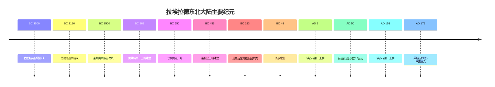

{ loading=lazy }

---

## 🌌 这是怎样的一个世界？

**拉埃拉德**（Laaerad）是一颗类地行星，悬挂着一道**魔力星环**。这里的魔法并非超自然奇迹，而是与高维宇宙交织的物理法则；这里的文明兴衰，与天体的运行周期、与海峡的潮汐、与山脉的风雪紧密相连。

> 三片旧大陆在远古便已交汇。黑蔑特海峡两岸的居民，凭借航运与商贸，建起了这片大陆上最庞大的帝国——**图斯克帝国**。它的都城哈希特见证了**黑蔑特王朝**的崛起与陨落，它的北方草原孕育了**莫斯瓦里克**的游牧帝国，它的西部群山庇护着神秘的**灵语者**。当帝国沉入黄昏，新的王朝在旧日的灰烬中重新点燃了王座的火焰。

本维基旨在系统收录拉埃拉德世界的地理、历史、政治、家族、语言与神话传说，为读者构建一个完整、清晰、可探索的虚构文明档案。

---

## 🗂️ 索引

按主题分门别类，快速抵达你感兴趣的内容。

### 五大板块一览

| 板块 | 主题 | 核心内容 |
| :--- | :--- | :--- |
| 🌍 **[地理风貌](地理风貌/index.md)** | 这片土地 | 大陆与海域、山脉与河流、区域与城镇 |
| 📜 **[历史长河](历史长河/index.md)** | 时间之河 | 朝代更迭、重大事件、世系演变 |
| ⚔️ **[政治势力](政治势力/index.md)** | 王权与疆域 | 帝国与王国、部落联盟、地缘格局 |
| 👑 **[家族血脉](家族血脉/index.md)** | 世家与人物 | 皇族、门阀、北方征服者氏族 |
| 📚 **[语言文化](语言文化/index.md)** | 精神与语言 | 神祇与神话、语法与方言、文学与游记 |

### 深入探索

??? note "🌍 地理风貌 — 在哪里？"
    涵盖[拉埃拉德世界](地理风貌/拉埃拉德.md)的空间架构、区域划分与城市名录。

    - **大陆与海洋**：[诺瓦亚](地理风貌/诺瓦亚.md)、[陀叶陆](地理风貌/陀叶陆.md)
    - **核心区域**：[图斯克](地理风貌/区域/图斯克.md)、[黑蔑特](地理风貌/区域/黑蔑特.md)、[拉普里奥](地理风貌/区域/拉普里奥.md)、[米斯特那提拉](地理风貌/区域/米斯特那提拉.md)、[赵黠斯](地理风貌/区域/赵黠斯.md)、[俺东](地理风貌/区域/俺东.md)、[安纽科萨](地理风貌/区域/安纽科萨.md)、[齐米亚克](地理风貌/区域/齐米亚克.md)
    - **山河湖海**：[黑蔑特海峡](地理风貌/山河陆海/黑蔑特海峡.md)、[佩尔南河](地理风貌/山河陆海/佩尔南河.md)、[克鲁索法河](地理风貌/山河陆海/克鲁索法河.md)、[色尔克山](地理风貌/山河陆海/色尔克山.md)、[古督卡-阿瑟萨山脉](地理风貌/山河陆海/古督卡-阿瑟萨山脉.md)
    - **城镇与设施**：[哈希特城](地理风貌/市镇/哈希特城.md)、[瓦特苏卡瑟母港](地理风貌/市镇/瓦特苏卡瑟母港.md)、[图佩罗堡](地理风貌/市镇/图佩罗堡.md) 等

??? note "📜 历史长河 — 何时发生？"
    自公元前 3500 年至今的完整编年史。

    - **朝代更迭**：[奎列奥王朝](历史长河/朝代更迭/奎列奥王朝.md) · [黑蔑特王朝](历史长河/朝代更迭/黑蔑特王朝.md) · [莫斯瓦里克王朝](历史长河/朝代更迭/莫斯瓦里克王朝.md) · [铁苏库王朝](历史长河/朝代更迭/铁苏库王朝.md) · [拉普里奥王朝](历史长河/朝代更迭/拉普里奥王朝.md) · [巴西卜王朝](历史长河/朝代更迭/巴西卜王朝.md) · [拉瓦劳王朝](历史长河/朝代更迭/拉瓦劳王朝.md) · [焦利亚王朝](历史长河/朝代更迭/焦利亚王朝.md) · [伯帖斯抓护王朝](历史长河/朝代更迭/伯帖斯抓护王朝.md)
    - **重大事件**：[七家共治](历史长河/大事件/七家共治.md) · [黑蔑特东进](历史长河/大事件/黑蔑特东进.md) · [长夜之乱](历史长河/大事件/长夜之乱.md) · [安纽科萨之乱](历史长河/大事件/安纽科萨之乱.md) · [俺东入侵](历史长河/大事件/俺东入侵.md)
    - **通史**：[图斯克帝国史](历史长河/图斯克帝国史.md)

??? note "⚔️ 政治势力 — 谁在统治？"
    帝国、王国与部落联盟的地缘政治档案。

    - **核心文明**：[图斯克帝国](政治势力/图斯克/图斯克帝国.md)
    - **周边势力**：[咕洛诸部](政治势力/图斯克/咕洛诸部.md) · [拉普里奥部落联盟](政治势力/图斯克/拉普里奥部落联盟.md)

??? note "👑 家族血脉 — 是谁在书写历史？"
    跨越王朝兴衰的世家与塑造时代的人物。

    - **皇族与王朝**：[黑蔑特家族](家族血脉/黑蔑特/index.md) · [铁苏库家族](家族血脉/铁苏库/index.md) · [莫斯瓦里克氏族](家族血脉/莫斯瓦里克/index.md) · [巴西卜家族](家族血脉/巴西卜/index.md)
    - **门阀与权臣**：[维斯尤丰家族](家族血脉/维斯尤丰/index.md) · [瑞联家族](家族血脉/瑞联/index.md)
    - **关键人物**：[马塔肖萨门一世](家族血脉/黑蔑特/马塔肖萨门一世.md) · [波拉斯蓬](家族血脉/黑蔑特/波拉斯蓬.md) · [阿贵吉奥](家族血脉/黑蔑特/阿贵吉奥.md) · [德卓黑一世](家族血脉/铁苏库/德卓黑一世.md) · [德卓黑三世](家族血脉/铁苏库/德卓黑三世.md) · [图录亥刻](家族血脉/莫斯瓦里克/图录亥刻.md) 等

??? note "📚 语言文化 — 他们如何思考与言说？"
    神祇、神话、语法与文学，文明的精神内核。

    - **神话与宗教**：[图斯克神话](语言文化/宗教与传说/图斯克神话.md)（海神教六主神体系）· [咕洛传说](语言文化/宗教与传说/咕洛传说.md)（萨满与祖先崇拜）
    - **语言学**：[图斯克语](语言文化/语言/图斯克语/index.md) · [咕洛语](语言文化/语言/咕洛语.md) · [拉普里奥语](语言文化/语言/拉普里奥语.md) · [拉埃拉德原始语](语言文化/语言/拉埃拉德原始语.md)
    - **文学与游记**：[瓦特苏卡瑟母游记](语言文化/文化/瓦特苏卡瑟母游记.md) · [佩尔南河纪行](语言文化/文化/佩尔南河纪行.md)

---

## 🧭 推荐阅读路径

不知道从哪里开始？以下三条路径将带你领略拉埃拉德世界的不同侧面。

### 🚀 路径一：世界巡礼（适合新读者）
从脚下的土地出发，逐步了解这片大陆。

1. [🌍 拉埃拉德 — 行星与魔法](地理风貌/拉埃拉德.md) → 理解世界的物理基础
2. [🗺️ 图斯克地区](地理风貌/区域/图斯克.md) → 走入帝国核心
3. [🏛️ 图斯克帝国](政治势力/图斯克/图斯克帝国.md) → 了解这个文明的政治与社会
4. [📜 历史长河](历史长河/index.md) → 追溯三千年的王朝兴衰

### ⚔️ 路径二：王朝风云（适合历史爱好者）
聚焦于权力的更迭与帝国的命运。

1. [📜 历史长河](历史长河/index.md) → 总览时间线
2. [👑 黑蔑特家族](家族血脉/黑蔑特/index.md) → 帝国奠基者
3. [⚔️ 七家共治](历史长河/大事件/七家共治.md) → 共和与黄昏
4. [🏰 铁苏库家族](家族血脉/铁苏库/index.md) → 帝国的重塑者
5. [📖 图斯克帝国史](历史长河/图斯克帝国史.md) → 完整通史

### 📖 路径三：语言与神话（适合文化爱好者）
深入文明的精神内核。

1. [🛕 图斯克神话](语言文化/宗教与传说/图斯克神话.md) → 海神教与六主神
2. [🗣️ 图斯克语](语言文化/语言/图斯克语/index.md) → 帝国的通用语言
3. [🛕 咕洛传说](语言文化/宗教与传说/咕洛传说.md) → 北方的萨满史诗
4. [🗣️ 咕洛语](语言文化/语言/咕洛语.md) → 元音和谐的黏着语
5. [📖 瓦特苏卡瑟母游记](语言文化/文化/瓦特苏卡瑟母游记.md) → 第一人称风土记

---

## ⏳ 三千年，一眼千年

---

## 🏛️ 核心王朝速览

| 王朝 | 时期 | 关键特征 |
| :--- | :--- | :--- |
| [奎列奥王朝](历史长河/朝代更迭/奎列奥王朝.md) | BC 1500 – BC 900 | 黄金时代，首次统一图斯克与八股纳洛 |
| [黑蔑特第一王朝](历史长河/朝代更迭/黑蔑特王朝.md) | BC 883 – BC 650 | 王朝奠基，征服克鲁索法，修筑马塔肖萨门大道 |
| [七家共治](历史长河/大事件/七家共治.md) | BC 650 – BC 598 | 寡头共和，贵族议政 |
| [黑蔑特第二王朝](历史长河/朝代更迭/黑蔑特王朝.md) | BC 48 – AD 1 | 长夜之乱后的中兴 |
| [莫斯瓦里克王朝](历史长河/朝代更迭/莫斯瓦里克王朝.md) | BC 183 – BC 48 | 北方游牧皇族，灵语黄金期 |
| [铁苏库第一王朝](历史长河/朝代更迭/铁苏库王朝.md) | AD 1 – AD 50 | 德卓黑一世建立图斯克公元 |
| [黑蔑特第三王朝](历史长河/朝代更迭/黑蔑特王朝.md) | AD 48 – AD 150 | 日落女皇与百年乱局 |
| [铁苏库第二王朝](历史长河/朝代更迭/铁苏库王朝.md) | AD 153 – 至今 | 帝国重塑，中央集权之巅 |

---

## 📌 几个值得一提的故事

!!! quote "🌊 浪潮不息 — 黑蔑特家族的格言"
    从色尔克山脚下的豪商家族，到哈希特城的主人，再到图斯克帝国皇位的三度登顶——[黑蔑特家族](家族血脉/黑蔑特/index.md)以商业、信仰与军事三位一体的方式，定义了图斯克文明的底色。

!!! quote "⚒️ 暖石与革新 — 铁苏库的崛起"
    在瘟疫与乱世的夹缝中，[德卓黑一世](家族血脉/铁苏库/德卓黑一世.md)利用古拉普里奥人的传送法阵遗产平定四方；[德卓黑三世](家族血脉/铁苏库/德卓黑三世.md)则推行单一货币税制，创立皇家学会，将图斯克从松散邦联锻造成真正的中央集权帝国。

!!! quote "🌾 根深者叶茂 — 维斯尤丰的权谋"
    "流水的皇帝，铁打的维斯尤丰。"[维斯尤丰家族](家族血脉/维斯尤丰/index.md)凭借联姻、阴谋与政治投机，在数百年乱世中始终把持朝政，是图斯克帝国最令人敬畏的门阀世家。

!!! quote "❄️ 北方来风 — 莫斯瓦里克的征服"
    [图录亥刻](家族血脉/莫斯瓦里克/图录亥刻.md)以第十代大酋长之姿，统一了散居在米斯特那提拉的咕洛诸部，并挥师南下，征服了哈希特城。他的后人将"灵语"魔法体系推向了黄金期。

---

🌊 浪潮不息 · 锻石为基 · 根深叶茂 · 北风不止 🌊

---

<footer align="center">
<small>
本站所收录的所有内容均为 <b>Phychias 骆以川</b> 本人个人创作（含少量 AI 内容）。 
维基计划持续建设中，欢迎通过 <a href="mailto:Phychiaslok@gmail.com">Phychiaslok@gmail.com</a> 与作者联系，共同完善拉埃拉德的世界。
</small>
</footer>
<footer align="center">
<small>
&copy; 诺瓦亚北陆全书 · 拉埃拉德维基计划 · 构建于 2025 年
</small>
</footer>
