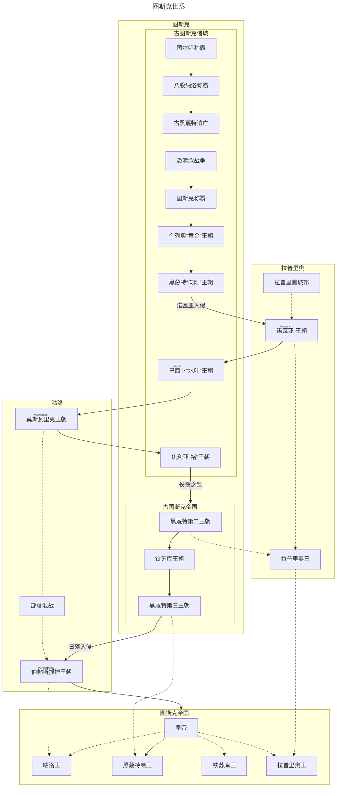

---
aliases:
  - 帝国史
tags:
  - 图斯克
  - 帝国
  - 历史
---
!!! wiki "词条信息"
    | 属性 | 描述 |
    | :--- | :--- |
    | **中文名称** | 图斯克帝国 |
    | **主要组成** | 咕洛诸部（北）、图斯克本部（中）、拉普里奥（南） |
    | **核心种族** | 图斯克人、咕洛人、拉普里奥人 |
    | **政治体制** | 中央集权与封建混合制 |
    | **信仰体系** | 黑蔑特-图斯克多神教（海神为主神） |

# 图斯克帝国史

**图斯克帝国**的历史是一部各部族从分裂走向融合、从城邦联盟走向中央集权的宏大叙事。其疆域涵盖了北方的游牧草原、中部的核心盆地以及南方的海洋城邦，经历了数个王朝的更替与制度的演变。

## 🏛️ 历史沿革

### 世系图谱

以下图表展示了图斯克历史上各政权的演变、征服与融合关系：

### 地理与政治组成

图斯克帝国的版图主要由三大板块构成：

- **咕洛诸部（北王国）**：由北方游牧民族咕洛族的各部领地构成，地貌以草原和丘陵为主。
- **图斯克地区（中央王国）**：帝国的核心领地，后续行政上划分为黑蔑特（直辖区）和铁苏库两个王国，是政治与经济的中心。
- **拉普里奥（南王国）**：古称“诺瓦亚”（意为“海边”），由南方沿海城邦整合而成，气候湿热，农业与航海业发达。

---

## 📜 早期文明与王朝更替

### 起源：工匠之国与城邦时代

根据考古与神话推测，图斯克各部族源自巨人山地区，后迁徙至图斯克盆地及周边。在这一时期，图斯克地区分布着众多城邦。

- **图斯克城邦**：凭借盆地内丰富的矿产资源和河流冲刷出的碎矿，图斯克人极早掌握了金属锻造技术。这种技术优势使图斯克城邦在早期的兼并战争中迅速崛起。
- **八股纳洛**：曾是图斯克地区最大的淡水湖周边的农业强权，被图斯克征服后，解决了图斯克军队的补给问题，奠定了统一盆地的基础。

在统一周边后，图斯克人并未止步，而是通过滑轮、铁链等原始机械技术的革新，开展了大规模的垦荒与基础设施建设（水渠、道路），为后续的霸权建立了物质基础。

### <b><ruby>奎列奥<rt>Kuileot</rt></ruby></b>“黄金”王朝

“奎列奥”在当代图斯克语中不仅是姓氏，更是高等贵族<b><ruby>奎列姆<rt>Kuilem</rt></ruby></b>的词源。关于其起源有多种假说，一种认为源自“黄金”一词（指代携带金器的商人），另一种认为是古语中对“王”的尊称。

- **开国君主**：奎列奥是第一位有铭文记载的君主。他在位期间广聚财宝，通过残酷的战争征服了黑蔑特，成为图斯克至海峡间的大河共主。
- **王朝特征**：持续约八百年。农业生产虽有积累但较为原始；政治体系虽稳定但缺乏明确的继承法理（可能是血缘与禅让混杂）。
- **衰亡**：王朝末期遭遇大规模旱灾，农业崩溃，加之宫廷内部对血统合法性的质疑，导致各地动乱。

### <b><ruby>黑蔑特<rt>Heimet</rt></ruby></b>第一王朝

黑蔑特地区位于瑟尔克山南、佩尔南河沿岸，临近海湾。在奎列奥王朝末期，黑蔑特的列戊克港已成为北方第一大港，商业极度繁荣。

- **马塔肖萨门改革**：哈希特城主<b><ruby>马塔肖萨门<rt>matasioksamen</rt></ruby></b>借海神之名起兵，终结了奎列奥的统治。虽然他未亲自称王，但其实际控制了帝国，并推行了关键改革：
    - **信仰确立**：梳理神话体系，提升黑蔑特神祇地位，确立**黑蔑特-图斯克信仰体系**。
    - **基础设施**：修建连接海峡与盆地的“马塔肖萨门大道”及沿海港口。
- **王朝建立**：马塔肖萨门二世作为奎列奥家族的女婿登基，开启黑蔑特王朝。
- **成就**：农业技术革新解决了粮食危机；货币系统初步形成；成功抵御了西北俺东人及北荒海盗的入侵。

### 南蛮入侵：<b><ruby>诺瓦亚<rt>Nowaja</rt></ruby></b>与<b><ruby>巴西卜<rt>basib</rt></ruby></b>王朝

黑蔑特王朝晚期，随着“[快照](../../地理/拉埃拉德.md#魔法)”高相差期的到来，“魔法”泛滥导致社会动荡。南方的拉普里奥人组建城邦联盟，凭借气候优势和农业积累，在综合国力上反超北方。

- **诺瓦亚王朝**：拉普里奥人发动的诺瓦亚战争持续约二十年，最终攻陷黑蔑特。其统治风格趋向“无为而治”，上层由军阀与商人构成，缺乏严密的贵族阶层。
- **巴西卜王朝**：趁诺瓦亚军队征讨北方咕洛族之际，蛰伏已久的“巴西卜”势力发动政变，夺取政权。该王朝存续约 88 年，期间未发生重大变革。

---

## ⚔️ 咕洛崛起与帝国动荡

### <b><ruby>莫斯瓦里克<rt>Moswarike</rt></ruby></b>王朝（咕洛王朝）

咕洛族第十代大酋长**图录亥刻**（意为“好斗者”）统一了北方诸部。利用高相差时期的灵语（Johuza）技术，他建立了一支专注于灵语作战的特种部队。

- **征服历程**：图录亥刻先向黑蔑特/诺瓦亚称臣以麻痹对手，随后在巴西卜王朝立足未稳时发动突袭。尽管初期因缺乏水军受挫，但最终凭借灵语者的战场分割能力全歼敌军，入主黑蔑特。
- **统治特点**：
    - **粗糙治理**：保留图斯克原有的税收体系，依赖情报机构（末洛法）控制各地。
    - **分封制**：大量分封亲属与功臣，试图融合图斯克制度。
    - **文化融合**：咕洛族开始学习图斯克语；广泛试验灵语技术。
- **衰亡**：在魔法低潮期，灵语者能力衰退，皇庭腐败，最终被焦利亚家族推翻。

### <b><ruby>焦利亚<rt>Jaolia</rt></ruby></b>王朝

焦利亚家族（原为战士家族）在推翻莫斯瓦里克王朝后建立了短暂的统治。

- **失败的集权**：首任君主<b><ruby>提卡<rt>tika</rt></ruby></b>一世试图建立强军政的统一政府。
- **内乱**：提卡死后，其子耶奇卡在夺权后分封功臣，破坏了官僚体系。耶奇卡死后国家再次分裂。

### <b><ruby>黑蔑特<rt>Heimet</rt></ruby></b>第二王朝与“三帝之治”

黑蔑特家族复辟，终结了焦利亚的混乱。

- **政治整合**：推行宽容的民族政策，通过贸易与官职吸纳咕洛族；确立以海神为至高主宰的多神教体系，统一宗教认同。
- **制度创新**：实行封建制与军区制混合，边境地区册封当地首领为总督/土司。
- **三帝之治**：连续三位杰出皇帝在位共四十八年，农业、手工业与贸易全面复苏，社会欣欣向荣。

### <b><ruby>铁苏库<rt>Tyesuku</rt></ruby></b>第一王朝

第三位皇帝无嗣，政权转入其外甥、铁苏库（意为“暖石”）亲王长子**德卓黑**手中。

- **德卓黑改革**：将帝国划分为大区，任命官员管理，加强中央集权。
- **疆域拓展**：平定南北叛乱，虽然在北方被迫与咕洛族和谈并和亲，但在南方大幅拓展海疆，发现长岛与密比恩。
- **经济举措**：改进铸币，明确税制，鼓励拉普里奥地区开荒。

### 日落入侵与<b><ruby>伯帖斯抓护<rt>Portesdrahu</rt></ruby></b>王朝

德卓黑死后，拥立的平庸皇帝黑蔑特·<b><ruby>法坨<rt>Vatom</rt></ruby></b>一世引发内战。德卓黑的长女、远嫁咕洛的<b><ruby>瓦特苏卡瑟姆<rt>Vatesukasem</rt></ruby></b>公主（日落女皇）借机率领咕洛军队反攻，史称“日落入侵”。

- **伯帖斯抓护统治**：瓦特苏卡瑟姆之子建立伯帖斯抓护王朝。
    - **百年乱局**：由于咕洛族缺乏明确继承法，导致皇位争夺频繁。大权常旁落于权臣、外戚。
    - **自由与繁荣**：中央权力的衰落意外带来了地方自治的宽松环境。商业空前繁荣，技术（铁犁、水车）进步，宗教信仰多元化。
- **危机与终结**：长期宽松导致土地兼并严重，咕洛驻军腐败堕落。最终，铁苏库家族旁系**德卓黑三世**发动起义，攻破首都。

---

## 🏛️ 真正的帝国：铁苏库第二王朝

铁苏库家族的复辟（铁苏库第二王朝）标志着图斯克真正进入了成熟的帝国时代。皇庭对行政、军事、经济进行了深度改革，建立了高效的中央集权体系。

### 1. 行政改革

- **继承法确立**：确立严格的嫡长子继承制，明确了庶子、兄弟、私生子及女性的继承顺位，杜绝了法理混乱。
- **区域划分**：
    - **黑蔑特王国（直辖区）**：由皇帝或亲王直接管辖，不设分封，实行郡县制，确保京畿安全与财政独立。
    - **铁苏库边区**：由铁苏库王（皇室旁系）管辖，实行分封制，巩固西部边防。
    - **拉普里奥王国**：由拉普里奥王管辖，下设安南都护府管理殖民与外交。皇庭对拉普里奥王的继承拥有最终干预权。
    - **咕洛王（北王国）**：设立<b><ruby>居皮奥马克<rt>Jupyomak</rt></ruby></b>（太阳酋长），统领各氏族。南方氏族逐渐封建化，北方仍保留部落制。

### 2. 军事改革

- **中央军**：建立直属皇帝的帝国卫队，与黑蔑特亲王统领的黑蔑特军相互制衡。
- **地方军**：王国多为征召兵制，咕洛族保留部落武装但受监控。

### 3. 经济政策

- **货币统一**：在黑蔑特及核心区推行皇室铸币（铜/银），实行单一货币税制。
- **多元并存**：考虑到地区差异，咕洛地区保留物物交换与实物税；偏远地区允许实物税与地方/地下钱庄共存，以维持经济活力。

铁苏库第二王朝通过强有力的制度设计，成功将风俗各异的图斯克、咕洛、拉普里奥三大板块熔铸为一个统一的政治实体。