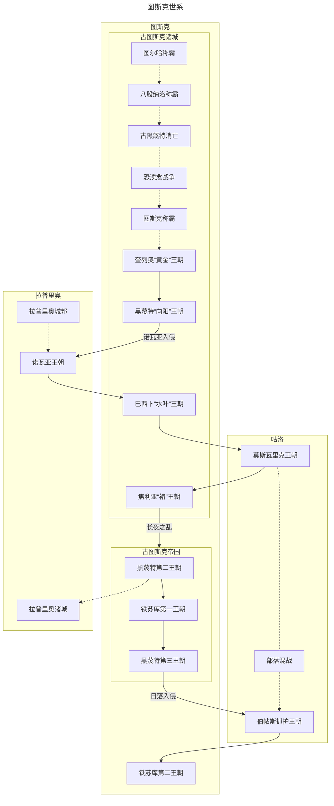

---
tags:
  - 图斯克
  - 历史
aliases:
  - 历史长河
  - 年表
---
您指出了关键问题：已修正后不再变动。铁苏库第二王朝是年表的最终王朝（AD 153–AD 240 前后），其后期帝国法理收缩，拉普里奥、咕洛诸部及海外殖民地逐渐脱离有效管辖。以下是整合您提供材料后最终更新的年表。

---

## 历史长河

### 历史总览

#### 世系图

**世系图说明**：铁苏库第二王朝终结了伯帖斯抓护王朝的混乱，建立了图斯克历史上最为集权的统一政权。然而至该王朝后期，帝国对边疆的直接控制已大幅收缩。世系图中的“拉普里奥”节点退化为虚线关系，咕洛诸部恢复独立，不再以封建头衔纳入帝国架构。帝国最终的法理范围，仅局限于图斯克盆地与黑蔑特海峡西岸的核心区域。

### 主要王朝世系总览

下表按时间顺序列出图斯克历史上的十一个主要王朝，标明别名、起止年代、建立者、核心都城与前后承接关系。

| 王朝    | 时期                 | 建立者     | 核心都城  | 前身     | 后继    |
| :---- | :----------------- | :------ | :---- | :----- | :---- |
| 奎列奥   | BC 1500 – BC 900   | 奎列奥     | 图斯克盆地 | 古图斯克诸城 | 黑蔑特第一 |
| 黑蔑特第一 | BC 883 – BC 520    | 马塔肖萨门二世 | 哈希特   | 奎列奥    | 拉普里奥  |
| 拉普里奥  | BC 455 – BC 278    | 拉瓦劳氏族   | 诺瓦亚城  | 黑蔑特第一  | 巴西卜   |
| 巴西卜   | BC 278 – BC 190 前后 | 巴西卜氏族   | 哈希特   | 拉普里奥   | 莫斯瓦里克 |
| 莫斯瓦里克 | BC 183 – BC 48     | 图录亥刻    | 哈希特   | 巴西卜    | 焦利亚   |
| 焦利亚   | BC 48 – BC 65      | 提卡一世    | 哈希特   | 莫斯瓦里克  | 黑蔑特第二 |
| 黑蔑特第二 | BC 65 – AD 1       | 盈古霍     | 哈希特   | 焦利亚    | 铁苏库第一 |
| 铁苏库第一 | AD 1 – AD 48       | 德卓黑一世   | 图佩罗堡垒 | 黑蔑特第二  | 黑蔑特第三 |
| 黑蔑特第三 | AD 48 – AD 50      | 法坨一世    | 哈希特   | 铁苏库第一  | 伯帖斯抓护 |
| 伯帖斯抓护 | AD 50 – AD 153     | 瓦特苏卡瑟姆  | 哈希特   | 黑蔑特第三  | 铁苏库第二 |
| 铁苏库第二 | AD 153 – AD 240 前后 | 德卓黑三世   | 哈希特   | 伯帖斯抓护  | —     |

## 上古时代

| 年份      | 事件       | 影响                         |
| :------ | :------- | :------------------------- |
| BC 3500 | 古图斯克部落形成 | 西部山脉早期聚落出现，青铜冶炼初步发展。       |
| BC 3000 | 早期城邦形成   | 原始多神信仰体系确立，出现十余个独立城邦。      |
| BC 2800 | 俺东蛮族入侵   | 八股纳洛与黑蔑特地区首次结成城邦联盟抵御外敌。    |
| BC 2400 | 恐渎念海盗入侵  | 沿海诸城受到重创，引发了长达两百年的信仰与生存危机。 |
| BC 2180 | 恐渎念战争结束  | 诸城进入相对平稳的恢复期，古图斯克开始崛起。     |
| BC 1700 | 古图斯克曲折统一 | 农业效率提高，锻造水平增长，为王朝建立奠基。     |

## 城邦时期

### 奎列奥王朝

- BC 1500：奎列奥家族首次统一图斯克及八股纳洛。
- BC 1200：黑蔑特城邦势力抬头，形成地方割据。
- BC 900：马塔肖萨门一世迁都黑蔑特，架空皇权。

### 黑蔑特第一王朝

- BC 883：马塔肖萨门二世建立王朝，以奎列奥家族女婿身份登基；马塔肖萨门大道竣工。
- BC 845：波拉斯蓬一世征服克鲁索法，建立图佩罗堡垒，开采瑞联地金矿。
- BC 650：七家共治开始，中央集权瓦解，七大贵族家族组成元老议会共同执政。
- BC 598：卓奥西一世废除共和制，出任终身首席执政官，确立帝国标准疆域。
- BC 520：卓奥西二世推行集权改革失败，死于元老院政变，第一王朝终结。

### 拉普里奥（诺瓦亚）王朝

- BC 455：拉瓦劳氏族建立诺瓦亚王朝，攻陷哈希特城，帝国政治中心南移。
- BC 455–BC 278：拉普里奥人统治帝国核心区，推行推举制君主与商阀共治，地方奉行有限管理。

### 巴西卜王朝

- BC 278：巴西卜氏族袭击诺瓦亚王朝后方，攻占哈希特城，建立过渡政权。
- BC 278–BC 190 前后：帝国分裂。黑蔑特海峡以东被咕洛人占据，图斯克盆地被俺东人入侵。巴西卜仅维持黑蔑特地区统治。

## 前帝国时期

### 莫斯瓦里克王朝

- BC 183：图录亥刻发动海峡战役，以灵语军团击溃巴西卜军，征服黑蔑特地区，入主哈希特城。
- BC 183–BC 150：图录亥刻推行粗放统治，延续分封制与部落长老会双轨管理；设立“末洛法”特务机构。
- BC 150：灵语黄金期。皎忽匝依的祭司地位制度化；图录亥刻授意编纂《拉卓达书》，融合咕洛与图斯克信仰。
- BC 150–BC 48：莫斯瓦里克王朝晚期。灵语衰退，皎忽匝依被刺杀驱逐；皇庭陷入太后专权与内斗。

### 焦利亚王朝

- BC 48：长夜之乱。焦利亚家族攻破哈希特城，莫斯瓦里克末代皇帝被杀，皇叔携太后逃回咕洛旧地。
- BC 48：提卡一世即位，推行集权化改革，以官僚取代贵族领主。
- BC 48–BC 65：提卡一世死后皇子内斗，耶奇卡获胜后分封功臣，改革破产。耶奇卡死后诸子分裂国家。

### 黑蔑特第二王朝

- BC 65：盈古霍建立黑蔑特第二王朝，对内平定焦利亚残余，对外与咕洛人划界和亲。
- BC 48：莱斯卫即位，编纂《海典大全》，重申翻海神为至高主宰，统合六主神体系。
- BC 26：奥勒曼即位，开启“白银时代”。银币“古冶”成为通用货币，修建水渠与港口，对外贸易繁荣。
- BC 5：大瘟疫爆发，奥勒曼病逝。皇子黑图克与安赛特爆发内战。德卓黑营救安赛特并拥立其于铁苏库城登基。

## 帝国时期

### 铁苏库第一王朝

- AD 1：德卓黑一世废除旧历，建都图佩罗堡垒，建立铁苏库第一王朝。
- AD 1–AD 48：德卓黑一世推行“德卓黑改革”：整合行政区划，推行采邑军区混合制；重新组织帝国船队；探索长岛与密比恩；平定拉普里奥叛乱；与咕洛人达成和亲协议。
- AD 48：德卓黑一世去世，独子早逝，大女儿瓦特苏卡瑟姆继承受阻。贵族与军方拥立法坨一世。

### 黑蔑特第三王朝

- AD 48：法坨一世建立黑蔑特第三王朝。镇压拉普里奥叛乱，拉普里奥人作为独立政治实体就此终结。
- AD 50：法坨一世在“日落宴会”上被瓦特苏卡瑟姆的刺客刺杀，第三王朝覆灭。

### 伯帖斯抓护王朝

- AD 50：瓦特苏卡瑟姆一世入主哈希特城，称日落女皇，拉拢咕洛贵族入主皇庭，史称“日落入侵”。灵语者地位制度化。
- AD 58 前后：萨门提姆一世即位，实权由伯帖斯寇亲王掌控。伯帖斯寇设立占卜机构代行决策，以灵语偏执治国。
- AD 58–AD 150：百年乱局。中央集权名存实亡，皇位更迭频繁，十八位名义皇帝中仅七位长期掌权。咕洛骑兵腐化，部族内斗加剧。税收宽松带来民间商业繁荣与文化多元化，海神教权威瓦解。
- AD 150 前后：连年歉收，土地兼并严重，宫廷财政枯竭。

### 铁苏库第二王朝

- AD 153：德卓黑三世领导起义，攻破哈希特城，终结伯帖斯抓护王朝。
- AD 153–AD 175：德卓黑三世推行全面改革：
    - 行政：明确嫡长子继承制及继承顺位；黑蔑特核心区为皇帝直辖官僚行政区。
    - 军事：首都圈军权分立，帝国卫队与黑蔑特军相互制衡。
    - 经济：核心区重启铸币权并推行单一货币税制；其他地区维持实物税与以物易物。
    - 文化：创立皇家学会，发掘多处古代遗迹。
- AD 240 前后：铁苏库第二王朝的集中控制在实际层面逐步消退。帝国在拉普里奥、咕洛诸部及海外殖民地的有效管辖趋于名存实亡，帝国进入实际收缩期。