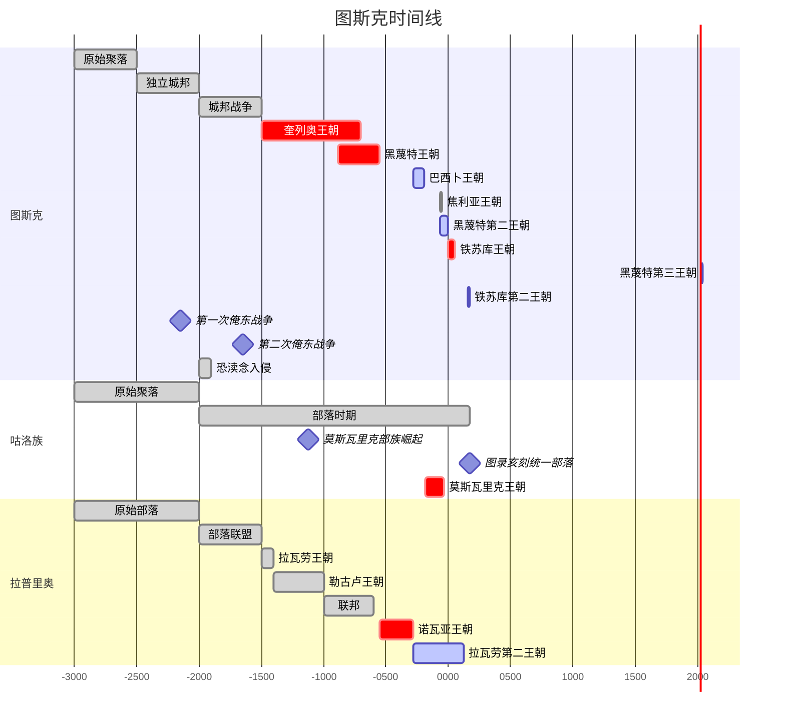
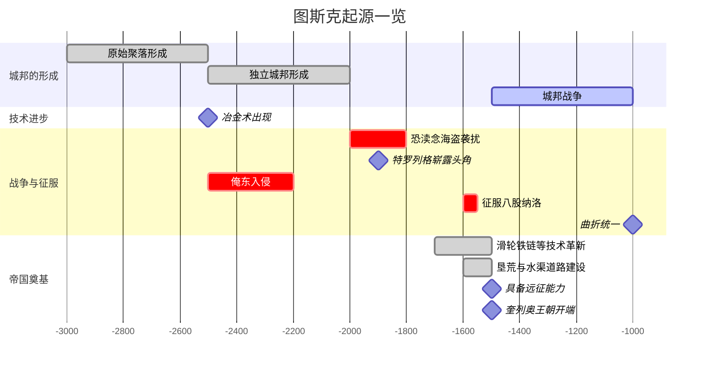
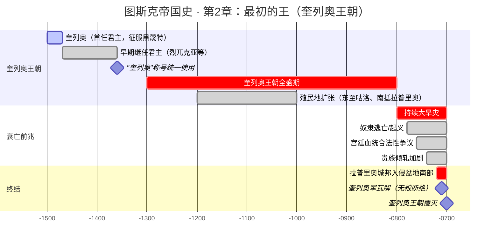
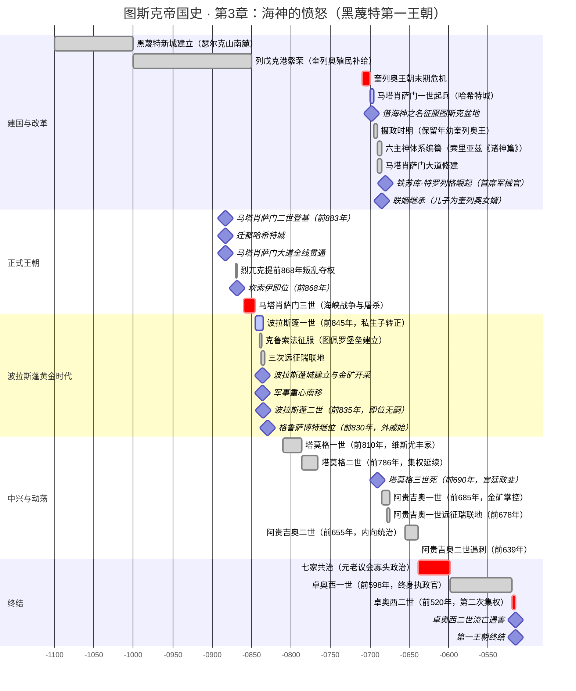

---
aliases:
  - 帝国史
tags:
  - 图斯克
  - 帝国
  - 历史
---
# 图斯克帝国通史

图斯克帝国的历史延续约四千年，大致可分为三个阶段：奠基与统一期、外族入侵与沦陷期、以及中央集权的重建期。

这篇文章的**第一至三章**讲述帝国的**奠基时代**。在帝国成形之前，是漫长的城邦时期，盆地内十余个城邦为争夺耕地、矿源和商路长期混战。诺瓦亚海上的恐渎念海盗和俺东人的入侵则迫使沿海诸城走向初步的军事合作。随后图斯克城邦兼并主要对手，建立起**奎列奥王朝**——一个以青铜冶炼、奴隶制和殖民扩张为基础的早期帝国。然而旱灾、奴隶起义与拉普里奥入侵的接踵而至终结了这一王朝。**黑蔑特第一王朝**借海神之名取而代之，奠定了神权与商业并重的统治模式，进一步拓展了图斯克人在诺瓦亚海的影响力。

**第四至七章**描述帝国的**蛮族入侵与沦陷**。诺瓦亚王朝的拉普里奥人征服了帝国核心区，[[巴西卜王朝]]则困守孤城八十八年而无所建树。莫斯瓦里克王朝的咕洛人凭借灵语与骑兵建立起游牧式统治，最终因魔法潮汐衰退而崩溃。**焦利亚王朝**作为图斯克人的首次复辟，虽成功驱逐蛮族，却因继承问题与集权失败而迅速瓦解。

**第八至十一章**叙述帝国的**重建与过渡**。黑蔑特第二王朝在废墟中重整秩序，却在内战与瘟疫中走向末路。**铁苏库·德卓黑一世**的改革试图建立中央集权的新帝国，却因继承问题一世而亡。随后的黑蔑特第三王朝与**伯帖斯抓护王朝**陷入咕洛贵族的百年乱局：分封松弛、继承无序、灵语者干政、军队腐化。

**第十二章**叙述帝国的**成熟**。**铁苏库·德卓黑三世**领导的铁苏库第二王朝完成了先祖未竟的改革：通过差异化的行政区划、军权分立与货币改革，帝国首次被整合到统一的中央集权框架之下。尽管这种统一仍存在局限，但它确立的制度遗产成为此后数百年图斯克政治的基础模板。

## 1 图斯克起源与城邦时代

按照咕洛口传史诗与图斯克神话中关于起源的部分推测，图斯克各部族的先祖与其他东北语系的族群一样，是从巨人之山南下、在图斯克盆地及周边地区定居的古老移民。这一迁徙过程发生在灾变时代的冰川退缩期，当气候转暖、低地被浅海重新淹没之后，人类开始在河流沿岸形成稳定的农业聚落。图斯克盆地——这片被山脉环抱、河流纵横的富饶谷地——成为了最狭义的图斯克人的家乡。

### 1.1 富矿的图斯克盆地

图斯克盆地之所以能够催生出一个强大的文明，与其得天独厚的自然资源密不可分。盆地及其周边山脉蕴藏着品质惊人的铁矿和铜矿，河流中亦可淘取碎矿砂。这些矿产的丰富程度，在整个诺瓦亚海沿岸是极为罕见的。

冶金术在图斯克地区的出现时间远超文字记载的上限。最早的考古证据可追溯至城邦形成之前数百年——在佩尔南河支流的冲积层中，发现了简陋的熔炉基座和铜渣残留。当时的图斯克人已经掌握了将矿石与木炭混合冶炼的技术，能够铸造简单的铜制农具和武器。随着冶炼温度的提升和矿石筛选技术的改进，青铜和早期的铁器逐渐出现。到城邦时代初期，图斯克的铁制刀剑与农具在硬度与韧性上已远超周边地区，而其中又以图斯克盆地中名为图斯克的这一支部落的锻造技术最为优胜，这也是他们最后得名图斯克“匠人”的原因之一。这一技术优势，成为图斯克日后崛起并称霸的核心原因。

富矿山不仅提供了武器，也提供了贸易的筹码。早在城邦形成之前，图斯克地区的铜锭与铁块就已经在原始贸易路线上流通——向北进入括罗台的群山，向南顺佩尔南河而下进入诺瓦亚海岸，向西翻越俺东群山进入西部高原。这些贸易路线在城邦时代发展为固定的商路，为图斯克城邦积累了远超前邻的财富。

### 1.2 城邦时代的混战

到公元前三千年左右，图斯克盆地及周边地区已经形成了大大小小十余个独立的城邦。这些城邦大多起源于佩尔南河及其支流沿岸的农业聚落，历经数百年的发展，逐渐扩展了各自的边界，直到领地在错综复杂的丘陵间开始相互重叠。

这是一个列国纷争的混乱时代。各城邦之间为争夺耕地、矿源和贸易路线不断爆发战争。与后世奎列奥王朝依靠奴隶大军作战不同，城邦时代的战争规模较小，主要由贵族率领的私人武装和临时征召的市民兵参与。战争的形式也不仅仅是城下决战——焚烧对方的农田、截断水源、劫掠商队，都是常见的战术手段。

图斯克城邦在众多竞争者中并非最初的霸主。它位于盆地东部，靠近富矿山的山麓地带。与它同时存在的还有数个不可忽视的强大对手。在海湾沿岸，黑蔑特城邦扼守着通往诺瓦亚海的天然港口，其商船在北方水域往返穿梭。

盆地内部最强大的对手则是八股纳洛。这个城邦的领地主要集中在水系最发达的低洼地带，控制了盆地内灌溉条件最好的粮食产区。他们的财富建立在农业而非矿产之上，这使得他们能够供养更大规模的人口和军队。在很长一段时间内，八股纳洛是盆地内当之无愧的第一强邦，其控制下的那些属于不同语族的村落向其纳贡称臣。

六大主神中离海神的原型，很有可能就来源于八股纳洛的守护神信仰。这一信仰后来被征服者图斯克人吸收并改造——在后世编纂的图斯克神话《诸神篇》中，汉布瓦西亚家族的索里亚兹将各城邦的保护神统合至海典体系之下，而八股纳洛最早贡献了离海神的雏形。尽管如此，在城邦时代的早期，八股纳洛与图斯克城邦之间的摩擦就从未停歇。图斯克人拥有更优良的金属武器，八股纳洛人拥有更充足的人力和粮食储备。两邦之间的战争持续了数代人，战场在河流交汇处的沼泽与山坡间反复拉锯。

最终，图斯克城邦凭借冶铁技术的突破取得了决定性的优势。掌握了渗碳淬火技术后，图斯克的剑锋能够轻易劈开八股纳洛士兵的青铜护甲；图斯克的重装步兵方阵在山地与丘陵间的近战中，击溃了八股纳洛引以为傲的数量优势。八股纳洛的都城在围困数月后陷落，其领土被并入图斯克版图。

征服八股纳洛是图斯克崛起过程中的关键转折。八股纳洛在图斯克地区最核心的粮食产区落入手中后，困扰图斯克军队已久的补给问题迎刃而解。较近的几个城邦见大势已去，纷纷遣使来降，将图斯克奉为共主，同时这一时期“奎列奥”这个概念也开始在考古铭文中被发现。而离得较远的城邦和部落则保持了一个观望的沉默姿态——以当时图斯克的交通水平而言，其能够有效辐射的范围确实相对有限。八股纳洛在被征服之后不再作为一个独立的政治单位而存在，仅仅作为地名被当地人所记忆和保留。

### 1.3 恐渎念之战：海盗阴影下的诸城

城邦时代的混战并非仅限于陆地。在公元前两千余年的漫长岁月中，诺瓦亚海沿岸的图斯克各城邦面临着一个共同的外部威胁——恐渎念海盗。

恐渎念的起源至今仍有争议。图斯克语中该词的字面意思为“渎神之人”，可能指他们不信仰海神，也可能指他们对沿海神庙的劫掠行为。据残存的铭文记载，这些海盗来自诺瓦亚海北方的某些岛屿或海岸地带，驾驶着速度极快的长船，在季风季节随洋流南下，袭击沿海城镇和商船。有一种说法是，恐渎念人实际上就是早期的咕洛人的一支，米斯特那提拉靠海的部分可能有适合造船的树木，在寒潮导致大规模的作物减产和牲畜死亡的时候，恐渎念人将这些树木做成了船，沿着北海往下劫掠。

恐渎念海盗的威胁对图斯克各城邦产生了深远的影响。沿海城邦被迫修筑城墙和沿海瞭望塔，将大量资源从内陆争霸转向海防建设。在某种程度上，恐渎念的长期袭扰迫使各城邦寻求更为紧密的军事合作——尽管这种合作往往是短暂的、各方心怀鬼胎的联盟。古图斯克与周边城邦在对恐渎念的战争中建立的那些合作关系，为后世的统一提供了某种原始的政治经验。

古黑蔑特城邦在这一时期遭到了摧毁。古代的黑蔑特城比现在的哈希特城更靠近黑蔑特海峡，也不像如今的哈希特城这样紧挨着色尔克山，那时的佩尔南河流向也可能有所不同。

这一时期持续了约两百年，直到海岸线上恐渎念的船只不知道为什么再也不出现——可能是气候变化改变了洋流与航线，恐渎念人发现南下劫掠不再有利可图。无论如何，当恐渎念战争的阴影散去时，图斯克诸城发现自己已经在这段共同危机中经历了深刻的转变，长期的一致对外使得图斯克诸城能够以更为统一的方式进行交流，各城邦、部族之间的信任也得到了增强。这一时期，原先的八股纳洛-黑蔑特联盟来对抗图斯克的格局可能随着黑蔑特城邦的覆灭而瓦解，原先的势力天平被打破，图斯克城邦蠢蠢欲动，迫不及待地要将整个他们所知的世界划入自己的领土。

### 1.4 俺东入侵与曲折统一

然而，威胁并非只来自海上。在城邦时代的混乱中，来自西部俺东山区的蛮族也多次尝试入侵富饶的图斯克盆地。

俺东人是帝国西北部山地森林的原住民，大多以渔猎为生，民风淳朴而彪悍。他们的战士持盾持斧，身披兽皮，在山区和丛林中来去如风，对盆地边缘的农耕聚落构成了长期的威胁。在公元前三千年到两千年间，俺东蛮族的入侵至少有数次记录在残存铭文中。

城邦间无休止的内耗——今日结盟、明日背约、年年征战——严重消耗了各城邦的力量，使得原本可能更早完成的统一事业被一再推迟。直到接近公元前两千年时，图斯克城邦才最终在几代人的时间内完成了对盆地内诸城邦的和解或征服。

在掌控周边数个城邦之后，图斯克人一度面临了锻造技术失去用武之地的困境。然而，他们很快转向了内部的技术革新。考古发现表明，这一时期的图斯克人已经开始运用滑轮、铁链等原始机械构件，工程水平远超周边地区。在此基础上，图斯克人展开了大规模的垦荒运动，并在新纳入版图的疆域内系统修建了水渠与道路等基础设施。这些建设成果降低了内部物流成本，使分散的城邦领地开始向统一的经济体转型，为随后的扩张奠定了物质基础。

到公元前一千五百年左右，图斯克城邦已具备了远征所需的充足物资、精良武器和组织能力。其统治疆域最终拓展至整个图斯克盆地，并开始向外延伸。一个强盛的、统一的图斯克政权即将登上历史的舞台——这便是后世所称的奎列奥王朝的开端。

***

## 2 最初的王：奎列奥

> 黄金王座还是黄金马桶？

当代图斯克语中奎列奥不仅作为姓氏存在，还演化出奎列姆这一对高等贵族的称谓。关于奎列奥王名字的起源，存在多种传说。第一种假说认为，图斯克城邦早期征服的某个城邦曾信奉名为奎列奥的神明，在漫长的融合过程中，奎列奥逐渐演变为对该城邦贵族的统称。然而，现今的图斯克-黑蔑特神谱中并未收录奎列奥之名，因此另有说法指出，古图斯克语中该词本意为"黄金"——奎列奥可能是对当时往来各城邦的商人的统称，这些商人惯用黄金交易，随身携带金器而得名；其中部分商人后来成为纵横家，在图斯克统一帝国西北的战争中发挥了重要作用。"黄金"假说还有另一种解释：根据铭文考证，这可能是古人对王的尊称，象征其拥有天下最多的黄金。总而言之，奎列奥是古图斯克城邦时代极具影响力的政治力量的统称，这股力量最终凝聚成了奎列奥王。

奎列奥是图斯克有记载的第一位君主。在他之前，图斯克似乎并未形成记录历史的传统。尽管出土铭文内容已相当详实，但此前可能发生过重大事件，导致所有早期王室铭文湮灭无存。铭文记载，奎列奥在位期间广聚天下财宝，颁布政令，修建宫殿，并提及与黑蔑特的战争，但未详述具体战况。从铭文中"财宝几近耗竭"的记载推测，这场战争应当相当惨烈。最终，奎列奥成功征服黑蔑特，成为图斯克至海峡间两条大河沿岸所有城邦的共主。

继奎列奥之后的几位君主也留有铭文，记载了当时的经济与政治状况，尽管内容较为简略。值得注意的是，这些早期继任者的名字与奎列奥并无关联，其中一位甚至名为"烈兀克亚"（意为"烧肉的人"）。然而自第四位君主起，所有王号前均冠以"奎列奥"字样，因此这一时期最终被称为奎列奥王朝——尽管"奎列奥"一词本身也可能仅是对"君主"的泛称。

奎列奥王朝持续了相当一段时间，现在通常认为在八百年左右。这一段时间内，农业生产的手段还处于一个相对原始的阶段，能够产生一定量的积累，但是无法为王朝的统治提供稳定的基础；蛮族部落不时侵扰地处偏远的几个小城邦，掠夺粮食人口和器械；物资的积累形成了一些基础的交换，但尚未形成贸易体系。简单而言，这一时期的生产力水平，没有为上位者提供长久而稳定的统治所需的物质基础；尽管核心的政治体系保持了稳定，但是没有发现王位顺利继承的确切依据，无法判断这一时期的政权交替是否诚如铭文记载那样；也不知道王与王之间是不是真有血缘关系，亦或是某种禅让继承制度。这或许也为王朝的终结埋下了伏笔。

### 2.1 青铜维系的黄金王朝

奎列奥王朝的辉煌远不止铭文所记载的那些宫殿与征服。近年的考古发掘揭示了一个更为辽阔、也更为残酷的帝国图景。

在诺瓦亚海沿岸，考古学家发现了大量带有典型奎列奥时期风格的城址地基、陶器碎片与铭有古图斯克语的石碑。这些遗迹东至今日咕洛腹地，南抵拉普里奥海峡以南数百里，西达俺东群山之麓——它们共同证明，奎列奥王朝本质上是一个以诺瓦亚海为中心的殖民帝国。与后世黑蔑特王朝以贸易立国的方针不同，奎列奥的扩张主要依靠两样东西：青铜与锁链。

图斯克人对冶金技术的垄断在这一时期达到了顶峰。通过对富矿山铁矿的系统开采，结合当时被认为近乎"通神"的附魔技术，奎列奥王朝的武器与农具在硬度与韧性上远超周边各族。铭文中多次出现"以铁犁破土，以铁剑立威"的记载，暗示着技术优势如何被系统性地转化为军事霸权。每一座沿海殖民地的建立，都意味着当地原住民的集体沦为奴隶——他们被编入帝国的矿产开采、城墙修筑与农田耕作之中，成为奎列奥铭文中那些"广聚天下财宝"的真正来源。

奴隶制是奎列奥王朝的经济根基。根据黑蔑特王朝时期编撰的史料推测，当时可能存在一套相当成熟的奴隶管理制度。附魔项圈的考古残片在多个殖民地遗址中被发现，其上残留的高维要素痕迹表明，这些项圈被施以魔法，能对试图逃跑的奴隶施加致命的限制。正是这种将魔法与暴力相结合的控制手段，使帝国的殖民体系得以跨海维持数百年之久。

然而，这种统治模式的脆弱性也贯穿了奎列奥王朝的始终。蛮族部落的侵扰不仅是掠夺，更多时候是对殖民地扩张的反抗；农业生产的相对原始，很大程度上源于奴隶劳动的低效与消极；而"贸易体系尚未形成"的表象之下，是帝国对物资流动的绝对控制——商人不过是奎列奥王室的附庸，贸易等同于贡赋的运输。铭文中那位被称为"烧肉的人"的君王，其怪异的名号或许正是对某个奴隶起义时期的血腥记忆。

### 2.2 衰落的征兆

奎列奥王朝的覆灭，从表面上看是旱灾、宫廷内乱与拉普里奥入侵三方夹击的结果。但在更深层面，它标志着一个依赖技术垄断与奴隶开采的古典帝国，在扩张到达极限后的必然崩塌。

王朝末期，持续的大规模旱灾严重冲击了本已脆弱的农业经济。依赖奴隶劳作的农田在灾害面前缺乏弹性，奴隶大量逃亡或死亡，帝国的粮食供应陷入危机。与此同时，宫廷内部出现对奎列奥王血统合法性的质疑——这与王朝长期缺乏明确的继承制度直接相关。当旱灾降临，王权的神秘面纱被撕开，贵族们开始为自己的利益而相互倾轧。

最为关键的是，拉普里奥北部的几个边缘城邦趁乱入侵了图斯克盆地南部。这些城邦长期遭受奎列奥王朝的压榨与奴役，他们的反攻不仅是军事行动，更是被压迫者对帝国体系的总清算。奎列奥军队在应付拉普里奥人的同时已无余力，而盘踞在哈希特城的马塔肖萨门一世，则敏锐地抓住了这个历史性的时机。

他借海神的名义起兵征伐奎列奥。黑蔑特军队没有费多大力气就攻下了图斯克一半的核心城市，俘虏了年幼的奎列奥王，并成功地断绝了各地对奎列奥军队的粮草供应。很快，奎列奥军队就在无粮可用的情况下瓦解了。

这标志着一个时代的终结。奎列奥王朝的崩溃，不是简单的外敌入侵或内部政变，而是一个依赖奴隶制与技术垄断的古典帝国，在内外压力的共同作用下，最终被其自身的沉重锁链所压垮。它的遗产——冶金技术、殖民体系、奴隶制度——将继续深刻影响随后的黑蔑特王朝，但帝国再也无法回到那个依靠铁与锁链就能统治整个诺瓦亚海的时代了。

## 3 海神的愤怒：黑蔑特第一王朝

黑蔑特的名号流传自远古时代图斯克地区的众城邦。在奎列奥王朝的黄金时代，黑蔑特不过是帝国北部边缘的一个小邦，位于瑟尔克山北侧，沿旧佩尔南河而起。然而，一场来路不明的可怕洪水摧毁了旧城。洪水退去后，幸存的居民携带着黑蔑特之名，迁居到瑟尔克山南麓，在佩尔南河新河道与黑蔑特海湾的交汇处建立了新的家园。

这是黑蔑特家族神话中反复讲述的起源。洪水夺走了旧土，却也赐予了新土。新的黑蔑特城邦靠近海湾，拥有比旧城优越得多的天然港口——列戊克港。奎列奥王朝对诺瓦亚海西岸的大规模殖民活动，让作为北方第一大港的列戊克迅速繁荣起来。西征的舰队在此补给，殖民地的财富在此集散，奴隶在此交易。黑蔑特的商业在短短百余年间达到了前所未有的繁盛，其政治地位也随之飙升。正是这份经济基础，让黑蔑特家族拥有了终结奎列奥统治的实力。

但经济实力不足以解释一切。真正让黑蔑特第一王朝区别于此前任何政权的，是马塔肖萨门一世借海神之名的动员力。

### 3.1 马塔肖萨门一世：借海神之名

关于马塔肖萨门一世的出身，史学界至今未有定论。"马塔肖萨门"一词在原始语中意为"住在山上的"，可能指其家族起源于瑟尔克山地区。他的真名已在历史流传中失传，后世将地名讹传为个人名，又将他们掌控的核心地区"黑蔑特"作为其姓氏。

无论出身如何，马塔肖萨门一世都堪称图斯克历史上最杰出的军事家与政治家。

奎列奥王朝末期，持续的大旱灾重创了帝国赖以为生的奴隶制农业体系。粮食绝收迫使各地奴隶主大规模减员，被遗弃或逃亡的奴隶成群结队沦为流寇，在帝国各地点燃了叛乱的火种。当拉普里奥北部的边缘城邦趁乱入侵图斯克盆地南部时，奎列奥王朝已无余力应付。正是在这个关口，马塔肖萨门一世在哈希特城宣布起兵。他的起兵宣言不同寻常——他没有以任何凡俗的名义，而是"借海神的名义"。

这一选择极具政治深意。海神原本只是黑蔑特地区的守护神，在奎列奥王朝的万神殿中地位平平。马塔肖萨门将其推至台前，一方面为自己的反抗涂抹了神圣的合法性，另一方面也为日后重构帝国宗教体系埋下了种子。黑蔑特军队势如破竹，没有费太大力气就攻下了图斯克一半的核心城市，俘虏了年幼的奎列奥王，并切断了各地对奎列奥军队的粮草供应。奎列奥军很快在无粮可用的情况下瓦解。随后，黑蔑特军挥师南下，击退了拉普里奥人，顺便攻陷了一两座城池。

然而真正的挑战在于治理。马塔肖萨门没有急于称王。他保留年幼的奎列奥王作为名义上的君主，自己以摄政者身份掌控实权。在随后数年里，图斯克盆地内的叛乱此起彼伏——既有奎列奥旧贵族不甘败亡的反扑，也有一度受奎列奥打压的旧世家趁机夺权。黑蔑特军队被迫长期驻守盆地进行镇压。

### 3.2 马塔肖萨门改革：帝国的重塑

在这场旷日持久的权力斗争中，马塔肖萨门推行了一系列影响深远的改革，这些改革不仅巩固了黑蔑特的统治，也深刻改变了图斯克国家的性质。

**信仰体系的再造。** 马塔肖萨门委托学者对各城邦的混乱神话进行系统整理，重新编纂神谱，将海神提升为至高之主。汉布瓦西亚家族的索里亚兹——首任宫廷修辞官——主持了《诸神篇》的编纂工作。索里亚兹被视为王朝合法性的神学奠基人。在马塔肖萨门一世统一战争期间，他着手将各城邦混乱的部落传说整合进统一的"六主神体系"。针对抵抗尤其激烈的佩尔南与格那拉城邦，索里亚兹创造性地将其保护神降格为"下三神"，从而在神学层面瓦解了敌对城邦的抵抗意志。史料记载，他曾于海边悬崖枯坐九昼夜，声称在织海神的幻象中获得了构建神学秩序的灵感。这是图斯克历史上第一次通过统一信仰体系来完成政治整合——奎列奥王朝靠的是刀剑与锁链，而黑蔑特王朝则在刀剑之上叠加了对灵魂的掌控。

**商路的打通。** 马塔肖萨门修建的"马塔肖萨门大道"连接了黑蔑特海峡与图斯克盆地，由洛萨安家族的耶普索伊主持建设。耶普索伊提出了"道通神达"的理念，针对盆地内复杂的沼泽地形，首创了"浮土沉石"筑路法。其家族格言"行直道，守正心"后演变为帝国官僚阶层的座右铭。这条大道的意义远超军事。它使得从图斯克盆地到黑蔑特港口的物流时间大幅缩短，来自内地的粮食、奴隶和矿产得以源源不断地运至海岸。与此配套，马塔肖萨门还在沿海地区修筑港口，为帝国日后向海峡西岸的大规模扩张奠定了基础。

**税法的改进。** 马塔肖萨门一世着手加强对往来行商的税收管理，建立了原始的包税商体系。法律上，他尝试以黑蔑特原有法律为基础推行新法条，但最终未能形成成文法典，这为后世留下了大量的灰色地带。

**冶金与军械的强化。** 在帝国西部，铁苏库家族作为军械世家崭露头角。其代表人物特罗列格被封为首席军械官兼铁苏库山脉领主，在对抗"恐渎念"海盗的战争中居功至伟。他改良了冶炼技术，发现加入特定比例的骨炭可锻造出更坚硬的钢材——这被称为"图斯克钢"的雏形。特罗列格性格暴烈，据传曾因刀剑质量问题，亲自将负责工匠投入海中"献祭翻海神"。这个细节折射出那个时代的一体两面：帝国依靠冶金技术的垄断维持霸权，而技术本身也被笼罩在暴力和迷信的阴云中。

**神权的柔性力量。** 在尚武的王朝初期，伊勒赛特家族的宁斯威代表了神权的另一面。她担任织海神大祭司，负责主持春季"开海仪式"。作为极少数能解读"后十戒"的高阶神职人员，宁斯威晚年为封印海中异物，自愿执行"藏海"仪式走向深渊，不知所踪。

马塔肖萨门一世本人始终未登帝位。这一举动令人费解——他手握军政大权，早已是实质上的帝国统治者。但在那个奎列奥法统尚未彻底崩塌的年代，任何废黜奎列奥王的举动都可能引发各方势力的激烈反弹。他选择了一条更迂回的路线：让自己的儿子成为奎列奥家的女婿，以联姻方式继承王位。

### 3.3 王朝的奠基

马塔肖萨门二世是黑蔑特王朝第一位正式君主。他在前883年登基，同年将帝国首都从图斯克盆地迁至哈希特城，并完成了马塔肖萨门大道的全线贯通。这座由他大规模扩建的城市，位于瑟尔克山东麓，南临佩尔南河，通过城南的依克列港掌控着通往东陆与南洋的贸易命脉。他还在帝国各地设立关卡并增税，极大地充盈了国库。

继马塔肖萨门二世之后，烈兀克提前868年通过叛乱夺权即位。其名"烈兀克提"在古图斯克语中意为"多火之处"，暗示其家族可能与火器或冶铁行业有关。他统治不足两年便被其弟坎索伊以兄弟继承的方式取代，后者在前868年即位。

随后的暴君马塔肖萨门三世多次发动海峡对岸的战争并实行种族屠杀，使他成为史上争议最大的君主之一。到他死后，私生子波拉斯蓬以军功转正继位。

### 3.4 波拉斯蓬一世：私生子的黄金时代

波拉斯蓬一世原为马塔肖萨门三世的私生子，在前845年凭借卓越的军事才能转正继位。他的征服重新划定了帝国的南部版图：南方的克鲁索法地区被纳入帝国，他在此建立了图佩罗堡垒（意为"胜利堡垒"）；三次远征瑞联地，建立了波拉斯蓬城并开采金矿。波拉斯蓬的扩张使帝国政治中心开始南移——尽管哈希特城和依克列港仍是经济中心，但军事重心已迁至图佩罗。

然而波拉斯蓬的血脉无法延续。波拉斯蓬二世在前835年即位后去世无嗣，其外甥格鲁萨博特在前830年继位。格鲁萨博特的母系来自维斯尤丰家族，自此开启了长达八十年的外戚掌权时代。

### 3.5 中兴与动荡

前810年即位的塔莫格一世是维斯尤丰家族的第一位君主。他推行了一系列旨在加强中央集权的改革，重新整编了波拉斯蓬时代的军队。其子塔莫格二世在前786年继位，延续了父亲的集权路线。

到塔莫格三世时，帝国的宫廷政治已经深陷贵族倾轧的泥沼。前690年，塔莫格三世死于残酷的宫廷政变。

阿贵吉奥一世在前685年的混乱中脱颖而出。他凭借对瑞联地金矿的掌控和与北方咕洛部落的联盟，暂时稳定了政局。但他真正的功绩在于军事远征——在前678年，他发动了对瑞联地的全面战争，重新控制了波拉斯蓬一世时代的金矿资源。

其子阿贵吉奥二世则是一位内向的统治者。他在前655年即位后很少离开哈希特城，将大部分政务委托给了宫廷官僚。这导致了外戚势力的进一步膨胀——维斯尤丰家族、铁苏库家族和新兴的瑞兰索姆家族在他统治期间攫取了大量实权。阿贵吉奥二世在前639年的一次宫廷宴会上遭到刺杀，凶手至今未能查明。

### 3.6 七家共治与王朝终结

随后的六十年间，帝国进入了一种被称为"七家共治"的寡头政治状态。包括分裂的黑蔑特皇室分支、复辟的维斯尤丰家族以及数个新兴商业家族组成的元老议会，把持着国家权力。黑蔑特家族的名义君主仍在，实权已失。

卓奥西一世在前598年以政治天才的姿态登场。他统合家族势力，与贵族达成妥协，废除了共和制并出任终身首席执政官。他重新划定了帝国的核心区边界，暂时遏制了帝国的分裂。然而他的儿子卓奥西二世在前520年即位后，试图完成父亲未竟的集权事业，推行削弱地方权力的"第二次集权改革"，旋即引发各大家族的联合反扑。卓奥西二世在流亡途中遭到杀害，第一王朝就此以血腥的方式划上了句号。

### 3.7 无冕者的黄昏

黑蔑特第一王朝跨越近四百年的历史，在图斯克的土地上留下了不可磨灭的印记。它曾在马塔肖萨门的旗帜下崛起，在波拉斯蓬的铁蹄下扩张，在塔莫格的改革中中兴，最终在七家共治的混乱中走向衰竭。在那个奴隶制尚未完全退出历史舞台、商业体系刚刚成型的时代，这个王朝尝试了各种政治模式——神权、军功、外戚、共和——却始终未能找到一种可以长久维系的秩序。

王朝崩溃之际，南方的拉普里奥人终结了北方政权。那个曾经靠借海神之名起兵、掌控了整个帝国的黑蔑特家族，最终也随着潮水的褪去，与奎列奥家族一同被卷入了历史的暗处。

但黑蔑特家族并未消失。他们退回了自己的老家——瑟尔克山与佩尔南河之间的那片狭长领地——在此后的数百年中，默默等待下一个借潮而起的机会。

## 4 诺瓦亚王朝：南方的血与火

> *他们乘着风暴而来，踏着废墟加冕。图斯克人的傲慢，在诺瓦亚人的铁蹄下第一次学会了沉默。*

诺瓦亚王朝，亦称拉普里奥王朝，是图斯克历史上第一个由南方拉普里奥人建立并统治帝国核心区的征服者政权。它的崛起并非依靠商业渗透或政治算计，而是一场纯粹的军事征服——一场被后世图斯克史官以恐惧和厌恶的笔调反复记述的“南蛮入侵”。这个王朝的统治虽仅持续了百余年，却在图斯克人的民族记忆中留下了无法愈合的伤痕，并为此后千年帝国对南方地区的管理埋下了深重的暗线。

### 4.1 风暴前夕：南方的蛰伏与觉醒

在黑蔑特第一王朝的数百年间，拉普里奥人不过是散居在帝国南方湿热海岸的一系列部落与城邦。他们的语言与图斯克人相通却自成体系，他们的政治组织松散而原始。在城邦时代早期，南方的土地过于湿热泥泞，不适合北方式的大规模农耕，拉普里奥人的人口长期停滞，从未被视为对帝国核心区的实质性威胁。

黑蔑特王朝的早期君主们对南方采取的是一种轻蔑的漠视态度。他们偶尔会发动惩戒性的远征，焚烧几座拉普里奥人的村落，掳走一批奴隶，然后便撤回北方。然而，正是这种反复的侵扰，在拉普里奥人心中埋下了对北方帝国的深仇大恨，也催生了他们内部的政治觉醒。那些在黑蔑特军队铁蹄下幸存的首领们开始意识到：若不联合，他们终将被图斯克人逐个碾碎。

在此后的几个世纪里，拉普里奥海峡西侧几个最强大的部落和城邦逐渐形成了一个松散的军事联盟。他们名义上向黑蔑特王朝称臣纳贡，暗地里却不断积蓄力量。他们从图斯克商人手中购入铁器，学会了北方的冶铁与锻造技术；他们模仿图斯克军队的组织方式，建立起自己的重装步兵队伍；他们利用南方湿热气候下一年多熟的稻作农业，积攒了足以支撑长期战争的粮食储备。

更为关键的是，黑蔑特王朝中期的寒冷气候给了拉普里奥人一个千载难逢的机会。当北方的农田因冻害而连年歉收时，南方的湿热土地依然丰饶。黑蔑特帝国对拉普里奥粮食的依赖日渐加深，这使得南方的领袖们第一次意识到，他们手中握着一样帝国无法拒绝的筹码——但这筹码不是用来交易的，而是用来等待最佳进攻时机的。

### 4.2 诺瓦亚战争：帝国的沦陷

诺瓦亚战争爆发于黑蔑特第一王朝的晚期。与后世某些试图为帝国恢复体面的史书所描绘的“漫长的边境摩擦”不同，留存至今的拉普里奥人战歌与北方铭文的残片都指向一个事实：这是一场经过了精心准备的、雷霆万钧的全面入侵。

拉普里奥联军并非如旧史所说“缺乏良好的运输和后勤体系”。相反，他们利用了数百年积累的对诺瓦亚海季风与洋流的深刻理解，选择在风暴季节发动进攻——这个时机让早已因内乱而疲惫不堪的黑蔑特海军无法出海拦截。成百上千艘拉普里奥战船在季风的掩护下横渡海峡，将一支前所未有的庞大军队送上了图斯克盆地的南岸。

黑蔑特守军措手不及。帝国的主力军队此时正在北方镇压俺东人的叛乱，而图斯克盆地内的驻军不过是一些地方民团和老弱残兵。拉普里奥军队势如破竹，一路焚毁城镇，屠杀抵抗者，将所过之处化为焦土。他们对帝国腹地地理的熟悉程度令被俘的图斯克指挥官惊恐不已——数十年间，那些以商人和雇佣兵身份深入北方的拉普里奥人，早已将帝国的城池、粮仓、兵营的位置绘制成图，传回了南方。

整个冲突前后持续了约二十年。黑蔑特王朝拼凑了一支又一支军队试图反击，却屡屡败于拉普里奥人灵活的战术和对后勤的精准打击之下。战争最后三年的烈度尤其惨烈。拉普里奥联军包围了帝都哈希特城，切断了从图斯克盆地运往帝都的所有粮道。守军饿殍遍野，城中甚至出现了人相食的惨剧。

城破的那一刻，帝都的陷落比任何图斯克人想象的都要屈辱。拉普里奥军队涌入哈希特城，洗劫了皇宫，焚毁了马塔肖萨门大道旁的大片城区，屠杀了所有敢于抵抗的守军。黑蔑特家族的末代君主在城破之前不知所踪——有说法称他死于乱军之中，有说法称他仓皇逃往海外。无论真相如何，黑蔑特第一王朝的统治在这个血色的秋天画上了句号。

### 4.3 南方的统治：征服者与被征服者

诺瓦亚王朝的统治带有鲜明的征服者色彩。与北方传统以血统和土地为根基的政治不同，拉普里奥人的政权建立在赤裸裸的军事优势和对失败者的无情支配之上。

王朝的最高统治者被称为“国王”，但他并非血缘世袭的君主。国王由那些在征服战争中立下最大功勋的军阀首领和大部族酋长推举产生，且据考证可能存在固定的任期限制。这是一种在拉普里奥人部落传统基础上演变而来的推举制——在征服图斯克之前，拉普里奥人从未有过一个统一的、世袭的王室，他们的政治智慧在于如何在部落间分配权力。征服帝国之后，他们只是将这套制度带到了北方。

国王的主要职责有二：主持宗教仪式以维系军队的士气与联盟的神圣性，以及组织各方力量对外进行战争。日常行政在很大程度上由各地的军阀自行处理。对北方图斯克故地的管理，则通过分封驻军将领和扶植傀儡贵族来实现。

诺瓦亚王朝对图斯克人的统治是冷酷而高效的。大量的图斯克战俘被贬为奴隶，送往南方拉普里奥本土的稻田和矿山。帝国各地的赋税被大幅提高，以供养驻守在北方各地的拉普里奥占领军。图斯克贵族的土地被大量没收，分配给拉普里奥将领和战士。那些在黑蔑特王朝时期显赫一时的家族——包括黑蔑特家族的分支——或在战争中被屠灭，或俯首称臣，在拉普里奥人的阴影下苟延残喘。

然而，诺瓦亚王朝从未真正试图“图斯克化”自己。与后世莫斯瓦里克王朝的咕洛人不同，拉普里奥人没有努力学习北方的语言、宗教或制度。他们保留了自己的神祇崇拜，在帝都建立了自己的神庙；他们继续说自己的南方方言，鲜少使用图斯克语进行官方记录——这或许也是后世图斯克史官声称诺瓦亚王朝缺乏记载的根本原因。他们始终是征服者，是占领者，是坐镇北方却心向南方的一群异乡人。

### 4.4 统治的脆弱与王朝的终结

诺瓦亚王朝的统治从建立之初就潜藏着深刻的脆弱性。拉普里奥人的军事优势建立在征服战争时期的锐气与统一指挥之上，但随着征服者一代的凋零和驻军生活的安逸化，这种优势迅速流失。新一代的拉普里奥将领更关心如何瓜分战利品，而非如何维持在北方日益不稳的占领。

与此同时，北方图斯克人的反抗从未停止。各地的图斯克贵族虽然在表面上屈服，暗中却不断组织叛乱和刺杀。咕洛人在北方的崛起也成为王朝新的威胁，他们不断对边境进行袭扰，消耗着拉普里奥军队的力量。

王朝的覆灭源于末代皇帝的远征。他违背了拉普里奥人“以逸待劳、守海制陆”的传统战略，集结大军亲征东北部的咕洛诸部。这场战争在寒冷的米斯特那提拉地区陷入了可怕的泥潭。拉普里奥军队习惯了南方的湿热气候，在北方的冻土与密林中损兵折将，补给线被咕洛骑兵反复截断。末代皇帝本人因不适应极寒气候在军中病逝——一说死于瘟疫，一说死于箭伤。

消息传回后方，脆弱的征服者联盟瞬间土崩瓦解。被压制的图斯克旧贵族与黑蔑特残余势力趁机发难。一支由自称“巴西卜”的势力领导的叛军，在拉普里奥主力北征、后方空虚之际，迅速攻占了帝都。征讨咕洛的拉普里奥残军被迫与叛军和谈，最终走水路退回了诺瓦亚城——那座他们在百余年前兴师动众出发征服北方的起点。

诺瓦亚王朝就此覆灭。它的统治不长，却深刻改变了图斯克帝国的轨迹。它证明了图斯克人不是不可战胜的，帝国的核心不是不可触及的。被南方蛮族征服的耻辱，成为此后数百年图斯克人心中最深的恐惧和最痛恨的记忆。帝国对南方拉普里奥地区的管理从此成为帝国政治的主线之一——不仅要防止南方再次崛起，更要以一种近乎偏执的热忱来反复确认北方对南方的统治地位。

征服者退回了南方。但他们留下的伤痕，将在图斯克的民族心灵中久久无法愈合。

---

## 5 巴西卜王朝：困兽的八十八年

巴西卜王朝是诺瓦亚王朝与莫斯瓦里克王朝之间的过渡政权，存在于约公元前278年至公元前190年前后，共约八十八年。这是一个建立在时机与阴谋之上的王朝，它的诞生充满了投机者的狡黠，它的统治笼罩在四面楚歌的恐惧之中，而它的覆灭则是对它窃国之举的最终清算。

### 5.1 权力的真空

诺瓦亚王朝末代皇帝北征阵亡的消息，如同一块巨石投入早已暗流涌动的池塘。拉普里奥人的统治在极短的时间内崩溃了：留守北方的驻军或被愤怒的图斯克民众围攻致死，或随撤退的舰队仓皇逃回南方。帝国核心区陷入了一种可怕的权力真空。

正是在这个当口，巴西卜势力浮出了水面。他们并非图斯克传统贵族，而是一个在黑蔑特王朝晚期就已积累了惊人财富的特许商业家族。他们在诺瓦亚王朝时期通过向征服者纳贡和提供后勤服务而保全了自身，此刻却在所有人都还在观望和犹豫之际，率先举起了反拉普里奥的旗帜。

巴西卜趁诺瓦亚军主力北征、后方空虚，集结了一支由家族私兵、雇佣军和投机贵族组成的军队，以迅雷不及掩耳之势攻占了刚刚被拉普里奥人弃守的哈希特城。他们在城中宣布光复图斯克帝国，自命为帝国的新统治者。残存的拉普里奥军队无心恋战，经由和谈后走水路退回南方。巴西卜王朝就此开启。

### 5.2 帝国的碎片

然而，巴西卜王朝的统治版图从未超出狭义的图斯克-黑蔑特地区。诺瓦亚王朝的崩溃并未带来帝国的重新统一——恰恰相反，它释放出了被征服者压抑了一个多世纪的分裂力量。

黑蔑特海峡以东，崛起的咕洛诸部趁乱吞并了帝国东方的大片领土，并将锋芒直指海峡以西。在图斯克盆地的广大腹地，俺东人从西部的群山之中涌入，占领了一座又一座城镇，建立起自己的部落领地。南方的拉普里奥地区则四分五裂：数个拉普里奥部落各自称王，在诺瓦亚王朝的废墟上展开了激烈的内部争斗，无暇北顾，但也绝不接受北方的任何号令。

巴西卜王朝名义上继承了图斯克帝国的法统，实质上不过是一个困守在帝都及其周边地区的地区性强权。它向北无力驱逐俺东人，向南无力控制拉普里奥人，向东则日夜警惕着海峡对岸咕洛骑兵的动向。

### 5.3 沉默的八十八年

巴西卜王朝的八十八年几乎没有留下任何值得称道的功绩。没有开疆拓土的征服，没有影响深远的改革，没有流传后世的法典或史诗。它的所有精力都消耗在了维持生存本身。

在经济上，巴西卜王朝承袭了诺瓦亚王朝遗留下来的沉重赋税体系，却无力维持征服者时代那样高效的征收机制。国库常年空虚，军队勉强维持。在军事上，王朝的军队主要由雇佣兵和少数忠于皇庭的贵族私兵组成，装备落后，士气低迷，在俺东人和咕洛人的反复侵袭下节节败退。在政治上，王朝内部充斥着阴谋与背叛，巴西卜家族的历代君主大多短命——或被刺杀，或被废黜——很少有在位超过十年的。

唯一值得记述的，或许只有巴西卜王朝对图斯克传统文化的维系。与诺瓦亚王朝的异族统治不同，巴西卜至少在图斯克人眼中是“自己人”——尽管他们曾是拉普里奥人的合作者，但他们毕竟说的是图斯克语，信奉的是翻海神。在巴西卜的统治下，海典的祭祀得以恢复，被拉普里奥人关闭的图斯克神庙重新开放，马塔肖萨门时代的法条被重新整理和颁布。这些举措为巴西卜赢得了部分旧贵族的支持，却无法掩盖王朝根本性的虚弱。

### 5.4 王朝的终结

真正终结巴西卜王朝的是北方崛起的咕洛人。

在巴西卜王朝困守在帝都的同时，黑蔑特海峡对岸，莫斯瓦里克家族的咕洛部落已经悄然完成了统一。他们的第十代大酋长图录亥刻——一个精通图斯克语言和战术、实施了“赵黠斯地图斯克化”的传奇人物——建立起了一支纪律严明、战力强悍的军队。他借着连年的天灾和物资匮乏，用父亲的高压政策和自己的灵活手腕，将松散的咕洛部落锻造成了一台战争机器。

当图录亥刻最终挥师南下时，巴西卜王朝几乎没有任何还手之力。叛军趁着巴西卜军队在应付俺东人的溃败、无暇顾及海峡方向的时机，摧枯拉朽般地渡过了海峡，包围了帝都。巴西卜末代君主在城破之际战死在哈希特城的废墟中，与其一同覆灭的还有巴西卜家族几乎全部的血脉。

巴西卜王朝的八十八年，是一个投机者家族在亡国边缘的漫长挣扎。他们凭借一个时机夺取了权力，却从未真正拥有过掌控帝国的力量与智慧。他们是不幸的——他们降临在一个帝国四分五裂、外敌环伺的时代；但他们也是可悲的——他们除了维持表面的统治符号之外，对拯救这个正在沉沦的文明几乎无能为力。

当莫斯瓦里克王朝的旗帜在哈希特城头升起时，图斯克帝国迎来了一个全新的、截然不同的统治者。帝国的历史翻开了下一页，只是这一次，执笔的不再是图斯克人。

## 6 游牧治国：莫斯瓦里克王朝

> _灵语非术，定生杀之契，判虚实之界，不可为凡人语。_

莫斯瓦里克王朝，史学界亦称之为咕洛王朝或马族王朝，是图斯克历史上第一个由北方蛮族咕洛人建立的大一统帝国。它的建立标志着帝国核心区被来自黑蔑特海峡对岸的征服者彻底统治的开端——这不是一次短暂的入侵与退潮，而是一场持续超过百年的征服者王朝实验。

与诺瓦亚王朝的拉普里奥人不同，咕洛人并非来自帝国南方早已被纳入文明体系的族群。他们是真正的异族——说着与图斯克语截然不同的语言，信奉着与海典格格不入的自然神灵，骑乘着图斯克人从未驯服的草原马，驾驶着能在深海中航行的长船，在米斯特那提拉的广袤草场与北方的寒海上度过了数百年的部落时代。当这个民族在第十代大酋长图录亥刻的旗帜下统一并最终挥师南下时，图斯克帝国面对的不是一支普通的人类军队，而是一个融合了海上劫掠与草原骑兵双重传统的、全然陌生的世界。

然而，莫斯瓦里克王朝的独特之处在于它并非简单的征服者政权。图录亥刻和他的继承者们并没有像诺瓦亚王朝的拉普里奥人那样，以征服者的姿态凌驾于被征服者之上，对帝国制度漠不关心。相反，他们以一种令人惊讶的实用主义态度，主动学习图斯克人的语言、律法与行政体系，将帝国的传统与咕洛人的部落制度揉合成一套前所未有的混合政体。这种主动图斯克化的姿态，使得莫斯瓦里克王朝在图斯克历史上留下的印记远比诺瓦亚王朝更为深刻——它不仅征服了土地，也改变了征服者自身。

### 6.1 咕洛族的崛起：从部落到帝国

咕洛族的起源，据其口传史诗记载，可追溯至神话时代的巨人之山地区。按照咕洛人代代相传的《拉卓达书》所述，人类是由巨人之妻慈心以自身血肉塑造而成，而咕洛人则是其中一支被北风带往草原的后裔。在漫长的灾变时代，咕洛人的祖先跨越了冰封的陆桥，进入了米斯特那提拉的广袤草场与海岸地带，从此与南方的图斯克文明分道扬镳。

与图斯克人建立的城邦和农耕社会不同，咕洛人保留了一种兼具草原与海洋双重特性的部落结构。内陆的咕洛氏族逐水草而居，以牛马为财富，骑射技艺自幼习成；沿海的咕洛氏族则建造长船，在北海与东海的海岸线上劫掠与贸易。他们的语言——古咕洛语——保留了原始语的古老语法特征，与图斯克语同源却早已无法互通。在信仰上，咕洛人信奉以灵语为核心的自然崇拜体系。他们的祭司被称为皎忽匝依，既是与灵魂沟通的通灵者，也是部落在战争与狩猎中不可或缺的精神领袖。与图斯克人将灵语视为少数精英的神秘学科不同，咕洛人将灵语视为一种可以在实战中广泛运用的工具——风暴可以召唤，亡灵可以问询，刀刃可以附上元素之力。

在漫长的世纪中，咕洛人对图斯克帝国的威胁始终是模糊而遥远的。在最早期，他们与帝国之间隔着广阔的赵黠斯地。咕洛骑兵虽能南下，却只能抵达赵黠斯地的边缘，无法望见帝国的核心。真正让帝国首次感知到咕洛存在的，是那些从北海乘风南下的咕洛长船。这些海盗式的小规模袭扰波及帝国北方的黑蔑特海湾与周边渔村，但帝国海军尚能应付，从未迫使朝廷正视这一威胁。

一切在黑蔑特第一王朝征服赵黠斯地之后发生了改变。当帝国军团跨过黑蔑特海峡，将赵黠斯地并入版图，帝国的边疆第一次与咕洛人活动的区域发生了直接接壤。从那一刻起，咕洛骑兵与帝国哨站之间开始了长达百年的摩擦与接触。帝国史官开始在记载中提到“北荒之民”的不定期犯边，赵黠斯地成为帝国与咕洛力量反复角力的前线。

### 6.2 海峡彼岸的阴影：莫斯瓦里克家族的崛起

莫斯瓦里克家族是咕洛诸部中最早与帝国发生系统性接触的氏族之一。他们的牧场邻近赵黠斯地边境，早在帝国征服之前，莫斯瓦里克就已经通过贸易和雇佣兵服务积累了与图斯克人打交道的经验。他们的战士熟悉图斯克的军阵，他们的长老能听懂图斯克语的指令，他们的皎忽匝依甚至接触过坦卡教的灵语典籍。

当黑蔑特第一王朝陷入内部衰微、诺瓦亚王朝覆灭、巴西卜王朝困守孤城之际，帝国对赵黠斯地的控制也日渐松动。莫斯瓦里克家族抓住了这个时机。在第九代大酋长的铁腕统治下，莫斯瓦里克利用连年天灾造成的物资匮乏，对各部落施加了残酷的控制——抗拒者被放逐，反叛者被解散，首领被贬为奴隶，部众被并入莫斯瓦里克麾下。这是一场依靠饥荒与恐惧完成的统一战争。尽管各部落人民怨声载道，人口也进入了增长的长期停滞，但草原的政治版图在短短一代人的时间内被彻底重塑。

真正完成这一统一大业的是第十代大酋长图录亥刻。

### 6.3 图录亥刻：两个名字的征服者

图录亥刻的出生年份已不可考，但据咕洛口传史诗的记载，他诞生于一个魔力高涨的夜晚——紫色的星环横贯天际，部落的皎忽匝依们预言这个孩子将“改变世界的形状”。他有两个名字：一个是他的咕洛本名，在各部落长老间口耳相传；另一个则是他更加广为人知、如今作为常见图斯克语姓氏流传的名字——图录亥刻，在古图斯克语中意为“好斗的”。据说这是图斯克人根据他一生勇猛好战的性格赋予他的外号。他本人似乎也颇为认可这个诨号，以至于后世的图斯克史官在编纂帝国史时，大多只记住了他的图斯克名字，而他的咕洛本名反而渐渐湮没在历史的长河中。

图录亥刻继承父亲的位置时，咕洛各部已经在高压统治下保持了表面上的统一。然而，父亲去世的消息刚刚传出，针对图录亥刻的叛乱和刺杀便接连爆发。至少有三次，刺客接近了这位年轻的大酋长，其中一次甚至在他自己的营帐中留下了刀痕。图录亥刻凭借自身的勇武和亲卫的忠诚，击退了每一次暗杀，并迅速镇压了公开的反叛。

但正是在这场血腥的内部清洗中，图录亥刻开始反思他父亲的统治模式。高压政治和严苛税收虽能维持短期的统一，却无法建立持久的王朝。奴隶的权利几乎没有任何保护，许多奴隶的地位甚至不如贵族豢养的貘骆。这种建立在恐怖基础上的秩序，随时可能因下一场天灾或一次战败而崩塌。

于是他推行了几项影响深远的改革。首先，他借鉴图斯克的分封制度，将帝国赵黠斯地区早已被图斯克人经营过的堡垒和庄园分封给自己的亲属和心腹，建立起一个以血缘和忠诚为核心的封建网络。其次，他颁布了一系列保护奴隶基本权利的惯例法，并创立了奴隶兵制度——这一制度允许奴隶通过军中服役获得上升通道甚至自由，从而将他们从潜在的反抗力量转化为最忠诚的皇权支柱。最后，也是最具争议的一步，他暗自向当时统治黑蔑特地区的巴西卜王朝称臣，并为自己父亲占领赵黠斯地诸多图斯克故地的行为向帝国做出解释。

这一步在后世被认为是他心机甚重的体现。巴西卜王朝此时正困守在图斯克-黑蔑特地区，四面受敌，根本无力实际控制海峡对岸的任何领土。图录亥刻的称臣不过是一纸空文，但这纸空文却给了他最关键的东西——时间。当巴西卜王朝以为北方的威胁已暂时解消时，图录亥刻正在不动声色地完善他的情报机构和常备军队，等待着一个合适的时机。

### 6.4 灵语的胜利：征服的利器

黑蔑特海峡是图斯克帝国的天然屏障。数百年来，这道海峡保护了帝国核心区免受北方蛮族的大规模入侵。咕洛人虽然擅长骑射，也曾以长船南下骚扰帝国北海，却几乎没有足以跨越海峡作战的大型水军，更遑论跨海攻坚的经验。

然而，图录亥刻找到了打破这道屏障的钥匙——灵语。

咕洛人长久以来都是灵语技术的实战使用者。在图斯克人将灵语视为少数皎忽匝依的特权技艺、并用复杂的仪式和禁忌将其层层包裹的同时，咕洛人却将灵语视为一种可以在战场上直接运用的武器。莫斯瓦里克王朝成立初期，恰逢拉埃拉德进入一个高相差的时期——现实与高维“快照”的距离较远，魔法潮汐高涨，灵语的效果也随之大幅增强。

图录亥刻最初对灵语作战并不热衷。在咕洛部落的传统中，灵语更多用于祭祀、预言和航海中的风向祈祷，而非直接用于大规模战场。他更相信骑兵的冲击力和弓箭手的密集射击。然而，在与巴西卜王朝的第一次大规模交锋中，随军的几个皎忽匝依以一场突如其来的风暴击溃了巴西卜人的侧翼，改变了战局。尽管那场战役最终因后勤的断裂而以咕洛军的撤退告终——图录亥刻本人也在撤退中失去了自己唯一的嫡子——但灵语的力量让他刮目相看。

撤回到海峡对岸后，图录亥刻立即着手改编军队，组建了一支专门负责灵语作战的特种部队。这支部队的核心成员都是从各部族选拔出来的、具有灵语天赋的皎忽匝依，他们被授予极高的待遇和荣誉，不受部落长老节制，直接向图录亥刻本人负责。在随后的战斗中，这支部队不仅成功地改善了跨海补给的运输——据说他们能通过通灵术与海峡两岸的哨站即时通讯——更在战斗中成功地分割了战场，用风暴和雷电打乱了巴西卜军的阵型。

巴西卜王朝的末日来得比任何人预想的都要快。灵语军团在战场上造成了可怕的混乱，巴西卜精锐在哈希特城外的野战中几乎被全歼。据说当时有观战者记载：天空在正午变得如午夜般漆黑，紫色的火焰从地面喷涌而出，敌军的战马不听使唤地四散奔逃。无论这记载有多少夸大，结果是不容置疑的——巴西卜王仓皇逃窜，在城破之际战死在哈希特城的废墟中。

图录亥刻入主了哈希特城。在随后的几年内，他接连征服了黑蔑特地区、图斯克盆地以南的大部分地区，以及拉普里奥山区以北的广袤平原，最终与南方的拉普里奥人签订了互不侵犯条约。一个由北方蛮族建立的大一统帝国，就此在图斯克的土地上诞生了。

### 6.5 粗放的帝国：莫斯瓦里克王朝的治理

莫斯瓦里克王朝对帝国的治理，与图斯克历代王朝截然不同。图录亥刻对图斯克的行政体系、商业模式和律法传统几乎一无所知——他一生的大多数岁月都在草原上度过，对城市的了解仅限于攻城的经验。他的统治方式，基本上延续了他在黑蔑特以西经营时的方针。

在经济上，整个帝国的税收系统和财政系统实际上仍由图斯克本地的旧官僚和商人世家把持着。图录亥刻没有试图改变这个精巧而陌生的机器，他唯一做的就是在各级机构之上加了一个简单的指标：每个地区必须上缴固定数量的税赋，具体如何征收则一概不问。这种做法虽然粗糙，却在短期内避免了因制度更迭造成的混乱，使得帝国的经济机器在征服后仍能勉强运转。

在军事上，他延续了早年的分封模式，将图斯克的广袤领土分封给在征服战争中立功的咕洛将领和投诚的图斯克旧贵族，以此换取忠诚。对于那些拒绝服从的领主，则以武力彻底铲除，将其土地重新分配。而在咕洛河畔草原的本部，他仍通过传统的长老会体系维系对各氏族的控制，并维持着广泛的通婚——他自己就迎娶了多个部落首领的女儿作为侧室。

他还设置了一个名为“末洛法”的特务机构。末洛法在咕洛语中意为“箭”，其职能是直接听命于皇帝，搜集各部族及各领地的情报，监视任何潜在的叛乱苗头。这个组织独立于传统的长老会和军队体系之外，只对图录亥刻一人负责。通过这个无孔不入的特务网络，图录亥刻试图弥补粗放行政体系所带来的情报盲区。

莫斯瓦里克王朝的后续君主们对帝国制度的调整有限。除了在军事系统上重整了哈希特城的卫队，以及在财政上重新梳理了税制之外，没有出现大的结构性变动。咕洛族人在这一时期为了适应统治的需要，开始广泛地学习图斯克语，这种语言上的主动靠拢为后来的族群融合打下了一定的基础。有些咕洛贵族甚至开始模仿图斯克人的服饰和生活方式，在图斯克旧贵族中引发了复杂的反响——既有鄙夷，也有暗自的认可。

这一时期，莫斯瓦里克王朝也模仿马塔肖萨门时代的做法，在赵黠斯地着手修建通向咕洛河畔平原的道路，以期加强对咕洛族旧地的控制。但总体来说，在整个莫斯瓦里克王朝的大部分时间里，咕洛统治者们将大部分精力都消耗在了维持帝国稳定和扑灭各地叛乱上。帝国在生产水平和科技水平上几乎没有取得什么进步。

### 6.6 《拉卓达书》：征服者的信仰融合

然而，莫斯瓦里克王朝的遗产并非只有停滞与粗放。在灵语领域，这个王朝实现了一次影响深远的创造——图录亥刻授意编纂的《拉卓达书》。

咕洛人的传统信仰与图斯克人的海典体系原本是两条平行的河流。咕洛人信奉自然神灵，相信万物有灵，他们的创世神话讲述了巨人、神祇与人类始祖的传奇故事。而图斯克人的海典则以翻海神为至高，铺陈了一套精密的多神体系。在莫斯瓦里克王朝的统治下，这两套信仰体系面临着整合的压力——或者说，征服者需要一种能够同时合法化自己对咕洛人和图斯克人统治的神学叙事。

《拉卓达书》便是在这一背景下编纂的。这部以咕洛语和拉普里奥语双语流传的经典，沿用了咕洛传统神话的骨架，却赋予了它一个更具普世性的阐释框架。书中将图斯克的海神、六大主神乃至翻海神的某些特质，巧妙地嵌入咕洛众神叙事之中。例如，咕洛神话中那位独眼、独臂、双翼的神灵，在《拉卓达书》的解读中，被赋予了与海典中藏海神相似的符号意涵。而巨人拉卓达的陨落，则被解读为神灵秩序对僭越者的惩罚——这与图斯克宗教中“恐渎念”的观念形成了呼应。

这部经典的编纂，一方面是图录亥刻对咕洛传统信仰的保存与再创造，另一方面也是他对帝国多元族群进行精神整合的尝试。尽管这种整合在莫斯瓦里克时期并未完全实现——图斯克旧祭司群体始终对《拉卓达书》保持怀疑与距离——但它为后世铁苏库王朝在宗教领域的大一统奠定了文本基础。更重要的是，它体现了莫斯瓦里克王朝不同于诺瓦亚王朝的特质：咕洛人没有简单地将自己的信仰强加于被征服者，也没有放弃自己的传统以换取合法性，而是试图创造一种新的、能够同时容纳征服者与被征服者的叙事框架。

### 6.7 王朝的崩解：灵语衰退与内部撕裂

莫斯瓦里克王朝的统治看似稳固，实则建立在两根脆弱的支柱之上：一是高涨的魔法潮汐带来的灵语军事优势，二是图录亥刻个人威望所维系的部落联盟。当这两根支柱相继崩塌时，王朝的末日也就降临了。

王朝晚期，拉埃拉德进入了魔法的大低潮期。随着现实维度与高维“快照”之间的重合度升高，环境中的灵力潮汐逐渐消退。那些曾经在战场上呼风唤雨的皎忽匝依们，一天天发现自己的力量在减弱。预言不再精准，附魔武器渐渐失去光泽，通灵术只能捕捉到模糊的碎片。王朝赖以威慑四方的灵语军团，从一支超自然的精锐部队变成了一群穿着奇装异服、口中念念有词却收效甚微的普通人。

与此同时，迁入南方定居的咕洛贵族们迅速沉溺于图斯克式的奢靡生活。他们住进了图斯克贵族留下的府邸，穿上了丝绸制的长袍，饮着拉普里奥运来的美酒，将草原上的骑射技艺抛在脑后。而留守北方的咕洛保守派则对这种腐化深恶痛绝，指责南迁的贵族们“变成了图斯克人”。征服者族群内部的分裂日益加深，皇庭对地方的控制力也随之急剧减弱。

危机的总爆发来自一次最不起眼的信号——一个在图斯克盆地的小镇上鱼肉百姓的皎忽匝依，被愤怒的当地居民当街刺杀。按照以往的惯例，这种对灵语者的冒犯会遭到军队的残酷镇压。但这一次，朝廷既没有足够的兵力，也没有足够的意愿来维持这日益失效的恐怖平衡。皎忽匝依被刺杀的消息迅速传遍了帝国各地，各地民众纷纷效仿，将长久以来对灵语者特权阶层的愤恨倾泻而出。失去了灵语保护的皎忽匝依们或被刺杀，或被驱逐，整个灵语体系在短短数月内土崩瓦解。

王朝的末代皇庭更是一片混沌。皇帝几乎是个弱智，实际的朝政被一位只会带着娘家人横征暴敛的太后把持。尽管这位太后最终也将搜刮来的财富全部投入到维护帝国稳定的战争中，但失去灵语者和军心涣散的莫斯瓦里克皇庭已经无力回天了。

哈希特城的沦陷比任何人的预期都要迅速。一支由图斯克盆地蛰伏多年的焦利亚家族领导的军队，在不到三十天的时间内围困并攻破了帝都。莫斯瓦里克末代皇帝在城破时被杀，皇叔带着太后和残存的支持者走水路仓皇逃回咕洛族旧地。焦利亚军随后渡过黑蔑特海峡，收复了海峡以西的大片领土。

莫斯瓦里克王朝就此覆灭。然而咕洛人并未就此退出帝国的历史。皇叔的出逃意味着莫斯瓦里克家族的血脉在图斯克北方草原上得到了延续，他们将在未来的数百年中，以不同的形式、不同的姿态，一次又一次地重返帝国的权力中心。而咕洛族群在南迁过程中已经深深融入了图斯克的社会肌理——语言、习俗、通婚、灵语传统——这些都不会随着王朝的覆灭而消失。

### 6.8 王朝的遗产

莫斯瓦里克王朝在图斯克历史上留下的评价始终褒贬不一。

图斯克的传统史官倾向于将这一时期描绘为一场漫长的蛮族蹂躏——一个粗放、停滞、被外来者统治的黑暗时代。咕洛人的统治被视为图斯克文明衰落的最低点，是帝国在拉普里奥人的诺瓦亚王朝后遭受的第二次外族征服。

然而，若从更长时段的视角来看，莫斯瓦里克王朝的统治在客观上极大地促进了帝国南北族群的血统交融与文化整合。咕洛语的许多词汇在这一时期大量进入图斯克语，南北方的饮食、服饰、丧葬习俗发生了不可逆转的深度融合。更重要的是，图录亥刻创立的那套混合体制——将游牧的部落传统、图斯克的分封制度与灵语者的神权影响整合在一起——虽未在他在世时就臻于完善，却为后来铁苏库王朝的政治实验提供了原型。

在灵语史上，莫斯瓦里克时期更是一个无法绕过的黄金时代。在魔法潮汐高涨的百年间，皇室资助了大量关于星象、草药、高维映射与灵语关系的研究项目，许多关于灵语的经典著作均编纂于此。这些知识虽在王朝末期的大衰退中大量散佚，但其残篇断简在后世仍被奉为灵语修行的权威典籍。

最难以抹去的，或许是这个王朝给图斯克民族心理留下的一道暗痕：它证明了图斯克人不仅能够被来自南方的拉普里奥人征服，也能够被来自北方的咕洛游牧民征服。帝国的核心区不再是不可触及的圣域，它也可以被外人踏入、占领和统治。这道伤痕将在日后的岁月中，成为一种驱动帝国不断加强集权、不断警惕外族渗入的动力——而这一切，将在铁苏库王朝的德卓黑时代迎来最终的回应。

## 7 驱逐蛮族：焦利亚王朝

> *他们从南方归来，带着复仇的剑与一个垂死的民族的最后希望。然而，胜利来得太迟，分裂来得太早。*

焦利亚王朝是图斯克人在经历了诺瓦亚王朝与莫斯瓦里克王朝近两百年的外族统治后，第一次由本土势力成功复辟的政权。它的建立者并非来自传统的帝国核心区，而是从南方边陲的图佩罗堡垒崛起的一支流亡者后裔——这本身就说明，在蛮族征服的漫长岁月中，帝国的残余力量已经被挤压到了最边缘的角落。

焦利亚王朝的统治不足六十年，但它承载的意义远超其存续时间。它证明了图斯克人的民族认同尚未消亡——在莫斯瓦里克王朝的统治下，被征服者的语言、宗教和政治传统并未被彻底抹去，它们在地下蛰伏，等待着一个举起义旗的契机。然而，焦利亚王朝也同样证明了，仅凭驱逐蛮族的热血与复国的激情，无法修复一个早已支离破碎的帝国。战争的胜利是迅速的，政治的崩溃却更为迅速。

### 7.1 焦利亚家族：南方堡垒的流亡者

“焦利亚”一词在古图斯克语中的本意已难以确考。从残存铭文推测，它应当是一个与战士或守卫相关的古老词汇，和当代“焦吉亚”的含义类似。焦利亚家族本身源自黑蔑特王朝时期的一支军事贵族。他们的祖先是波拉斯蓬一世时代的将领，在帝国征服克鲁索法地区时立下战功，被分封至帝国的南部边疆图佩罗堡垒——波拉斯蓬一世亲手建立的“胜利堡垒”。

随着黑蔑特王朝的衰微，帝国中央对南方边陲的控制日渐松弛。然而焦利亚家族没有离开他们的堡垒。他们留在了图佩罗，与当地的图斯克移民和拉普里奥人通婚，在帝国的边缘维系着一支规模不大但纪律严明的常备军。当诺瓦亚王朝的拉普里奥大军北伐时，焦利亚家族选择了表面臣服。他们将堡垒大门向征服者敞开，缴纳贡赋，派遣士兵参与拉普里奥人的远征。正是这种务实的生存策略，让他们在诺瓦亚王朝的统治下保全了血脉和武装。

当莫斯瓦里克王朝的咕洛骑兵横扫黑蔑特地区时，焦利亚家族再次选择了沉默。图录亥刻的灵语军团势不可挡，任何公开的抵抗都无异于自杀。焦利亚家族向莫斯瓦里克王朝派遣了人质，获得了继续统治封地的许可。他们的图佩罗堡垒成为南方众多臣服于咕洛人的图斯克诸侯之一。

但焦利亚家族从未真正屈服。他们只是等待。

莫斯瓦里克王朝的统治衰败得比任何人预想中更快。灵语力量的衰退瓦解了咕洛人的军事威慑。迁入黑蔑特地区的咕洛贵族陷入内斗与腐化，对地方的控制力急剧减弱。各地起义此起彼伏，王朝疲于应对。此时的焦利亚家族已历经五代的蛰伏经营，图佩罗堡垒的军械库中储藏着足够武装数千人的刀剑与甲胄。更为重要的是，他们始终保持着与图斯克盆地各大旧世家——包括残存的黑蔑特分支和铁苏库家族——的紧密联系。

当灵语衰退的浪潮将莫斯瓦里克王朝推向崩溃边缘时，焦利亚家族率先举起了复辟的旗帜——他们自称继承了奎列奥家族的法统。起义的火种自图佩罗开始燃烧，迅速蔓延至整个图斯克盆地。旧贵族、流亡者、对咕洛统治心怀不满的平民纷纷响应。焦利亚军队在极短的时间内集结了可观的兵力。他们攻入哈希特城时，莫斯瓦里克末代皇帝几乎无力组织任何有效抵抗。城破之际，末代皇帝被杀，皇叔带着太后仓皇逃回海峡对岸的咕洛旧地。

焦利亚家族登上了图斯克的帝位。

### 7.2 提卡一世：复国者的雄心与界限

焦利亚王朝的首任君主提卡一世，是一位兼具军事才能和政治野心的统治者。在他的领导下，焦利亚军队不仅成功收复了帝都及图斯克盆地，还渡过了黑蔑特海峡，收复了赵黠斯地的大片领土。这是图斯克人自黑蔑特王朝覆灭以来，第一次在核心区以外重新插上自己的旗帜。

然而，提卡一世面临的困境远超先前的预想。他继承的是一个被蛮族蹂躏了近两百年的帝国。各地的行政体系支离破碎，可以采信的税收记录早已在战火中散佚。旧有的商路或被废弃、或被新兴的咕洛商团和拉普里奥船只所取代。帝国边境的防御工事年久失修。更为棘手的是，那些响应他起义的贵族们——黑蔑特的残余分支、铁苏库的私兵、各地方豪强——并非无条件地拥护他。在驱逐咕洛人的共同敌人面前，这些势力尚能团结一致；但一旦敌人被驱逐，利益的分歧便显露无遗。

提卡一世看到了这一切。他意识到，如果他仅仅满足于成为又一个依靠分封维系统治的军阀，帝国终将重蹈黑蔑特王朝的覆辙。于是他试图推进一场大胆的集权化改革：用皇帝任命的官僚来管辖各地，取代世袭的贵族领主；建立中央直属的常备军，以取代各家的私兵；统一税制，将税收直接纳入国库而非经由层层分封截留。他的政策核心是效仿马塔肖萨门时代的中央政府，甚至更进一步——恢复奎列奥王朝鼎盛时期的皇帝权威。

在焦利亚军队锐气尚存的早期，这些改革取得了相当的成效。那些胆敢公开反对集权的贵族，或被剥夺封地，或被派遣至边境戍守。提卡一世提拔了一批出身较低但能力出众的官僚，让他们在中央和各地推行新政。帝国似乎正在从蛮族统治的废墟中复苏。

然而，改革的根基远不稳固。那些表面上服从的旧贵族，在暗处积蓄着不满。那些被剥夺了世袭权力的地方豪强，等待着皇帝露出弱点的时机。提卡一世以军事强人的姿态推动一切，但他无法将自己复制到每一个郡县、每一个堡垒。帝国的官僚体系从未真正超越世袭贵族的影响力。

### 7.3 耶奇卡：手足相残的胜利者

提卡一世离世后，帝国迅速陷入了继承权斗争。

提卡一世膝下至少有三位成年的皇子，但他未能——或是刻意不愿——明确指定继承人。这或许是他改革计划中最致命的疏忽：集权需要明确的继承规则来保障权力的平稳过渡，而提卡一世将全部精力用于削弱地方贵族，却忽略了皇庭内部的权力结构。

三位皇子各自获得了不同势力的支持。大皇子代表了保守派旧贵族的利益，他们希望恢复分封制度并终止集权改革。二皇子获得了南方拉普里奥边境驻军的拥护，因为他是提卡一世多次南征的副将。而小皇子耶奇卡——看似最不起眼的一个——却获得了帝都禁军和官僚系统的暗中支持。

这场权力斗争的具体经过已难以还原。宫廷档案大多在随后的战火中被毁，留存至今的只有焦利亚王朝末期一份残缺的编年史。不过可以确定的是，耶奇卡成为了最终的胜利者。他利用禁军的忠诚，先发制人地软禁了两位兄长，随后以谋反罪名将他们圈禁在各自的府邸中。据说大皇子在被软禁后不久便“病逝”——这个含糊其词的记载暗示着冷血的清洗。

耶奇卡登基后，面临着如何酬谢支持者的棘手问题。那些帮助他夺取皇位的禁军将领和官场亲信，需要相应的封赏。而帝国的府库在提卡一世的多年征战中早已耗竭。耶奇卡最终做出了一个致命的决定：他将大片土地分封给支持自己的功臣们，其中包括帝国核心区域的大片庄园。这直接否定了其父亲以官僚取代贵族的基本国策。

焦利亚王朝的集权化改革就此事实上宣告破产。耶奇卡或许并非不明白这一决定的后果——但在他眼中，巩固自己的皇位优先于实现父亲的理想。

### 7.4 崩溃与分裂

耶奇卡死后，他的儿子们分裂了国家。这一过程的具体细节同样淹没于历史迷雾之中，但可以确认的是，帝国在短短数年内重新回到了城邦和军阀割据的状态。

焦利亚家族的各个支系各自占据一座城池，以皇帝自居。有的控制图斯克盆地的富庶农业区，有的盘踞在北方黑蔑特地区的贸易港口，有的退回了南方图佩罗堡垒的老巢。他们互相攻伐，互相结盟，互相背叛，将帝国撕成碎片。

那些曾被提卡一世压制的旧贵族趁势而起。黑蔑特家族的分支仍然据守在瑟尔克山与佩尔南河之间的世代领地，在这个混乱的时代保持着古老的家族记忆与政治传统。铁苏库家族在西部山区的军械产业仍在运转。维斯尤丰家族的残余势力则在南方拉普里奥边境经营着自己的小王国。咕洛部落虽被驱逐出核心区，但在北方草原上重新集结，窥伺着南方的混乱。俺东人继续从西部山区涌入图斯克盆地，占据那些无人守卫的城镇。

焦利亚王朝的光复事业，在短短两代人的时间内就化为了泡影。它证明了一个残酷的道理：驱逐蛮族或许是可能的，但重建一个统一的帝国需要远比军事胜利更为深刻的条件。

焦利亚家族的末代君王最终战死于乱军之中，据载他没有辱没家族“战士”之名的起源——焦利亚在古语中的本意或许正是“守卫”。而真正崛起并终结这一混乱时期的，是此前在各王朝中始终保持顽强生存的黑蔑特家族。他们启动了新一轮的武力统一，建立了黑蔑特第二王朝。帝国将迎来另一个重建者，以及一场更为深刻的制度性地震。

### 7.5 遗产

焦利亚王朝在图斯克历史上仅占据极短的一段时间，然而它的意义超越了其短暂的存在。

首先，它标志着图斯克人在长达近两个世纪的外族统治后，成功地实现了一次民族性复辟。诺瓦亚王朝是南方拉普里奥人的征服，莫斯瓦里克王朝是北方咕洛人的征服。焦利亚王朝证明图斯克人的民族认同并未在蛮族统治的熔炉中消解——他们的语言、宗教、政治理想仍然存续，并且能在恰当的时机重新凝聚为一个统一的政治实体。这一事实深刻地影响了此后数百年图斯克人的自我认知。

其次，焦利亚王朝的失败为后来的改革者提供了直接的教训。提卡一世的覆辙告诉后世君主：集权不能仅仅依靠军事征服和官僚任命；继承规则的模糊终将以血腥的内战收场；而削弱贵族而不建立新的执政基础，则无异于为帝国埋下分裂的种子。后世铁苏库王朝的德卓黑一世在推行自己的改革时，显然研究了焦利亚王朝的经验——他明确规定了继承顺位，设立了军区制度，并以采邑换取军事义务，从而在集权与分权之间找到了一个相对稳固的平衡点。从某种意义上说，焦利亚王朝是德卓黑改革的第一块试验田——只不过这场试验以失败告终。

更为微妙的是，焦利亚王朝在图斯克人的集体记忆中留下了一种特定的情感结构：对复国的渴望与对分裂的恐惧交织在一起，对外族统治的憎恨与对内部倾轧的厌倦并存。这种情感在后世的历史编纂中反复浮现。图斯克的史官们在讲述焦利亚王朝时，往往流露出一种复杂的态度——既有对提卡一世光复帝国的敬佩，也有对耶奇卡背叛改革的鄙夷，更有对帝国终究无法逃脱内斗命运的悲哀。

或许正因为它的短暂，焦利亚王朝反而成为了图斯克衰落叙事中一个不可或缺的转折点。它不是复兴的开端，而是旧秩序最后的回光。它让人们看到图斯克帝国曾经可以变成什么样子——然后再将这个幻象击碎。在它之后登场的黑蔑特第二王朝，已经不再试图恢复奎列奥式的古典帝国，而是开始摸索一种全新的、适应于后蛮族入侵时代的政治形态。

## 8 帝国的雏形：黑蔑特第二王朝

> _潮水退去又涨起，旧帆沉没又重扬。瑟尔克山下的家族从未离开，他们只是在等待一个连焦利亚人都疲惫不堪的时刻。_

黑蔑特第二王朝的建立，标志着图斯克帝国在经历了诺瓦亚王朝、莫斯瓦里克王朝与焦利亚王朝近三个世纪的动荡之后，终于重新回到图斯克-黑蔑特本土势力的掌控之中。然而，这个王朝的寿命并不长久——前后仅三位君主，总计不过数十年。它的意义不在于延续，而在于过渡：它结束了焦利亚王朝末期的混乱，为帝国争取了喘息的时间，却最终无法阻挡一个更强大的力量——铁苏库家族——登上历史舞台的中心。

### 8.1 从未消失的家族

黑蔑特家族的血脉从未真正断绝。在黑蔑特第一王朝终结之后，他们退回了自己的祖地——瑟尔克山与佩尔南河之间的那片狭长领地。在诺瓦亚王朝的拉普里奥征服者统治下，他们俯首称臣。在莫斯瓦里克王朝的咕洛铁蹄下，他们继续隐忍。在焦利亚王朝短暂而混乱的光复时期，黑蔑特家族同样选择了沉默观察。

焦利亚王朝末期的混乱为黑蔑特家族提供了等待已久的时机。焦利亚家族的内战已将帝国撕成碎片，各地的军阀和旧贵族各自为政，瘟疫与饥荒席卷大地。盈古霍，黑蔑特家族当时的家主，在这一片狼藉中悄然完成了力量整合。他利用世代积累的商业财富，重新组织起来一支相对庞大的兵力，并与那些对焦利亚内战感到厌倦的旧贵族达成了秘密协议。

前 65 年，盈古霍率领黑蔑特家族私军攻入哈希特城。焦利亚末代君主在混乱中被杀，盈古霍登基称帝，黑蔑特第二王朝就此建立。

### 8.2 盈古霍：务实的奠基者

盈古霍是一位清醒的统治者。他深知帝国已经不可能恢复奎列奥时代或黑蔑特第一王朝鼎盛时期的疆域与国力。经历了诺瓦亚王朝、莫斯瓦里克王朝和焦利亚内战之后，图斯克的核心区满目疮痍，边境防御形同虚设，而北方的咕洛诸部仍然是不可忽视的军事存在。

他选择了一条务实的道路，放弃此前几个王朝的夙愿——将图斯克帝国恢复到奎列奥时代的疆域，全面收缩帝国的统治范围。对内，他迅速平定了焦利亚王朝残余势力的零星反抗，重新整合了图斯克盆地和黑蔑特地区的行政体系；放弃了对奴隶制的维护，转向用贵族控制农奴获得税收。对外，他主动与海峡对岸的咕洛族部落签署合约，以赵黠斯地北部的河流为界，承认彼此的实际控制区域。作为和约的象征，他亲自安排了家族成员与咕洛首领女儿的联姻。这条边境线在此后数十年间维持了大致的稳定，为帝国争取了宝贵的休养生息时间。

盈古霍的统治风格低调而高效。他没有大兴土木，也没有发动远征。他的全部精力都放在了恢复秩序和填补国库上。当他于前 48 年去世时，帝国虽然远称不上强盛，但至少不再处于崩溃的边缘。

### 8.3 莱斯卫：信仰的统合者

盈古霍的继承者莱斯卫，将目光投向了帝国内部的精神领域。

经过蛮族统治和焦利亚内战的反复冲击，帝国的宗教体系陷入了严重的混乱。拉普里奥人带来的南方地方神信仰、咕洛人通过《拉卓达书》推行的融合崇拜、以及正统海典残存的祭祀传统，在帝国各地的信仰实践中互相竞争。有些地区将翻海神置于诸神之首，有些地区则重新崇拜那些早年被降格为“下三神”的地方神祇。

莱斯卫决心结束这种混乱。他委托王室祭司对各地区的信仰实践进行普查，随后以皇帝权威介入教派辩论，最终确认了以翻海神为至高主宰、辅以六大主神的多神教体系。各地方神祇被巧妙地纳入帝国正统框架之下——或被赋予“六大主神之属神”的身份，或被解释为翻海神在不同地区的显现形态。

这一宗教整顿在很大程度上恢复了海典自马塔肖萨门一世时代以来作为帝国国教的权威。各地的神庙被要求按照统一的仪轨进行祭祀，哈希特大圣堂被重新修缮，一部官修版《海典大全》的编纂工作也在莱斯卫的支持下启动。

在政治体制上，莱斯卫也是一个务实主义者。他允许不同地区采取不同的管理模式：核心区继续实行由皇帝任免的官僚制，新征服或重新收复的边境地区则采取分封制以换取将领和贵族的忠诚，而遥远的边境部落则被授予一定程度的自治权，以其对帝国名义上的臣服和贸易义务作为交换条件。这种混合政体缺乏制度上的优雅，却有效地适应了帝国各地区截然不同的现实状况。

这一时期帝国的影响力逐渐恢复，开始有能力影响到一些奎列奥时期的旧地。但这一时期从遥远东方跨越大森林，从海岸线入侵的卡扎卡人开始在帝国的东部造成越来越多的影响，尽管此时帝国还没有人将卡扎卡人的出现当作严肃的政治事件看待，但是在帝国接下去的时光里，卡扎卡人逐渐成为帝国最强大的对手。

### 8.4 奥勒曼：白银时代的繁荣与瘟疫的阴影

前 26 年继位的奥勒曼，是黑蔑特第二王朝最后一位真正意义上的皇帝。他的统治时期被后世称为“白银时代”——一个帝国久违的和平与繁荣时期。

奥勒曼继承了父祖两代积累的稳定基础。他大力修复自莫斯瓦里克时代以来年久失修的水利设施，推广耐旱作物以应对周期性的干旱。他鼓励对外贸易，帝国的商船重新频繁往来于诺瓦亚海沿岸各港口。更为重要的是，他在位期间发行了以帝国信誉背书的银币“古冶”，这种统一货币在帝国大部分地区流通，极大地促进了商业的复苏，这也是这一时期被称作“白银时代”的重要原因之一。

然而，繁荣的表象下潜藏着危机。长期的和平使地方封建领主和祭司阶层的势力不断膨胀。帝国在莱斯卫时代形成的混合政体，虽然在短期内带来了稳定，却也赋予了地方势力合法的自治权。土地兼并的趋势在奥勒曼时代重新抬头。帝国的财税虽然表面充盈，但实际上大部分财富留在了地方领主和包税商手中，中央政府对地方的控制力正在悄然衰退。

奥勒曼统治的终结是突然而可怕的。前 5 年，一场来源不明的瘟疫从南方扩散至整个帝国。这场瘟疫传播迅速，致死率极高，帝国的医疗体系在它面前形同虚设。哈希特城的街道上堆满了尸体，宫廷内部也未能幸免。奥勒曼本人在疫情最严重的时期染病身亡。

他的死引发了一场致命的继承危机。奥勒曼的两个儿子——次子黑图克与三子安赛特——为争夺皇位爆发了激烈内战。黑图克控制了帝都哈希特城，而安赛特则逃往南方寻求支持。帝国的短暂繁荣在瘟疫和内战的双重打击下土崩瓦解。

### 8.5 王朝的终结：德卓黑的崛起

正是在这场内战中，一个此前一直在帝国西部默默积蓄力量的人物走上了历史舞台的中心。

铁苏库家族的德卓黑一世，在南方营救了被黑图克势力追捕的安赛特，并在铁苏库城拥立安赛特登基，称阿赛特三世。在随后的数年中，德卓黑以安赛特之名号令诸侯，利用他在帝国海军服役期间发现的拉普里奥传送法阵网络，高效地调度兵力和物资，接连收复了被叛军和拉普里奥人占据的南方诸城。

然而，当共同的敌人被消灭后，德卓黑与安赛特在治国理念上产生了不可调和的分歧。据史料暗示，安赛特试图在战后恢复奥勒曼时代的政策，而德卓黑则主张推行更为彻底的中央集权改革。

博弈的最终结果以德卓黑的全面胜利而告终。安赛特三世在一次宫廷阴谋中被杀——关于他的死因，史料语焉不详，但多数后世史家将矛头指向德卓黑。此后，德卓黑以黑蔑特家族女婿的身份接管了权力。他废除了旧历，将首都迁往南方的图佩罗堡垒，建立了铁苏库王朝。黑蔑特第二王朝名存实亡。

黑蔑特家族并未就此消失。一如他们在第一王朝覆灭后所做的那样，残余支系退回了瑟尔克山与佩尔南河之间的祖地。在德卓黑一世身后，继承问题再度陷入混乱之际，黑蔑特·法坨一世短暂地建立了黑蔑特第三王朝，试图夺回帝国的权力——尽管这将是另一个血腥而短暂的故事。

### 8.6 遗产

黑蔑特第二王朝的寿命不长，三位君主的统治叠加起来也不及第一王朝任何一个鼎盛时期的长度。然而，它在图斯克历史中的位置是独特的。

它结束了焦利亚王朝末期的全面混乱，却又被一场突如其来前所未有的瘟疫所终结。它代表了帝国旧贵族在古典秩序崩溃后的最后一次尝试——试图通过务实的妥协和温和的统治来维系传统帝国框架。三位君主各有侧重：盈古霍以武力重建秩序，莱斯卫以宗教凝聚认同，奥勒曼以经济恢复繁荣——然而他们谁也无法阻止帝国走向一个更为集权、更为军事化的新时代。

从某种意义上说，黑蔑特第二王朝的温和与务实，恰恰是它短命的根源。在帝国各地势力膨胀、强敌环伺的时代，一个依靠妥协和宽容维系的政权是脆弱的。德卓黑一世之所以能够取而代之，正是因为他比黑蔑特家族更深刻地认识到了这一点——帝国需要的不是休养生息，而是一场将权力从地方领主手中重新收归中央的剧烈手术。

黑蔑特家族的旧贵族们退回了祖地，而铁苏库王朝的铁幕正在帝国上空缓缓升起。

## 9 铁苏库第一王朝：德卓黑的帝国

> _两个太阳在天空悬挂的那一天，没人知道这个沉默的孩子将改变帝国的一切。而当人们终于意识到这一点时，他已经不再需要任何人的认可。_

铁苏库第一王朝是图斯克历史上最为短促却最具转折意义的王朝之一。它仅经历了一位君主——德卓黑一世——便因继承问题而终结，然而正是在这短短数十年的统治中，图斯克帝国的政治体制经历了一场根本性的重塑。德卓黑将帝国从古典时代依赖奴隶制与商业垄断的松散体系，转向了一种以采邑与军区为基础的集中政权。这一转变并非源于理想主义的改革热情，而是一个在瘟疫、内战与蛮族环伺中挣扎的帝国，为求生存而做出的冷酷选择。

### 9.1 崛起：从军械世家到帝国之主

德卓黑一世出身于铁苏库家族，一个以军械制造闻名的西部世家。铁苏库在原始语中意为“暖石”，后引申为“铁匠”，其先祖特罗列格曾在黑蔑特第一王朝时期改良冶炼技术，以骨炭入铁锻造出图斯克钢的雏形。然而到德卓黑出生时，这个家族虽仍掌控着帝国西部的富矿山，其政治影响力却早已大不如前。

德卓黑的出生伴随着一个被后世反复记载的异象：双日同天。他的父亲韦伯据此为他取名“德卓黑”，在原始语中意为“分日”。但这个名字的主人直到六岁才开口说话，而他说出的第一个完整句子是咕洛语——这让所有人都大吃一惊。他的童年大半在坦卡的寺院中度过，与那些沉默冥想的皎忽匝依为伴，学会了咕洛古文，也初次接触了灵语的世界。

黑蔑特第二王朝末代皇帝奥勒曼死于瘟疫后，帝国陷入了皇子黑图克与安赛特之间的内战。德卓黑被帝国海军征召，在服役期间发现了被遗忘已久的拉普里奥传送法阵网络，并借此在南方战场上立下战功。他营救了被黑图克囚禁的安赛特，在铁苏库城拥立其登基，被封为铁苏库王。然而，当共同的敌人被消灭后，德卓黑与安赛特在治国理念上的分歧日益加深。最终，德卓黑以黑蔑特家族女婿的身份接管帝国权力，废除旧历，将首都迁往南方的图佩罗堡垒，建立了铁苏库王朝。

### 9.2 德卓黑改革：帝国的重塑

德卓黑一世的改革，被后世史家视为图斯克帝国从古典时代向中世纪转型的分水岭。他推行的新政涵盖行政、军事、经济三个维度，其核心目标是将权力从世袭贵族和包税商手中重新收归中央。

在行政上，德卓黑将帝国整合为几个大区，任命官员进行管理。他保留了各地不同的治理形态——核心区由皇帝直接任免的官僚管辖，边境军区由军事将领兼管民政，遥远的部落地区则维持自治但需承担军事义务。这种混合政体缺乏制度上的优雅，却有效地适应了帝国各地区截然不同的现实状况。

在军事上，他将军区制与采邑制相结合。边境将领被授予世袭土地，以换取其提供常备军的义务。这一制度既保证了边防的军事力量，又将养兵的成本分摊给了地方领主。

在经济上，德卓黑改进了铸币材料，推进货币的统一使用；他改革税制，明确商业税和农业税的范畴；他广泛鼓励向拉普里奥边远地区开荒，恢复了旧时南方繁盛的农业生产。据载他临终前，帝国的官粮储备比起即位时几乎翻了三番。帝国的船队被重新组织，诺瓦亚海沿岸的商业活动再度繁荣。

### 9.3 晚年：强敌环伺中的帝国

德卓黑执政晚期，帝国的扩张遭遇了严峻的挑战。北方咕洛族和南方拉普里奥族的叛乱同时爆发。他派军队平定了南方，但北方的咕洛人凭借高机动性的骑兵和从括台人处购买的甲胄，对德卓黑军形成了压倒性的优势。帝国东部的领土被迫压缩，咕洛兵锋直指首都。

德卓黑在平定南方拉普里奥人的叛乱后，集中兵力将咕洛人拒于黑蔑特山间，并与之和谈。和谈的结果是苦涩的：帝国放弃了对咕洛人的进一步控制和同化，边境向南推进了两百里，帝国必须定期开启互市。作为和平的代价，咕洛大酋长的女儿嫁给了德卓黑的弟弟，而德卓黑的大公主瓦特苏卡瑟姆则前往咕洛族和亲。

在稳定东北边患后，德卓黑将目光投向海洋。帝国舰队以举国之力的支持向南进发，帝国的视野被拓展到长岛，在那里发现了古洛斯人的踪迹；舰队也绕过了西南无边无际的大沙漠，发现了沙漠中的方尖碑，神秘的密比恩文明开始进入帝国的认知范围。

### 9.4 一世而亡：继承危机的爆发

德卓黑于七十八岁辞世，执政生涯长达四十八载。然而，他留下的帝国在他身后迅速崩塌。

他原定的独子继承人已先他而去。德卓黑对血缘传承抱有强烈执念，曾试图召回远嫁咕洛的大女儿瓦特苏卡瑟姆公主，并扶植她登基为帝。然而，这一计划遭到了帝国各阶层的联合抵制：贵族阶层对确立女性继承权毫无兴趣；商人阶层不认为一位长期生活在咕洛族地区的公主能延续德卓黑的经济政策；而普通民众对这位已与异族和亲的公主也缺乏好感。

德卓黑一世死后，贵族与军方首领共同拥立了黑蔑特·法坨一世，建立了短暂的黑蔑特第三王朝。铁苏库第一王朝仅历一世而终。然而，德卓黑一世留下的制度遗产并未随着王朝的中断而消失。从奴隶制向采邑军区混合制的转型、中央集权的行政框架、以及统一的货币与税制基础，都将在未来成为铁苏库家族重返权力中心后再度推行的模板。

德卓黑一世的帝国如同他出生那天的双日——短暂地照亮了天空，然后归于沉寂。但他留下的制度蓝图，将在铁苏库第二王朝的时代迎来更为完整和持久的实现。

## 10 黑蔑特第三王朝：旧日王朝的最后一舞

> *他以为自己挣脱了绳索，却不知道绳索的另一端早已系在了别人的刀刃上。*

黑蔑特第三王朝是图斯克历史上最为短命的王朝之一。它由黑蔑特·法坨一世在铁苏库第一王朝崩溃后的权力真空中建立，存续时间不过寥寥数年。这个王朝的全部历史，几乎就是法坨一世个人的悲剧——一个被贵族当作傀儡推上前台的人，在尝到权力的滋味后试图真正掌控它，最终在一场日落宴会中死于刺客之手。

### 10.1 德卓黑身后的真空

铁苏库·德卓黑一世以铁腕统治帝国四十八年，但他未能在生前解决继承问题。他的独子先他而去，而他对血缘传承的执念——试图召回远嫁咕洛的大女儿瓦特苏卡瑟姆继位——遭到了帝国各阶层的联合抵制。贵族阶层对确立女性继承权毫无兴趣，商人阶层不信任一位长期生活在咕洛族地区的公主，而民众对这位已与异族和亲的公主也缺乏好感。

德卓黑一世死后，帝国的权力出现了危险的真空。正是在这个关口，贵族与军方首领共同拥立了黑蔑特·法坨一世。法坨出自古老的黑蔑特家族旁支，在铁苏库王朝时期并无显赫功绩。他之所以被选中，恰恰是因为他在各方势力眼中显得平庸而易于操控。那些扶持他上位的人——旧贵族、禁军将领、包税商——需要一个名义上的皇帝来维持帝国的运转，同时确保自己的既得利益不受威胁。

法坨一世登基后，帝国暂时恢复了表面上的秩序。但这表面的平静之下，三方势力的暗流正在涌动。瓦特苏卡瑟姆并未放弃自己的继承权主张，她凭借父亲在宫中二十余年经营留下的人脉网络，以及夫家咕洛族伯帖斯抓护家族的军事支持，正在北方边境组织属于自己的势力。与此同时，南方的拉普里奥贵族趁德卓黑去世、中央权力交接之际再次发动叛乱。他们试图恢复自诺瓦亚王朝覆灭以来失去的独立地位。

### 10.2 平庸者的蜕变

法坨一世上位之初，确实如扶持者们所期望的那样，是一个恭顺的傀儡。他签署贵族们拟定的政令，出席必要的仪式，在重大决策上听从元老们的建议。然而，随着他对权力运作的日渐熟悉，他开始不甘于仅仅充当一个橡皮图章。

据残存的宫廷记录，法坨一世在登基第二年便开始主动过问财政和军事事务。他罢免了几位由贵族安插的宫廷官员，换上自己的亲信。他试图绕过元老会议，直接向禁军下达命令。这些举动迅速引发了与扶持他上位的旧贵族之间的紧张关系。那些曾经认为他“平庸可操控”的人，此刻发现这个傀儡正在试图扯断绳索。

与此同时，法坨一世展现出令人意外的军事才能。南方的拉普里奥叛乱在初期取得了一些进展，叛军占领了几座边境城镇。但法坨一世亲自部署了反击，他集中帝国海军的优势兵力，切断了拉普里奥人的海上补给线，然后以雷霆之势南下镇压。那些妄图分裂帝国的拉普里奥贵族们，在战败后被尽数以叛国罪名处以绞刑，其家族的根基被彻底铲除。在这场镇压中，成规模的拉普里奥人作为一个独立的政治实体，就此永远退出了历史舞台，其文化与影响力也随之大幅衰退。

这场胜利极大地提升了法坨一世的威望，也让他对自己的能力产生了过度的自信。他不再满足于仅仅做一个平叛的将军，开始构想一个由自己真正掌控的强大帝国。

### 10.3 日落宴会：和谈的陷阱

北方战线是另一番景象。瓦特苏卡瑟姆领导的伯帖斯抓护家族势力，凭借对边境复杂地形的熟悉和咕洛骑兵的机动性，与法坨一世的军队展开了旷日持久的战争。战线犬牙交错，补给线屡遭袭扰，帝国的兵力在这场消耗战中逐渐枯竭。

法坨一世展现出了与前任德卓黑如出一辙的军事才能，在帝都哈希特城郊成功击溃了伯帖斯家族孤注一掷的来犯攻势。然而这场胜利是惨烈的，连年的征战已使帝国兵力损耗严重，国库空虚，他已无多余的兵力进行大规模的反击或追击。出于对帝国长远稳定和恢复元气的考量，他最终审时度势，决定与瓦特苏卡瑟姆坐下来和谈。

这场和谈被安排在秋日的一个黄昏。瓦特苏卡瑟姆提议以一场宴会作为和谈的开端——这是咕洛族的传统，双方在宴席上共饮马奶酒，以示诚意。法坨一世相信了这套说辞。他带着自己的亲卫进入宴会大厅，准备在杯觥交错之间敲定一份对帝国有利的和约。

然而，法坨一世并没有机会进行真正的和谈了。瓦特苏卡瑟姆安排的刺客在宴会上夺走了他的性命。宴席之间，灯火摇曳，乐声未歇，法坨一世的尸体已倒在血泊之中。他的亲卫或被杀、或被俘，无一幸免。

德卓黑一世在宫中二十余年的经营终究没有辜负他的女儿。瓦特苏卡瑟姆随即以铁苏库家族继承人的身份登上了皇位，自称铁苏库·瓦特苏卡瑟姆一世。由于她的加冕发生在日落之后，史称“日落女皇”。

### 10.4 王朝的终局

法坨一世死后，瓦特苏卡瑟姆对黑蔑特家族主系展开了彻底的清算。那些曾支持法坨一世的贵族或被处决、或被流放，黑蔑特家族在帝国核心区的政治影响力遭到毁灭性打击。残存的支系一如他们在第一王朝覆灭后所做的那样，退回了瑟尔克山与佩尔南河之间的祖地。

瓦特苏卡瑟姆即位后，拉拢大量咕洛贵族入主图斯克皇庭。伯帖斯抓护家族的亲信们在黑蔑特以西的广袤草原跑马圈地，咕洛族群的政治地位迅速上升。这一事件被后世史家称为“日落入侵”——既指女皇在日落之后加冕，也暗示帝国自此沉入咕洛贵族主导的漫长黄昏。

黑蔑特第三王朝从建立到覆灭，不过数年光景。它的全部历史意义，几乎都凝聚在法坨一世这个人物身上。他是一个被当作棋子推上台面的人，却在权力的诱惑下试图成为棋手。他成功地镇压了拉普里奥人的叛乱，终结了南方分离势力长达数个世纪的威胁；却在面对一个更狡诈、更冷酷的对手时，栽倒在一场以和谈为名的陷阱中。

法坨一世的命运折射出那个时代的残酷法则：在德卓黑一世留下的权力真空中，仅凭军事才能和政治野心是远远不够的。真正决定胜负的，是那些在暗处编织多年的网络、那些在忠诚与背叛之间游刃有余的人脉、以及在关键时刻毫不犹豫拔刀相向的冷血。这一切，法坨一世都不曾拥有。

## 11 混乱而自由：伯帖斯抓护王朝

> *预言家们闭上了眼睛，却无人看清脚下的深渊。*

伯帖斯抓护王朝是图斯克历史上最为奇特的政权之一。它由一场暗杀诞生，在一个深宫傀儡皇帝的阴影下运转，依靠一套混乱的继承规则苟延百余年，最终在内忧外患中被铁苏库家族的又一次起义终结。

这个王朝的本质是一群掌握了军事力量和灵语解释权的咕洛贵族，在德卓黑一世留下的制度废墟上建立的神权分封国家。它被冠以“伯帖斯抓护”之名并非偶然——这一姓氏在原始语中意为“使预知成真者”，暗示着这个家族对灵语和预言的痴迷。它的建立者瓦特苏卡瑟姆一世，凭借一场黄昏宴会上的刺杀夺取了皇位；它的真正操盘者伯帖斯寇亲王，则是一个将国家命运系于占卜结果的灵语偏执者。

### 11.1 日落女皇的遗产：神权分封的建立

瓦特苏卡瑟姆一世在法坨一世的血泊中登上皇位，史称日落女皇。她的统治不长，却为伯帖斯抓护王朝奠定了两个决定性特征。

首先是大规模的咕洛贵族入主。瓦特苏卡瑟姆凭借父亲德卓黑一世在宫中二十余年经营的人脉，以及夫家伯帖斯抓护家族在咕洛诸部中的军事资源，牢牢掌控了帝国的核心权力。她拉拢大量咕洛贵族进入图斯克皇庭，伯帖斯抓护家族的亲信们在黑蔑特以西的广袤草原跑马圈地，史称“日落入侵”。咕洛族群的政治地位迅速上升，图斯克旧贵族或被边缘化，或通过与咕洛家族联姻来保全自身地位。

其次是灵语者地位的制度化。伯帖斯抓护家族以预言家和灵语者的身份起家，他们将这种个人迷信带入了国家治理。灵语者皎忽匝依在宫廷中获得了前所未有的权力——他们不仅主持祭祀和占卜，还直接参与政策制定和军事决策。坦卡寺院在这一时期获得了大量土地和赋税豁免权，灵语解释权成为帝国最核心的政治资源之一。

瓦特苏卡瑟姆一世死后，皇位传给了她的儿子。这位君主做了一个意味深长的决定：他不采用母亲的铁苏库姓氏，而是自称伯帖斯抓护·萨门提姆一世。伯帖斯抓护王朝由此正式得名。

### 11.2 深宫皇帝与幕后操盘者

萨门提姆一世的统治名存实亡。他自幼体弱多病，即位后更是纵情声色犬马，沉溺于宫廷的奢靡享乐之中。登基仅一年，他便因病重而深居简出，对朝政不闻不问，形同虚设，将整个帝国抛诸脑后。

政权实际上一直牢牢掌握在他的父亲——亲王伯帖斯寇手里。萨门提姆的继承权本就存在争议，加之他能力平庸，无法真正驾驭帝国大权。伯帖斯寇亲王顺理成章地继续执掌实权，成为名副其实的幕后主宰。

伯帖斯寇是一名皎忽匝依——灵语者。然而他的灵语天赋平庸，却对灵语有着近乎偏执的痴迷。这种痴迷深刻地影响了他的施政方式：他将个人迷信带入国家治理，凡事皆需先求神问卜，甚至设立了专门的占卜机构来为他的决策提供“神谕”。

然而，伯帖斯寇的灵语水平实在有限，他所依赖的那些宫廷皎忽匝依也多是阿谀奉承之辈。真正拥有高深灵语造诣的大师们，往往心怀清高，不屑于卷入朝堂的尔虞我诈，选择隐居山林，远离尘嚣。

于是，在萨门提姆一世在位期间，帝国的治理一团乱麻。政令朝令夕改，民生凋敝，边境战事频发，官员贪腐横行。中央集权名存实亡——皇庭的权威不出哈希特城百里之外，地方领主和咕洛部族首领才是帝国真正的统治者。

### 11.3 百年乱局：继承规则的缺失

萨门提姆一世驾崩之后，伯帖斯抓护王朝大约又存在了一百余年，这段时期被后世史家称为“百年乱局”。

期间，名义上在位的皇帝多达十八位，但真正能够长期执掌实权的皇帝仅有七位，史称“伯帖斯抓护七皇”。这七位皇帝的统治相对稳定，为王朝的延续提供了短暂的支撑。然而，在七皇之外的绝大部分时间里，国家权力实际上被门阀世家、外戚集团，乃至通过军功或财富积累而权势滔天的素人大臣轮流摄政所掌控。这些摄政者或挟持幼主，或架空成年皇帝，使得中央政令难以推行，宫廷内部权力斗争此起彼伏。

这一切混乱的根源在于咕洛族在继承规则上的长期缺失。与图斯克传统王朝的长子继承制不同，咕洛族内部始终没有形成一套明晰且被普遍接受的皇位继承法理。每逢皇帝驾崩，诸皇子、皇叔乃至其他有血缘关系的亲王之间便会爆发激烈的争夺，甚至引发流血冲突。

此外，咕洛族自入主帝国核心区后，逐渐沉溺于宫廷的奢靡生活，昔日骁勇善战的尚武传统日渐式微。皇帝们往往体弱多病，或因宫廷内斗而遭遇不测，在位时间短暂，进一步加剧了政局的不稳定。宫廷制度也因此陷入混乱，各部门职权不清，贪腐横行。更甚者，伯帖斯抓护王朝为了巩固统治或拉拢势力，过于热衷于与各大家族进行联姻，结果导致拥有继承法理的皇室成员数量庞大，使得每一次皇位继承都成为一场复杂的政治博弈，为野心家提供了可乘之机。

尽管帝国高层陷入前所未有的混乱，咕洛贵族们凭借着三样坚实的基本盘，依然牢牢把握着权力。首先是世代相传的联姻网络——他们通过盘根错节的家族通婚，将权力核心紧密维系在一起。其次是他们所掌控的军队——几支最精锐的帝国军团只听命于咕洛家族，是他们权力的最终保障。最后则是对灵语者体系的控制——他们不仅拥有自己的家族皎忽匝依，还通过掌控坦卡寺院，确保灵语的解释权和影响力始终掌握在手中，以此来影响民意和朝政走向。

### 11.4 无为而治的意外繁荣

尽管帝国中央陷入了前所未有的混乱，这种“无为而治”的局面，却意外地为地方经济带来了发展的契机。

宫廷对于地方权力的下放，使得各地郡守和豪族获得了更大的自主权，能够根据本地实际情况制定政策。同时，混乱的税法也意味着中央对地方的盘剥减弱，地方财富得以更多地留存和积累，刺激了图斯克各地的生产生活进入了一个快速发展的阶段。

在农业方面，铁器的冶炼技术日渐成熟，催生了更高效的农具如铁犁和水车，农耕技术有了长足发展，粮食产量显著提升，为人口增长和经济繁荣奠定了基础。商品经济也因此迅速恢复，甚至在某些方面超过了黑蔑特第二王朝的“三帝之治”时期。各地市场繁荣，商贾云集，丝绸、瓷器、香料、矿产等商品流通频繁。图斯克的巨型商船从沿海的各大港口出发，沿着既定的航线，前往遥远的西方大陆、南方的群岛国家乃至东方的神秘国度，将图斯克的文明和商品带向世界各地，也带回了异域的珍宝和文化。

在宗教领域，随着皇庭对各族群宗教控制力的减弱，以往由中央强制推行的宗教政策逐渐失效。各地原有的、具有地方特色的各种宗教又重新获得了发展的空间，并逐渐兴盛起来。古老的自然崇拜、祖先信仰以及一些地方性的神祇崇拜重新焕发活力，甚至出现了新的宗教流派。曾经在黑蔑特王朝时期占据主导地位、并被皇室大力推崇的海神教，虽然仍有信众，但其作为国家官方信仰的绝对权威性已不复存在，转变为众多并存宗教中的一支。宗教多元化的格局逐渐形成。

在文化领域，咕洛族与图斯克族群的融合在这一时期达到高峰。大量咕洛贵族与图斯克世家通婚，两种语言、服饰、饮食习惯相互渗透。拉普里奥文化也通过南方贸易路线持续北上，影响着帝国的艺术和建筑风格。这是一个混乱的时代，却也是一个文化上异常活跃和自由的时代。

### 11.5 宽松政策的代价

宽松政策带来了繁荣，却也埋下了毁灭的种子。

伯帖斯抓护皇庭征收的税赋已是历代最低，意在减轻民众负担。然而各地贵族却利用这一宽松环境，变本加厉地进行土地兼并，将大量自耕农的土地收归己有，迫使他们沦为依附农甚至农奴。这些贵族巧立名目征收各种苛捐杂税，同时通过瞒报、贿赂等手段，大幅减少自己向皇庭上供的税金。在贵族们日益奢靡的挥霍下，宫廷的财政收入锐减，渐渐陷入无钱可用的窘境，甚至连日常开支和军队俸禄都难以维持。

更为严重的是军事力量的衰退。作为伯帖斯抓护王朝军事支柱的咕洛族骑兵，在近百年的安逸生活中，衣食无忧，缺乏实战磨砺，其曾经横扫千军的威风已逐渐丧失。他们不再是令人生畏的精锐，而更像是一群养尊处优的贵族子弟。就连由铁苏库·德卓黑一世在图斯克本土设立的、曾一度是帝国精锐的皇庭卫队，也因为其非咕洛族的血统和与铁苏库家族的紧密联系，长期遭受皇庭的猜忌与排挤，得不到应有的信任和资源，最终在政治斗争中逐渐没落，形同虚设。

在内部，咕洛族固有的部族斗争愈演愈烈。各部族之间为争夺资源和权力而冲突不断，使得皇庭的统治基础进一步动摇。宫廷内部的政治斗争更是阴云密布，派系林立，互相倾轧，朝政日益腐败。与此同时，东方的卡扎卡人开始从赵黠斯地越过边境侵扰帝国东部，北方的咕洛保守派对南方皇庭的腐化日益不满，西方的俺东人在山区蠢蠢欲动。

### 11.6 铁苏库的再次崛起与王朝终结

正是在这一片狼藉中，铁苏库家族再次登上了历史舞台。

铁苏库家族的血脉从未真正断绝。德卓黑一世的直系后裔虽在法理上已融入伯帖斯抓护皇室血脉，但德卓黑的弟弟韦伯二世这一支系，在伯帖斯抓护王朝统治期间，凭借深厚的根基和卓越的经营能力，不断开枝散叶，势力日益壮大。到伯帖斯抓护王朝动乱时期，他们已成长为图斯克盆地西部最具影响力的势力。铁苏库家族作为皇室的外戚兼异族，其强大的影响力一直令咕洛族皇室感到不安。早在萨门提姆一世时期，伯帖斯抓护家族便以半流放性质，将铁苏库家族分封到图斯克盆地南边一个偏远但战略位置重要的城镇——那个地方也因此随之改名为铁苏库城——意图削弱其在核心区域的影响力。然而，这反而给了铁苏库家族一个独立发展壮大的机会。

铁苏库家族的德卓黑三世，一位雄才大略的领袖，苦心经营其领地。他发展经济，安抚民心，暗中积蓄力量。他秘密吸收拉普里奥山区那些身披藤甲、擅长山地作战的勇士，组建了一支独特的“藤甲兵”作为特种部队，得以避开伯帖斯抓护皇庭的审查与监控。同时，他还在领地内大规模修建坚固的堡垒和防御工事，囤积足以支撑长期战争的军粮和物资。

在连续数年的歉收导致民不聊生、社会动荡不安之后，一颗巨大的彗星划破图斯克的夜空，被视为上天示警和改朝换代的预兆。德卓黑三世抓住这一天赐良机，顺应民意，正式举兵反抗伯帖斯抓护王朝。

起义的烽火迅速燎原。帝国各地长期积压的矛盾和不满瞬间爆发。不仅图斯克本土的贵族和地方势力趁机而动，就连原本作为伯帖斯抓护王朝基石的咕洛族本地，也出现了其他部族的叛军。他们或因内部矛盾，或因对皇庭的失望，纷纷倒戈。伯帖斯抓护皇庭在内外交困之下，发现自己已是无兵可用——曾经强大的咕洛骑兵已不复当年勇，地方卫队也因长期被削弱而无法有效抵抗。

德卓黑三世的军队势如破竹，迅速包围了帝国首都。在经历了一场短暂而激烈的攻防战后，哈希特城在起义军的猛烈攻势下告破。伯帖斯抓护王朝的统治至此彻底倒台。

在与咕洛族各部族进行了一系列复杂的政治谈判和妥协之后，铁苏库家族再次登上了图斯克的帝位，开启了铁苏库第二王朝。

### 11.7 王朝的遗产

伯帖斯抓护王朝在图斯克历史上留下的评价始终复杂而矛盾。它是图斯克历史上唯一由咕洛贵族以家族姓氏命名的王朝，也是统治最为松散、中央权威最为衰弱的时期之一。同时，正是在这个看似混乱的王朝治下，民族融合达到了前所未有的深度。

咕洛族的语言、服饰、饮食习惯和图斯克传统文化在这一时期实现了大规模的相互渗透，为日后铁苏库王朝的统一帝国奠定了族群融合的基础。伯帖斯抓护王朝对宗教控制的放松，客观上促进了宗教多元化和地方文化的繁荣，其宽松的经济政策则为地方商业和手工业的复苏创造了条件。

然而，这个王朝的失败同样是深刻的。咕洛式部落继承制度与图斯克帝国传统之间的不兼容，导致了长达百余年的继承混乱；灵语者过度的政治参与将国家治理推向了迷信和专断的泥沼；中央政府的软弱无力使得土地兼并和地方割据愈演愈烈；军队的腐化则让帝国在外部威胁面前暴露无遗。

德卓黑一世曾试图建立一个中央集权、军政合一的新式帝国。伯帖斯抓护王朝以一种扭曲的方式保留了分封制度——不是作为集权的工具，而是作为权力分割的遮羞布。这种“德卓黑预想之外”的分封制度，既没有实现中央对地方的有效控制，也没有阻止贵族的土地兼并。它的真正遗产在于提供了一种反面教材：一个没有明确继承规则、缺乏中央权威、依赖神权而非法治的政权，注定无法长久维系。

当铁苏库第二王朝的铁幕在帝国上空再次升起时，德卓黑三世的改革者们清楚地知道他们要修正什么——不是推翻伯帖斯抓护王朝的一切，而是将其混乱中的自由收束为一种更为有序、更具持续性的帝国秩序。

## 12 铁苏库第二王朝：真正的帝国

> _德卓黑一世曾梦见一个统一的帝国，但他只来得及画下蓝图。德卓黑三世用铁与血将这张蓝图刻进了大地。_

铁苏库第二王朝是图斯克历史上最具决定性意义的王朝。它的建立标志着长达百余年的伯帖斯抓护王朝混乱局面的终结，也标志着图斯克地区首次被系统地整合到一个具备中央集权性质的政府框架之下。德卓黑三世领导铁苏库家族再度崛起，但他的目标远不止于复仇或复辟——他试图完成的是德卓黑一世未能完成的事业：建立一个真正的帝国。

### 12.1 从废墟中再度崛起

铁苏库家族的血脉从未真正断绝。德卓黑一世的直系后裔在日落入侵后融入伯帖斯抓护皇室，但德卓黑的弟弟韦伯二世这一支系在伯帖斯抓护王朝的统治下不断开枝散叶，势力日益壮大。到王朝动乱时期，他们已成长为图斯克盆地西部最具影响力的势力。伯帖斯抓护皇庭对这种威胁心知肚明，早在萨门提姆一世时期便将铁苏库家族以半流放的形式分封到南方偏远城镇——那里因此得名铁苏库城——意图削弱其在核心区的影响力。然而，这道流放令反而为铁苏库家族提供了一个独立发展壮大的温室。

德卓黑三世继承了先祖的名字，也继承了先祖的野心。他苦心经营领地，发展经济，安抚民心，暗中积蓄力量。他从拉普里奥山区招募擅长山地作战的藤甲兵，组建了一支能够避开伯帖斯抓护皇庭审查的特种部队。他在领地内大规模修建堡垒和防御工事，囤积足以支撑长期战争的军粮和物资。

起义的时机在连续数年的歉收后到来。一颗巨大的彗星划破图斯克的夜空，被民间视为改朝换代的预兆。德卓黑三世抓住这一天赐良机，正式举兵反抗伯帖斯抓护王朝。起义烽火迅速燎原——不仅图斯克本土的贵族和地方势力趁机而动，就连原本作为伯帖斯抓护王朝基石的咕洛族本地也出现了其他部族的叛军。伯帖斯抓护皇庭发现自己无兵可用：昔日骁勇的咕洛骑兵已在百年安逸中腐化，地方卫队因长期被削弱而无法有效抵抗。德卓黑三世的军队势如破竹，最终攻破哈希特城，终结了伯帖斯抓护王朝的统治。

### 12.2 德卓黑三世的全面改革

德卓黑三世登基后，拒绝沿袭旧制。他对帝国的行政、军事和经济制度进行了前所未有的深度重构。这场改革的核心逻辑是：在承认帝国各地区差异的前提下，最大限度地强化中央集权。

#### 12.2.1 行政制度：差异化的集权

在继承法统方面，德卓黑三世明确规定首位继承人必须是嫡长子，继承顺位严格依照庶子、嫡兄、嫡弟、嫡侄的次序。私生子在所有合法男性亲属之后仍享有继承权。女性继承人被置于所有男性继承人之后。若领主绝嗣，帝国有权收回其所有头衔和领地并由皇帝重新分配。这一规定从根本上杜绝了伯帖斯抓护王朝时期因继承混乱导致的百年动荡。

在行政区划上，德卓黑三世采取了差异化的治理策略。帝国核心——黑蔑特地区——设立黑蔑特亲王领，由皇帝本人或信赖的皇子出任黑蔑特亲王。这一地区不实行分封，而是划分为统一的行政单位，所有官员由皇帝直接任免。黑蔑特亲王虽握有军权，却无独立的财政收入——该地区的赋税由皇庭直接管辖，有效杜绝了亲王形成割据势力的可能性。

铁苏库家族的旧领地则设立了铁苏库边区，由铁苏库王管辖。第一任铁苏库王是德卓黑三世的弟弟安忽而蔑特，他因在统一战争中的功勋而获此封号。铁苏库王国内采取分封制度，将土地主要分封给有军功的将领和旧臣。

拉普里奥地区由拉普里奥王管辖。鉴于拉普里奥人的多次反叛历史，皇庭对这一地区的控制日益收紧——皇帝在拉普里奥王死后可以随意指定继承人，甚至从帝国贵族中选派。帝国还在南方设立了安南都护府，专门管理与长岛人、密比恩人相关的事务，体现了向南扩张的行政意志。北方的咕洛诸部则由咕洛王统领，各氏族保留其原有的部落习俗或早期封建制度，但较大的部落中已被安插了图斯克中央的贵族，以影响咕洛王的推举过程。

#### 12.2.2 军事制度：军权分立

军事制度上，德卓黑三世吸取了伯帖斯抓护王朝军队腐化的教训，推行了一套多层防御与相互制衡的体系。

首都圈实行严格的军权分立制度。黑蔑特军由黑蔑特亲王执掌，主要负责拱卫京畿安全及边境防御；帝国卫队则直接由皇帝统领，作为皇室的最后屏障和核心力量。两者相互制衡，有效避免了单一将领拥兵自重的风险。

咕洛族保留其氏族部落军事体制，主要负责区域自卫与秩序维护。其余王国普遍不设立常备军，作战时由领主征召组成。这一制度在和平时期有效节省了军费开支，但对中央的动员能力提出了极高的要求。

#### 12.2.3 经济制度：重建金融秩序

铁苏库第二王朝面临的经济局面极为严峻。经历连年动荡后，图斯克社会失去了统一的货币制度，经济秩序早已瓦解。面对这一现实，德卓黑三世推行了因地制宜的差异化经济政策。

在黑蔑特核心地区，皇庭重新启动铸币权，发行带有皇室徽记的铜币和少量银币，推行严格的单一货币税制。所有赋税必须以新铸货币缴纳，并对市场买卖、货物运输等商业交易征税。这既是为了确保皇室收入，也是为了重建帝国的金融秩序。

咕洛族聚居地区因其部落传统和封闭经济，货币流通稀少。当地税收主要以物料交换形式进行，部落成员上缴兽皮、矿石或谷物，用于维持公共开支和对外贸易。

至于其他饱受动荡之苦的广大地区，货币系统已崩溃多年，经济主要依赖以物易物，税收以实物税为主。地方领主直接向佃农和农奴征收谷物、牲畜、布匹乃至劳役。在这种复杂格局下，一些地方政府或领主设立的官方钱庄会铸发带有地方特色的临时性钱币，而大量游离于官方监管的地下钱庄也在民间借贷和汇兑中发挥着不可或缺的作用。皇庭对此采取默许态度，形成微妙的共存关系。

### 12.3 皇家学会与文化复兴

德卓黑三世在文化领域的贡献与其政治成就同样显赫。他在位期间创立了皇家学会这一学术机构，专门提供资金与人力支持对古代文明的研究。

在他的推动下，学会发掘了包括米斯特那提拉的咕洛语石碑、拉普里奥方尖碑及古图斯克雕像在内的多处遗迹。这些考古工作为后世破译古图斯克语及原始拉埃拉德语奠定了坚实基础。德卓黑三世对学术的热忱与其政治目标紧密相连——他深知，一个统一的帝国不仅需要统一的行政和货币，还需要统一的历史叙事和文化认同。通过对古代遗迹的系统发掘和研究，他试图为图斯克帝国构建一个超越族群差异的共同起源。

他执政的十五年间，是帝国学术研究的黄金时期。他去世后，学会经费一度缩减，导致古迹研究放缓，这也从侧面反映了他个人对这一事业的热忱。

### 12.4 真正的帝国：德卓黑三世的遗产

铁苏库第二王朝的历史意义在于，它完成了图斯克帝国从古典时代向中世纪的制度转型。德卓黑一世曾在满目疮痍中推行改革，将奴隶制和控制商人的旧模式转向采邑与军区混合的新制度；德卓黑三世则将这套制度体系化、法典化，使其能够持久运转。

在铁苏库第二王朝的治下，尽管帝国各地的政府形态仍不尽相同——从半独立的公国到部落联盟，各地的风俗、文化也依然各异——但它们首次被联系到一个统一的、具备中央集权性质的政府框架之下。帝国的继承规则首次以成文法形式固定下来，核心区域的行政管理彻底官僚化，军事力量通过军权分立实现了制度性的相互制衡，经济政策则在承认地区差异的前提下逐步推进统一。

当然，这种统一远非完美。各地的实际自治程度仍然很高，咕洛诸部和拉普里奥地区在大多数时候只维持着名义上的臣服。帝国的财政能力受到货币体系分裂的严重制约，中央对地方的控制力在远离核心区的边远地带相当有限。但无论如何，铁苏库第二王朝建立的制度框架在此后数百年间一直是图斯克政治的基础模板，后世君主的所有改革或复古尝试，都不得不以铁苏库的制度遗产为参照点。

正如后世史家所言，铁苏库第一王朝让图斯克人看到了帝国可以变成什么样子，伯帖斯抓护王朝让图斯克人看到了帝国不该变成什么样子，而铁苏库第二王朝最终让图斯克人看到了帝国真正应该成为的样子。
