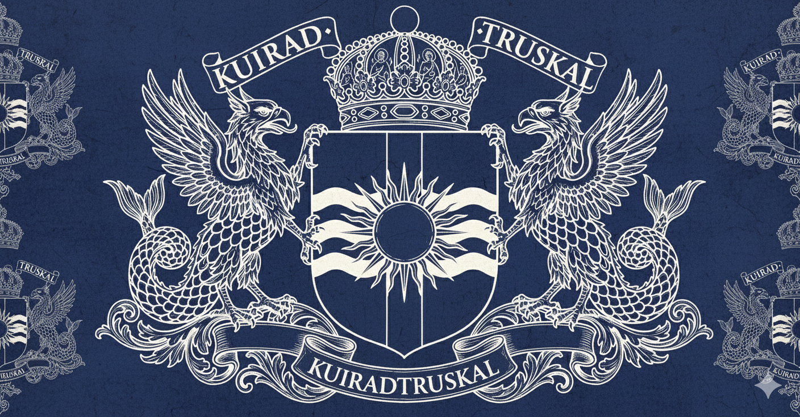
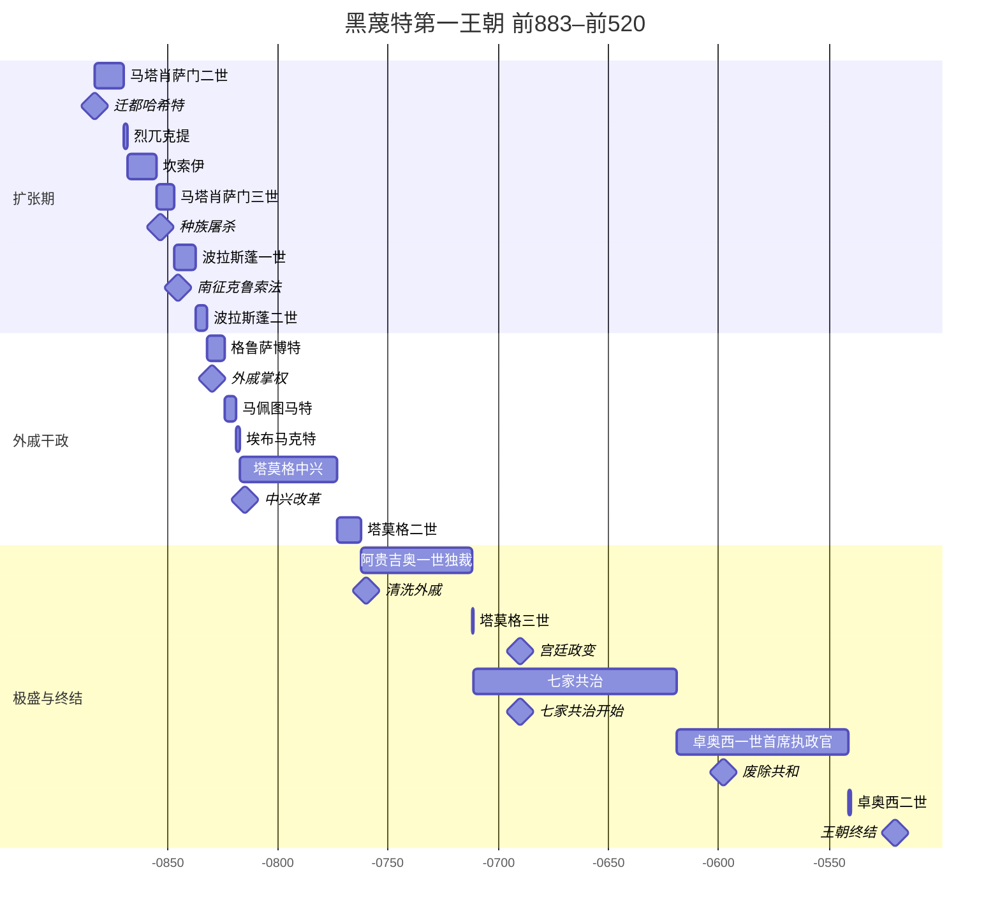

---
tags:
  - 黑蔑特
  - 王朝
---
# 黑蔑特王朝

!!! wiki "黑蔑特王朝"

    | 项目 | 内容 |
    | :--- | :--- |
    | **存在时期** | BC 883 – AD 50（第一/二/三王朝合计跨度） |
    | **建立者** | [马塔肖萨门二世](../../家族血脉/黑蔑特/马塔肖萨门二世.md)（第一王朝） |
    | **核心都城** | 哈希特、图佩罗堡垒 |
    | **政治体制** | 君主制、贵族共和制（过渡期）、军事独裁 |
    | **主要分支** | 第一王朝、第二王朝、第三王朝 |

<b><ruby>黑蔑特<rt>Heimet</rt></ruby></b>王朝是图斯克历史上影响最为深远的统治家族之一。该王朝的统治跨越了数个世纪，经历了从早期的扩张、中期的共和动荡到后期的复辟与衰亡。其历史通常被划分为三个主要阶段：第一王朝、第二王朝以及短暂的第三王朝。

## 黑蔑特第一王朝

第一王朝由[奎列奥](奎列奥王朝.md)的女婿[[马塔肖萨门二世]]登基而正式开启。这一时期是图斯克帝国奠定版图与制度基础的关键阶段。

### 奠基者：马塔肖萨门一世

第一王朝的实际奠基者是[[马塔肖萨门一世]]。他借海神之名起兵，推翻奎列奥王朝，俘虏年幼的奎列奥王，在击退趁乱入侵的拉普里奥人后以摄政者身份掌控实权。他推行了一系列影响深远的改革：

**信仰体系的再造。** 马塔肖萨门委托汉布瓦西亚家族的索里亚兹负责整理各城邦混乱神话，编纂《诸神篇》，将海神提升为至高之主，构建统一的“六主神体系”。针对抵抗激烈的城邦，索里亚兹将其保护神降格为“下三神”，在神学层面瓦解敌对城邦的抵抗意志。

**商路的打通。** 他修建了连接黑蔑特海峡与图斯克盆地的马塔肖萨门大道，由洛萨安家族的耶普索伊主持建设。耶普索伊首创“浮土沉石”筑路法，解决了盆地内复杂的沼泽地形问题。这条大道使内地物资得以源源不断运至海岸，极大促进了商业发展。

**税法的改进。** 他建立原始的包税商体系，加强对往来行商的税收管理，为帝国提供了稳定的财政来源。

**冶金与军械的强化。** 铁苏库家族的特罗列格被封为首席军械官兼铁苏库山脉领主。他改良冶炼技术，发现加入特定比例的骨炭可锻造出更坚硬的钢材——即“图斯克钢”的雏形。

**马塔肖萨门一世本人始终未登帝位。** 他选择了一条迂回路线：让自己的儿子成为奎列奥家的女婿，以联姻方式继承王位。

### 早期扩张与制度建设（前883–前830）

- **马塔肖萨门二世（前883–前870）**：黑蔑特王朝第一位正式君主。在前883年登基，同年将首都从图斯克盆地迁至哈希特城，完成马塔肖萨门大道的全线贯通。他在帝国各地设立关卡并增税，极大地充盈了国库。
- **烈兀克提（前870–前868）**：马塔肖萨门二世次子，通过叛乱夺权即位，统治不足两年。
- **坎索伊（前868–前855）**：烈兀克提之弟，以兄弟继承的方式取代烈兀克提。史书对其统治记载较为简略。
- **马塔肖萨门三世（前853–前845）**：坎索伊之孙，史称暴君。多次发动海峡对岸的战争并实行种族屠杀，开启后宫与阉宦制度。
- **波拉斯蓬一世（前845–前835）**：马塔肖萨门三世的私生子，凭借卓越军事才能转正继位。征服克鲁索法地区并建立图佩罗堡垒（意为“胜利堡垒”），三次进攻瑞联地，建立波拉斯蓬城并开采金矿。政治中心开始南移。
- **波拉斯蓬二世（前835–前830）**：波拉斯蓬一世之子。修建通往克鲁索法河入海口的大道，但丢失了瑞联地及其金矿。去世时无嗣，皇位传给其外甥。

### 外戚干政与皇权博弈（前830–前760）

格鲁萨博特（前830–前822）继位，其母系来自[[维斯尤丰]]家族，自此开启长达八十年的外戚掌权时代。此后政局动荡，皇权在亲王与外戚之间反复易手。

- **马佩图马特（前822–前815）**：格鲁萨博特之弟，深陷权力斗争，曾被废黜。
- **埃布马克特（前817–前816）**：波拉斯蓬的外孙，由亲王谒普肯扶植的傀儡，在位仅十个月即遭外戚暗杀。
- **塔莫格（前815–前771）**：马佩图马特之子。在两大势力相互牵制的缝隙中亲政，通过扶植商人阶层、改革图斯克地区官僚体系，成功将皇权强化至前所未有的高度，是为中兴之主。
- **塔莫格二世（前771–前760）**：塔莫格的六子，统治中后期皇权逐渐旁落。

### 极盛与转折（前760–前690）

- **阿贵吉奥（前760–前690）**：塔莫格二世的堂弟，通过政变掌握实权。他清洗了维斯尤丰家族的势力，结束了外戚统治。在前678年发动对瑞联地的全面战争，重新控制金矿资源，但因补给线过长及土著游击战而导致财政崩溃。统治长达50年，前40年为独裁统治，晚年权力逐渐下移。
- **塔莫格三世（前690）**：阿贵吉奥的继承人。其在位期间爆发了惨烈的宫廷政变，死于残酷的宫廷斗争。他死后，国家进入贵族共和状态。

### 共和时期与王朝终结（前690–前520）

前690年起，帝国进入长达62年的“七家共治”寡头政治时代。国家权力由元老议会把持，其成员包括分裂的黑蔑特皇室分支、复辟的维斯尤丰家族、瑞联家族、赵黠斯家族以及新兴的巴西卜家族。

- **卓奥西一世（前598–前520）**：共和晚期的政治天才。他通过统合家族势力、与贵族达成政治妥协，废除共和制并出任终身“首席执政官”。他重新划定核心区边界，奠定了帝国的标准疆域。
- **卓奥西二世（前520）**：理想主义者，试图推行“第二次集权改革”以削藩，结果引发“元老院政变”。他在流亡途中遇害，标志着黑蔑特第一王朝的彻底落幕。随后，异族统治的诺瓦亚王朝建立。

### 黑蔑特第一王朝速览

## 黑蔑特第二王朝

### 复辟与稳定（前 65 – 前 26）

- **盈古霍（前 65）**：在焦利亚王朝末期的混乱中，盈古霍率领黑蔑特家族私军攻入皇宫，建立第二王朝。他对内平定骚乱，对外与咕洛族部落签署合约并联姻，确立了以海峡西侧大沼泽与大森林为界的边境线，为帝国赢得了休养生息的时间。
- **莱斯卫（前 48）**：致力于精神与文化的统一。他推行温和的宗教改革，确立了以海神为至高主宰的多神教体系。政治上，他建立了混合政体：核心区实行官僚制，新征服区实行封建制，边境则保留部落自治，有效促进了族群融合。

### 白银时代（前 26 – 前 5）

**奥勒曼**统治时期被称为“白银时代”。他大力修复水利，推广耐旱作物，并鼓励对外贸易。图斯克银币`古冶`成为通用货币，国库空前充盈。然而，长期的和平导致地方封建领主与祭司阶层势力膨胀，土地兼并严重，中央对地方的掌控力开始衰退。

### 瘟疫与篡权（前 5 – 图斯克历元年）

奥勒曼末期，一场恐怖的瘟疫席卷帝国，终结了繁荣。奥勒曼染病身亡后，次子黑图克与三子安赛特爆发内战。[铁苏库家族](../../家族血脉/铁苏库/index.md)的[德卓黑一世](../../家族血脉/铁苏库/德卓黑一世.md)在乱世中崛起，他营救了被软禁的安赛特并在南方拥立其登基。

在击败北方势力后，德卓黑与安赛特在治国理念上产生分歧。最终，德卓黑暗杀安赛特，以黑蔑特家族女婿身份接管权力，废除旧历，建都图佩罗，建立[铁苏库王朝](铁苏库王朝.md)，黑蔑特第二王朝名存实亡。

---

## 黑蔑特第三王朝

铁苏库·德卓黑去世后，**黑蔑特·法坨一世**上位，开启了短暂的黑蔑特第三王朝。然而，其统治引发了与旧贵族及瓦特苏卡瑟姆势力的激烈冲突。最终，法坨一世在著名的“日落宴会”上遭遇刺杀，第三王朝随之终结，黑蔑特家族主系的成员随后也遭到诛杀，黑蔑特家族对图斯克的统治彻底成为历史。

---
