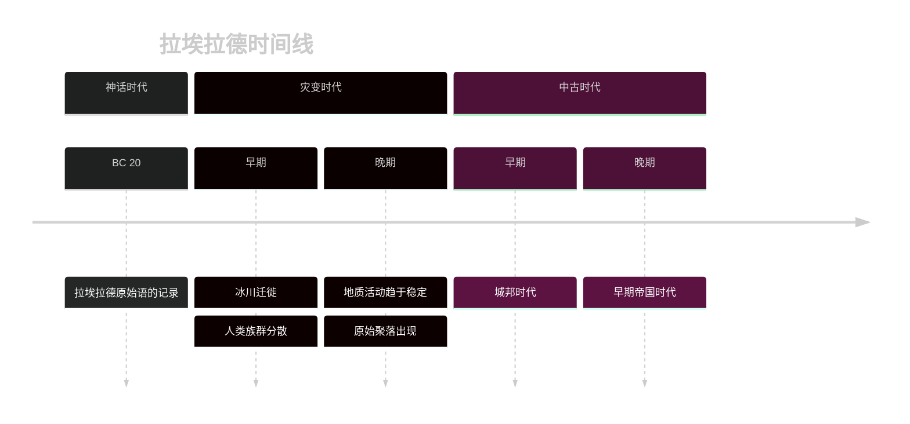
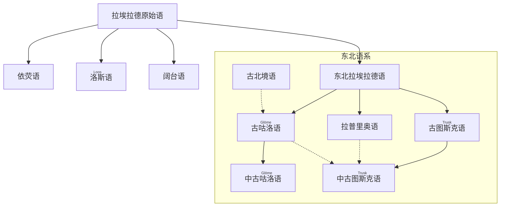

---
tags:
  - 拉埃拉德
  - 概念
  - 中文
language: zh
---
# <ruby>拉埃拉德<rt>laaerad</rt></ruby>基础设定

拉埃拉德是一个将硬科幻设定与传统奇幻元素巧妙融合的独特世界。它不仅拥有一个神秘的魔力星环，其魔法体系也并非凭空产生，而是基于一种复杂的宇宙学理论。在这个世界里，历史进程和文明发展都与天文现象和魔法事件紧密相连，共同塑造了一个充满未知与探索的独特宇宙。

## 1 天文

从天文学角度看，**拉埃拉德**是一颗质量与体积都与地球极为相似的行星，重力与气候条件相近，因而孕育了多样的生态与智慧生命。它围绕着自己的恒星运行，并有一颗卫星相伴；其所在的星系构成与太阳系相仿。然而，这颗行星最显著的特征，是一圈闪耀的**魔力星环**以独特的方式环绕其轨道。星环不仅是美丽的夜空景观，也是“魔法”在世界中生效强度的重要指标。当它在夜空显现时，会反射日光点亮苍穹，大多数时候如月亮般皎洁，有时却呈现紫红色或灰绿色；白天则取决于星环与太阳的相对位置，在特定角度下，地面上的人甚至能看到天空中同时出现两个太阳——“双日同天”的奇观。

---

## 2 魔法

拉埃拉德的“魔法”遵循以下的规则：

在“现实”之外，存在着一个更高维度的空间。现实世界在其中以“快照”的形式被映射，这种映射唯一且可逆，不仅包含空间的全部信息，也囊括了时间的流动。魔法的发生，本质上是施法者在现实与某个“快照”之间打开一条通道，使当前的现实状态向该“快照”坍缩。在坍缩的过程中，能量、波动与物质会在两者之间发生交换。每隔一段时间，当天文尺度上的“现实”旋转至与高维空间中某个映射位置接近时，便会显现出魔力星环。基于前述的魔法机制，在这一时期大多数魔法会失效。这种周期可能极为漫长，长则跨越数百年，短则在一天之内便能多次往复。

### 2.1 形式

魔法在拉埃拉德的表现形态多种多样：

- **附魔（uru）**  
    通过将“要素”与物品的高维映射绑定，使物品获得超越物理属性的能力。例如附魔的剑可在挥动时切割非实体物质，附魔的衣物可隔绝极端温差。附魔的稳定性取决于施法者对要素的纯度与匹配度的掌握，一旦绑定过程失衡，物品可能失效甚至反噬持有者。
    
- **祝福（anhuz）**  
    借由魔法通道，将“快照”中某个理想状态叠加到目标之上，从而提升其生命力、运气或精神状态。祝福常用于战前、婚礼、丰收祭等仪式，效果通常不显著，也是一种常见的礼仪，拉埃拉德的许多民族都有和“*祝福*”相关的民俗。
    
- **预言（portesdra）**  
    罕见且极难掌握的形式，通过选择性地读取“快照”中的信息来预测事件的可能走向。然而“快照”是高维空间，而且并非固定，施法者所见可能是错乱且模糊的印象，且读取过程会引发精神上的负担，严重者可能丧失对现实的感知。
    
- **通灵（strahuy）**  
    一些曾经涉足高维空间的*灵语者*或*魔法师*可能会在高维空间留下属于它们的印迹，通过对这些印迹进行探索，通灵的*灵语者*可能获取*前人*（也可能是*后人*）的一些想法。

无论何种形式，魔法的施展都依赖特定“要素”的获取——这些要素可能是物质、能量、符号或环境条件。能否稳定地重复施法，关键就在于施法者是否能够在每一次尝试中，准确找到并获取所需的要素。

### 2.2 机制

在拉埃拉德，所谓的“魔法师”是指那些能够看见高维空间中“*快照*”的人。施法者的实力，很大程度上取决于他们观察“*快照*”的能力。然而，这种观察高维空间的天赋极其稀有——只有当高维空间的映射与现实世界在某种程度上发生重合时，新生的婴儿才有概率获得此能力。虽然它似乎能通过血统遗传，但因样本过少，至今无法总结出稳定的规律。

能够观察“快照”的人，并不一定具备对要素进行精准定位的能力；能够定位要素的人，也未必能观察到足够多的要素。即便同时擅长两者，也可能因无法打开现实与高维空间之间的通道而失去施法能力。已知*冥想*有助于加强与高维空间的联系，但效果因人而异。

以**为一柄剑附加火焰**为例：

1. 在现实中，剑作为实体存在；

2. 魔法师先窥探并分析其“快照”，再设法打开通道；

3. 在“快照”中，状态是静止不变的，施法者必须找到构成火焰的要素，将其与剑的映射绑定，通过通道将火焰显现到现实中。

表面上，这与一般幻想世界的魔法形式无异，但在这一设定中，魔法的效果与强度取决于现实宇宙与“快照”的相对位置。因此，通过观星，人们可以预测某一时期魔法的可行性与威力变化；在特定时段，魔法甚至可能完全失效。由此，拉埃拉德的世界中既可能存在高度发达的魔法文明，也可能出现完全不掌握魔法技术的社会结构。

这种体系既为魔法提供了自洽的物理与天文学基础，也为科幻式的创作留出了足够的空间。

> 灵感来源：阿西莫夫《神们自己》

---

## 3 文化基础
### 3.1 历史

#### 3.1.1 <ruby>神话时代<rt>porurmart </rt></ruby>
##### 3.1.1.1 概况

在温暖稳定的气候下，拉埃拉德的海平面高企，大片浅海覆盖大陆边缘，陆地面积相对有限。陆生动植物种类繁多，气候适宜，早期人类与其他智慧种族得以在温带与沿海区域繁衍扩散。

人类在神话纪元结束前约十万年已出现，并逐渐遍布大陆温带与海岸线。纪元结束前二十年，拉埃拉德原始语首次以石刻的方式记录——约两百个词，被镌刻在岩石上，成为现存最古老的语言文献。在这一时期，_Porurka_诸神神话盛行，语言、部落与自然崇拜高度交织，构成早期社会的精神核心。

纪元末期，一位被史家称为“开门者”的人物发现了通向宇宙早期状态的“快照之门”。这扇门的开启使大量水汽瞬间冻结并回落至星球，造成海平面骤降、气候急变与地壳剧烈运动。旧大陆多处海底裸露、山脉隆起，这场灾难标志着神话时代的终结与灾变时代的开启。

#### 3.1.2 <ruby>灾变时代<rt>glios</rt></ruby>
##### 3.1.2.1 概况

灾变时代持续约一千年，是地质与气候剧烈波动的时期。极地冰盖急速扩张，冻土带广泛形成，海平面不断下降，部分内陆湖泊干涸。板块活动与火山喷发频繁，塑造出新的山脉与裂谷。

严酷的气候迫使人类族群大规模迁徙，他们跨越冰原与陆桥，扩散至各大陆。拉埃拉德原始语在长期隔绝中迅速分化为多种方言与早期独立语言。冰川迁徙浪潮促成文化多样化与区域隔绝，部分温带地区出现稳定的狩猎与采集中心，并建立了最初的固定营地。

至纪元末，地质活动趋缓，气候逐渐回暖，冰川开始退缩，低洼地重新被海水淹没。各地原始聚落的发展为农业与手工业奠定了基础，迎来了新的文明进程。

#### 3.1.3 <ruby>中古时代<rt>yupoyur</rt></ruby>

随着气候稳定，大陆各地进入以农业与牧业为核心的生产阶段，粮食剩余带动人口增长与城镇扩张。区域文明相继出现，彼此交流仍有限，多数文化独立演化。

青铜冶炼技术逐渐普及，并向铁器时代过渡。金属工具与武器显著提升了战争与工程能力。部分地区重新发现并掌握魔法，引发“次生文明”的崛起。

这一时期出现了围绕河谷、湖泊与海湾建立的早期城邦国家。区域贸易与资源竞争催生跨城邦联盟与霸权格局。至纪元晚期，早期帝国雏形初现，少数文明通过军事征服与文化同化建立起跨区域统治，为后续大帝国的形成奠定了基础。

***

## 4 文明

### 4.1 语言

进入中古早期，原始语在地理隔绝与交流的作用下逐渐分化。

东北拉埃拉德语演变为东北语系，孕育出古咕洛语、拉普里奥语与古图斯克语三大古典语言。古咕洛语保留了大量古老语法结构，并受到古图斯克语的影响；拉普里奥语分布于沿海地带，早期吸收了图斯克语及外海语言的成分；古图斯克语发展为中古图斯克语，成为官方与书写交流的核心语言。北方的古北境语虽然与东北语系有共同渊源，却在早期脱离，其部分方言成为古咕洛语的间接祖先。

分布在大陆中部与西南部的依荧语系、洛斯语系与阔台语系诸语直接承续原始语，较少受外部影响，在音系上保留了更多古老特征。语言的演变不仅受地理隔绝影响，也受到族群迁徙、接触与融合的塑造，东北语系各语言在相互影响中渗透，而相对孤立的语支则保留着史前语言的古老面貌，为后世研究提供了重要线索。

### 4.2 本节关联词条

| 词条                          | 关联            |
| --------------------------- | ------------- |
| [拉埃拉德原始语](../语言/拉埃拉德原始语.md) | 拉埃拉德最古老和原始的语言 |
| [图斯克语](../语言/图斯克/图斯克语.md)   | 东北拉埃拉德语的子系之一  |
| [咕洛语](../语言/图斯克/咕洛语.md)     | 东北拉埃拉德语的子系之一  |

---

<footer>

<!--
  <<< Author notes: Footer >>>
  Add a link to get support, GitHub status page, code of conduct, license link.
-->

&copy; This Website is constructed by Phychias Lok, Phychiaslok@gmail.com. The copyrights of the conlan that's not created by Phychias is owned by its creator. &copy;

世界观交流群QQ：150665831

</footer>

---